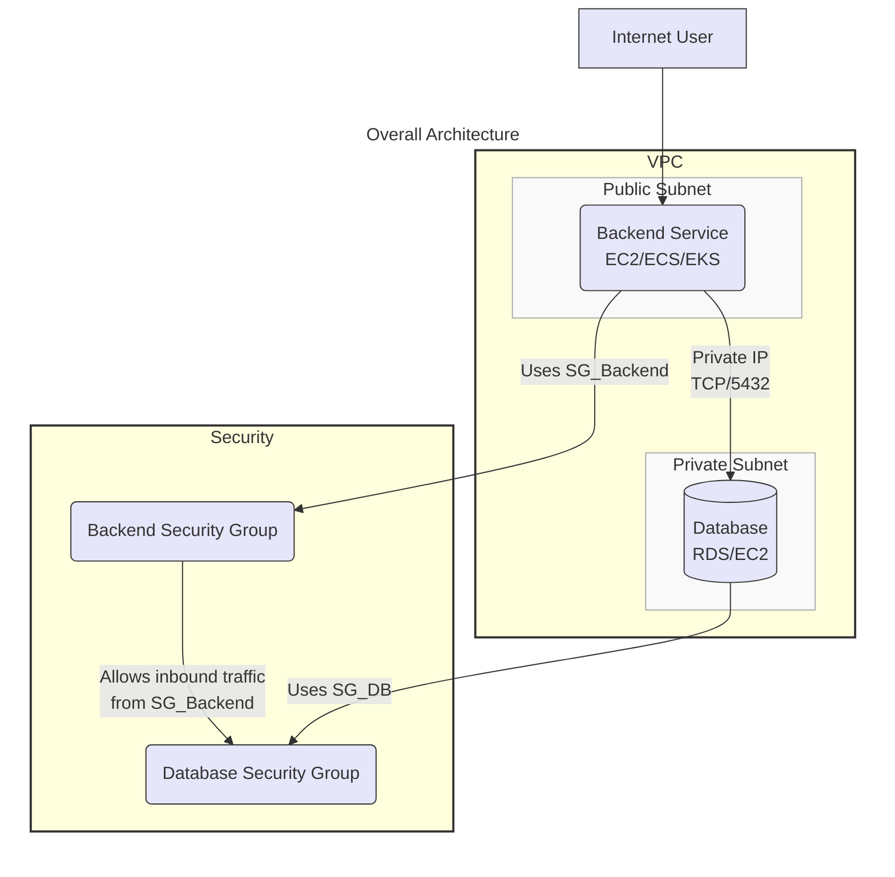
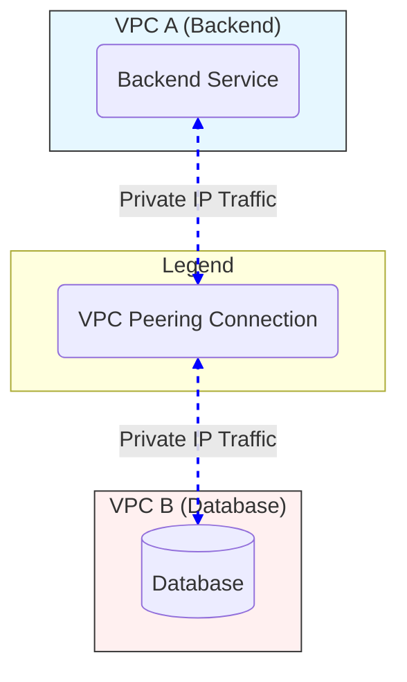
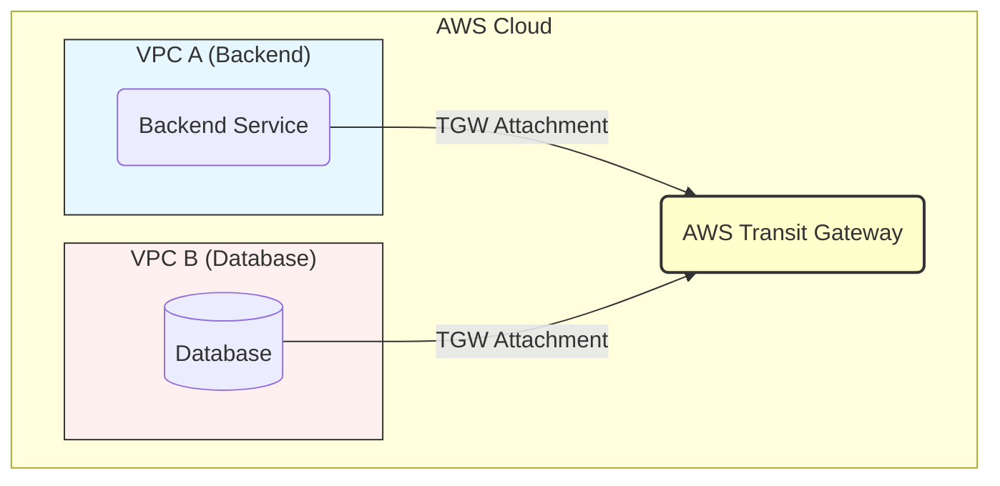
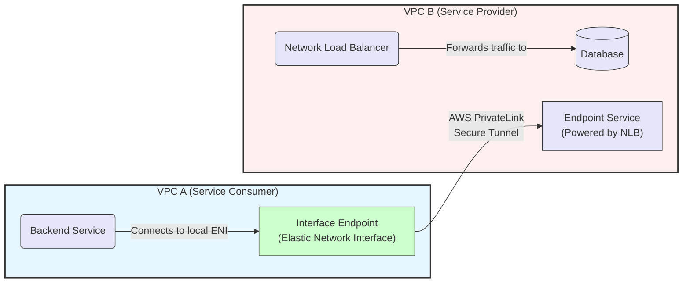

### Backend Service and Database in the Same VPC

```mermaid
graph TD

    %% Define the user at the top level
    InternetUser[Internet User]

    %% Define an invisible subgraph to control the side-by-side layout
    subgraph overall_architecture[Overall Architecture]
        direction LR %% Layout direction for the main blocks is Left-to-Right

        %% Security Subgraph (Now defined FIRST to appear on the LEFT)
        subgraph Security
            direction TB
            SG_Backend(Backend Security Group)
            SG_DB(Database Security Group)

            SG_Backend -- "Allows inbound traffic <br> from SG_Backend" --> SG_DB
        end

        %% VPC Subgraph (Now defined SECOND to appear on the RIGHT)
        subgraph VPC [VPC]
            direction TB
            subgraph public_subnet[Public Subnet]
                B(Backend Service <br> EC2/ECS/EKS)
            end

            subgraph private_subnet[Private Subnet]
                DB[(Database <br> RDS/EC2)]
            end
        end
    end

    %% --- Define Relationships Between All Elements ---

    InternetUser --> B
    B -- "Private IP <br> TCP/5432" --> DB
    B -- "Uses SG_Backend" --> SG_Backend
    DB -- "Uses SG_DB" --> SG_DB


    %% --- Styling to Match the Image ---
    style VPC fill:#ffffde,stroke:#333,stroke-width:2px
    style Security fill:#ffffde,stroke:#333,stroke-width:2px
    style public_subnet fill:#f9f9f9,stroke:#aaa
    style private_subnet fill:#f9f9f9,stroke:#aaa
    style B fill:#e6e6fa,stroke:#333
    style DB fill:#e6e6fa,stroke:#333
    style InternetUser fill:#e6e6fa,stroke:#333
    style SG_Backend fill:#e6e6fa,stroke:#333
    style SG_DB fill:#e6e6fa,stroke:#333
    style overall_architecture fill:none,stroke:none
```

### Using VPC Peering

```mermaid
graph TD
    subgraph vpc_a["VPC A (Backend)"]
        B(Backend Service)
    end

    subgraph vpc_b["VPC B (Database)"]
        DB[(Database)]
    end

    subgraph Legend
        direction LR
        Peering(VPC Peering Connection)
    end

    B <-->|Private IP Traffic| Peering
    Peering <-->|Private IP Traffic| DB

    linkStyle 0,1 stroke-width:2px,stroke:blue,stroke-dasharray: 5 5;

    style vpc_a fill:#e6f7ff,stroke:#333
    style vpc_b fill:#fff0f0,stroke:#333
```

### Using AWS Transit Gateway

```mermaid
graph TD
    subgraph AWS Cloud
        TGW(AWS Transit Gateway)

        subgraph vpc_a["VPC A (Backend)"]
            B(Backend Service)
        end

        subgraph vpc_b["VPC B (Database)"]
            DB[(Database)]
        end

        B -- "TGW Attachment" --> TGW
        DB -- "TGW Attachment" --> TGW
    end

    style TGW fill:#ffc,stroke:#333,stroke-width:2px
    style vpc_a fill:#e6f7ff,stroke:#333
    style vpc_b fill:#fff0f0,stroke:#333
```

### Using AWS PrivateLink

```mermaid
graph LR

    %% --- Define the VPCs and their contents ---

    %% VPC B (Service Provider) - Defined first to appear on the left
    subgraph vpc_b["VPC B (Service Provider)"]
        direction TB %% Internal direction is Top-Down
        NLB(Network Load Balancer)
        DB[(Database)]

        %% The Endpoint Service is defined separately for better layout control
        EndpointService["Endpoint Service <br> (Powered by NLB)"]

        %% Define internal connections
        NLB -- "Forwards traffic to" --> DB
    end

    %% VPC A (Service Consumer) - Defined second to appear on the right
    subgraph vpc_a["VPC A (Service Consumer)"]
        direction TB %% Internal direction is Top-Down
        B(Backend Service)
        ENI["Interface Endpoint <br> (Elastic Network Interface)"]

        %% Define internal connections
        B -- "Connects to local ENI" --> ENI
    end

    %% --- Define the main connection between the VPCs ---
    ENI -- "AWS PrivateLink <br> Secure Tunnel" --> EndpointService


    %% --- Styling to Match the Image ---
    %% Container Styling
    style vpc_a fill:#e6f7ff,stroke:#333,stroke-width:2px
    style vpc_b fill:#fff0f0,stroke:#333,stroke-width:2px

    %% Node Styling
    style B fill:#e6e6fa,stroke:#333
    style NLB fill:#e6e6fa,stroke:#333
    style DB fill:#e6e6fa,stroke:#333
    style EndpointService fill:#e6e6fa,stroke:#333
    style ENI fill:#ccffcc,stroke:#333
```
