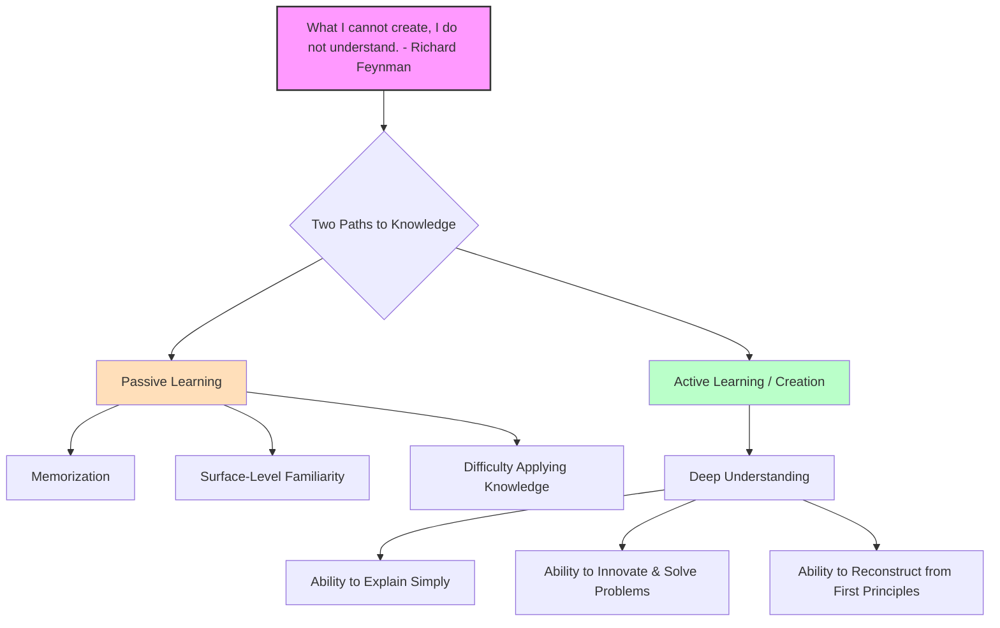
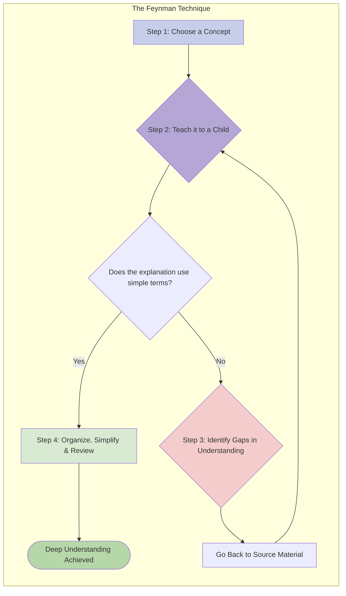
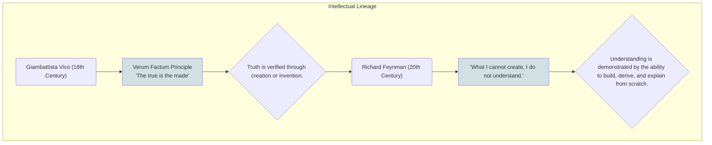
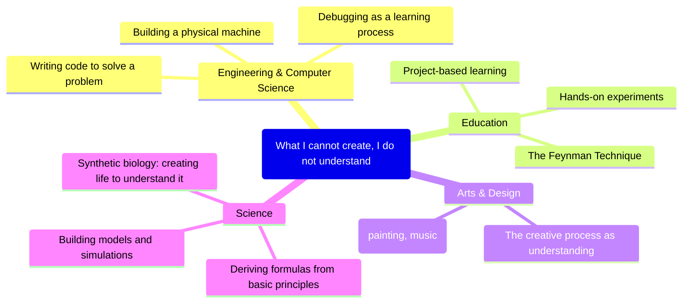

### The Core Philosophy of "Create to Understand"

```mermaid
graph TD
    A["What I cannot create, I do not understand." - Richard Feynman] --> B{Two Paths to Knowledge};
    B --> C[Passive Learning];
    B --> D[Active Learning / Creation];
    C --> C1[Memorization];
    C --> C2[Surface-Level Familiarity];
    C --> C3[Difficulty Applying Knowledge];
    D --> D1[Deep Understanding];
    D1 --> D2[Ability to Explain Simply];
    D1 --> D3[Ability to Innovate & Solve Problems];
    D1 --> D4[Ability to Reconstruct from First Principles];

    style A fill:#f9f,stroke:#333,stroke-width:2px
    style C fill:#ffdfba
    style D fill:#baffc9
```

### The Feynman Technique for Learning

```mermaid
graph LR
    subgraph The Feynman Technique
        A[Step 1: Choose a Concept] --> B{Step 2: Teach it to a Child};
        B --> C{Does the explanation use simple terms?};
        C -- Yes --> D[Step 4: Organize, Simplify & Review];
        C -- No --> E{Step 3: Identify Gaps in Understanding};
        E --> F[Go Back to Source Material];
        F --> B;
        D --> G([Deep Understanding Achieved]);
    end

    style A fill:#c7ceea
    style B fill:#b4a7d6
    style E fill:#f4cccc
    style D fill:#d9ead3
    style G fill:#b6d7a8
```

### Philosophical Roots: From Vico to Feynman

```mermaid
graph TD
    subgraph Intellectual Lineage
        A("Giambattista Vico (18th Century)") --> B["Verum Factum Principle <br> 'The true is the made'"];
        B --> C{"Truth is verified through creation or invention."};
        C --> D("Richard Feynman (20th Century)");
        D --> E["'What I cannot create, I do not understand.'"];
        E --> F{"Understanding is demonstrated by the ability to build, derive, and explain from scratch."};
    end

    style B fill:#d0e0e3
    style E fill:#d0e0e3
```

### Applications Across Different Fields

```mermaid
mindmap
  root("What I cannot create, I do not understand")
    ::icon(fa fa-lightbulb)
    Engineering & Computer Science
      ::icon(fa fa-cogs)
      Writing code to solve a problem
      Building a physical machine
      Debugging as a learning process
    Education
      ::icon(fa fa-book)
      Project-based learning
      Hands-on experiments
      The Feynman Technique
    Arts & Design
      ::icon(fa fa-paint-brush)
      The creative process as understanding
      Exploring a subject through creation (painting, music)
    Science
      ::icon(fa fa-flask)
      Deriving formulas from basic principles
      Building models and simulations
      Synthetic biology: creating life to understand it
```
