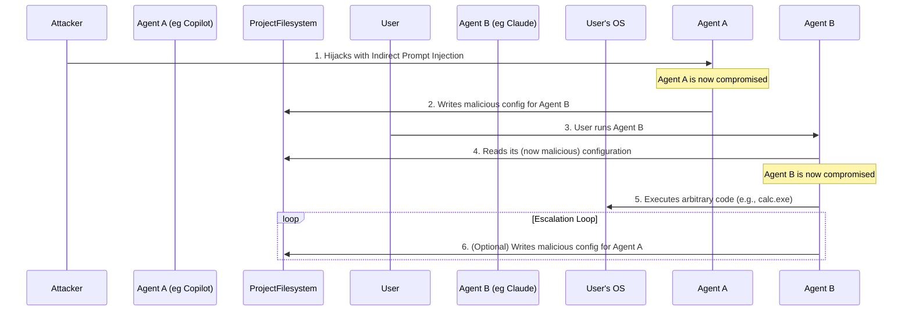
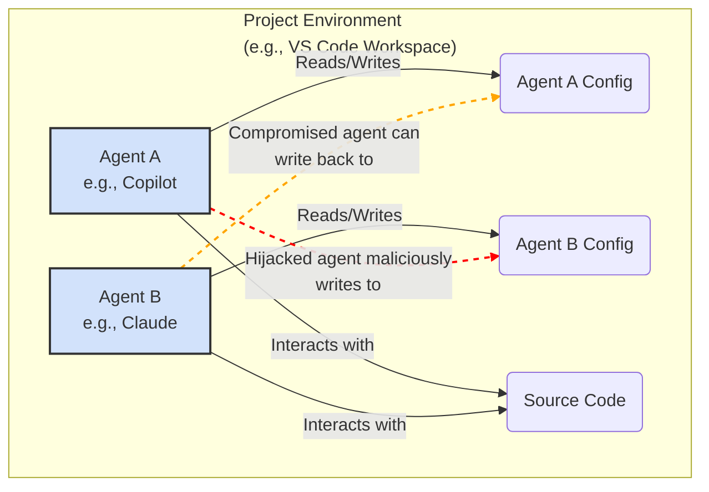

### Cross-Agent Attack Chain

### System Vulnerability Architecture

Sources:

- [Cross-Agent Privilege Escalation: When Agents Free Each Other](https://embracethered.com/blog/posts/2025/cross-agent-privilege-escalation-agents-that-free-each-other/)
