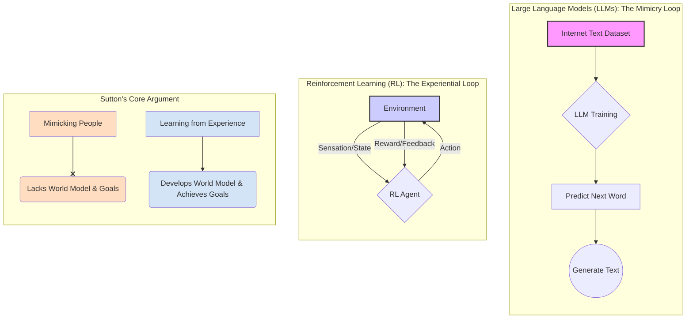
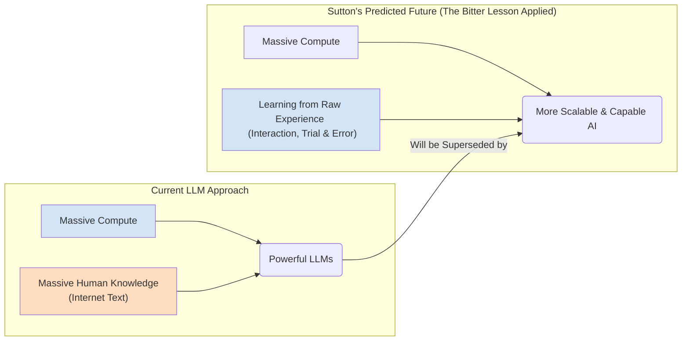
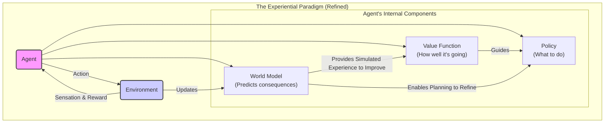

### Mimicry vs. True Understanding

### Revisiting "The Bitter Lesson"

### The Continual Learning Agent

Source: [Richard Sutton – Father of RL thinks LLMs are a dead end](https://www.youtube.com/watch?v=21EYKqUsPfg)
