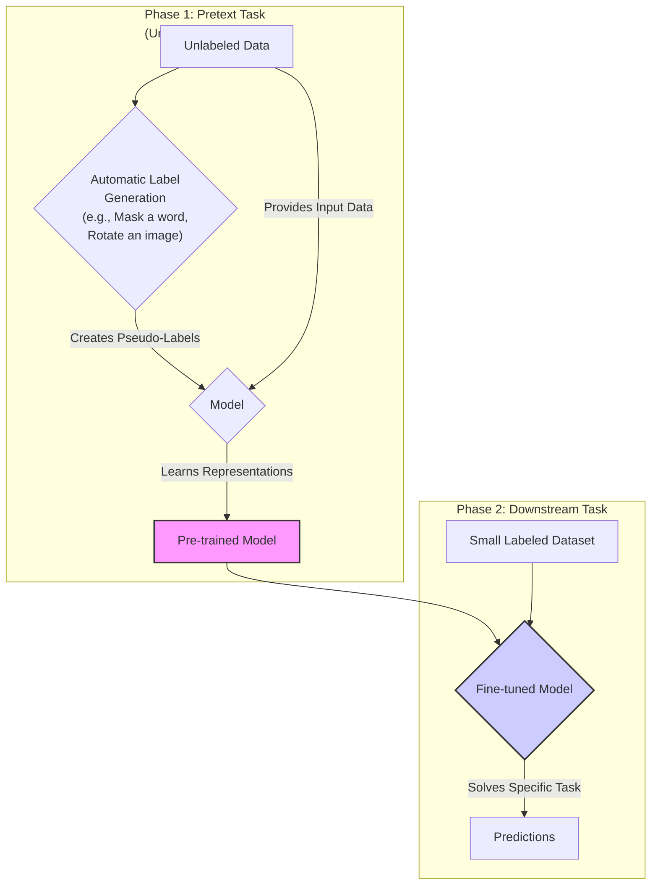
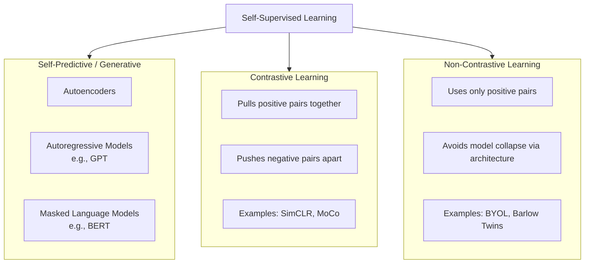
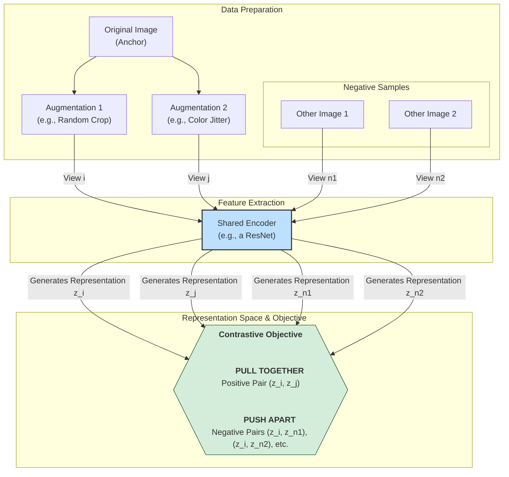
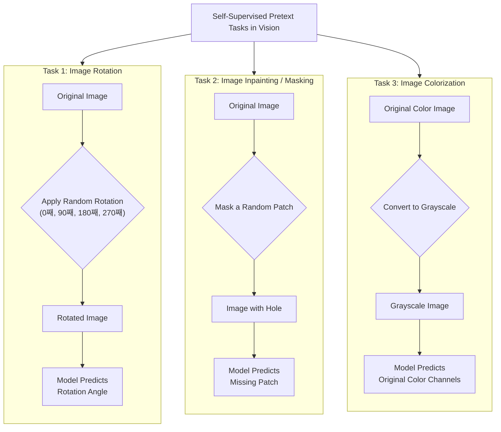

### The General Self-Supervised Learning Workflow

```mermaid
graph TD
    subgraph phase_1["Phase 1: Pretext Task <br/> (Unsupervised)"]
        A[Unlabeled Data] --> D{"Automatic Label <br/> Generation <br> (e.g., Mask a word, <br/> Rotate an image)"};
        D -- Creates Pseudo-Labels --> B{Model};
        A -- Provides Input Data --> B;
        B -- Learns Representations --> C[Pre-trained Model];
    end

    subgraph phase_2["Phase 2: Downstream Task <br/> (Supervised Fine-tuning)"]
        C --> E{Fine-tuned Model};
        F[Small Labeled Dataset] --> E;
        E -- Solves Specific Task --> G[Predictions];
    end

    %% Styling
    style C fill:#f9f,stroke:#333,stroke-width:2px;
    style E fill:#ccf,stroke:#333,stroke-width:2px;
```

### Main Methodologies of Self-Supervised Learning

```mermaid
graph TD
    A[Self-Supervised Learning] --> B[Self-Predictive / Generative];
    A --> C[Contrastive Learning];
    A --> D[Non-Contrastive Learning];

    subgraph B [Self-Predictive / Generative]
        direction LR
        B1[Autoencoders]
        B2[Autoregressive Models <br> e.g., GPT]
        B3[Masked Language Models <br> e.g., BERT]
    end

    subgraph C [Contrastive Learning]
        direction LR
        C1[Pulls positive pairs together]
        C2[Pushes negative pairs apart]
        C3[Examples: SimCLR, MoCo]
    end

    subgraph D [Non-Contrastive Learning]
        direction LR
        D1[Uses only positive pairs]
        D2[Avoids model collapse via architecture]
        D3[Examples: BYOL, Barlow Twins]
    end
```

### How Contrastive Learning Works

```mermaid
graph TD
    subgraph "Data Preparation"
        A["Original Image <br> (Anchor)"] --> B["Augmentation 1<br>(e.g., Random Crop)"];
        A --> C["Augmentation 2<br>(e.g., Color Jitter)"];
        
        subgraph "Negative Samples"
            N1[Other Image 1];
            N2[Other Image 2];
        end
    end

    subgraph "Feature Extraction"
        E["Shared Encoder <br> (e.g., a ResNet)"];
        style E fill:#bde0fe,stroke:#333,stroke-width:2px;
    end

    B -- "View i" --> E;
    C -- "View j" --> E;
    N1 -- "View n1" --> E;
    N2 -- "View n2" --> E;

    subgraph "Representation Space & Objective"
        E -- "Generates Representation z_i" --> Goal;
        E -- "Generates Representation z_j" --> Goal;
        E -- "Generates Representation z_n1" --> Goal;
        E -- "Generates Representation z_n2" --> Goal;

        Goal{{"<b>Contrastive Objective</b><br/><br/>
        <b>PULL TOGETHER</b><br/>Positive Pair (z_i, z_j)<br/><br/>
        <b>PUSH APART</b><br/>Negative Pairs (z_i, z_n1), (z_i, z_n2), etc."}};
        style Goal fill:#d4edda,stroke:#155724;
    end
```

### Common Pretext Tasks in Computer Vision

```mermaid
graph TD
    A[Self-Supervised Pretext Tasks in Vision];

    subgraph task_1["Task 1: Image Rotation"]
        direction TB
        B[Original Image] --> B1{"Apply Random Rotation <br> (0째, 90째, 180째, 270째)"};
        B1 --> B2[Rotated Image];
        B2 --> B3["Model Predicts <br> Rotation Angle"];
    end

    subgraph task_2["Task 2: Image Inpainting / Masking"]
        direction TB
        C[Original Image] --> C1{Mask a Random Patch};
        C1 --> C2[Image with Hole];
        C2 --> C3["Model Predicts <br> Missing Patch"];
    end

    subgraph task_3["Task 3: Image Colorization"]
        direction TB
        D[Original Color Image] --> D1{Convert to Grayscale};
        D1 --> D2[Grayscale Image];
        D2 --> D3["Model Predicts <br> Original Color Channels"];
    end

    A --> task_1;
    A --> task_2;
    A --> task_3;
```
