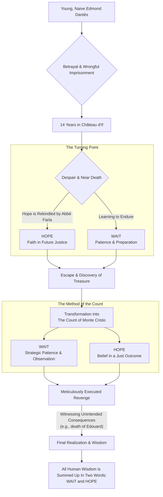
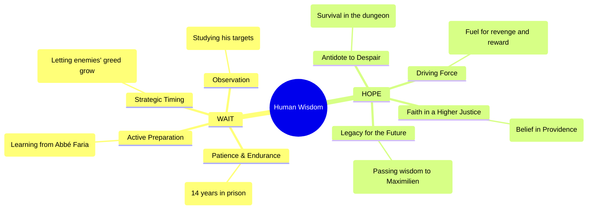

### The Journey of Edmond Dantès: A Flowchart

```mermaid
graph TD
    A[Young, Naive Edmond Dantès] --> B{Betrayal & Wrongful Imprisonment};
    B --> C[14 Years in Château d'If];
    C --> D{Despair & Near Death};

    subgraph "The Turning Point"
        D -- Hope is Rekindled by Abbé Faria --> E[HOPE<br>Faith in Future Justice];
        D -- Learning to Endure --> F[WAIT<br>Patience & Preparation];
    end

    E --> G[Escape & Discovery of Treasure];
    F --> G;

    G --> H[Transformation into<br>The Count of Monte Cristo];

    subgraph "The Method of the Count"
        H --> I[WAIT<br>Strategic Patience & Observation];
        H --> J[HOPE<br>Belief in a Just Outcome];
    end

    I --> K[Meticulously Executed Revenge];
    J --> K;

    K -- Witnessing Unintended Consequences<br>(e.g., death of Edouard) --> L[Final Realization & Wisdom];
    
    L --> M["All Human Wisdom is Summed Up In Two Words:<br>WAIT and HOPE"];
```

### Mind Map of the Core Concepts

```mermaid
mindmap
  root((Human Wisdom))
    ::icon(fa fa-brain)
    WAIT
      ::icon(fa fa-hourglass-half)
      Patience & Endurance
        (14 years in prison)
      Active Preparation
        (Learning from Abbé Faria)
      Strategic Timing
        (Letting enemies' greed grow)
      Observation
        (Studying his targets)
    HOPE
      ::icon(fa fa-lightbulb)
      Antidote to Despair
        (Survival in the dungeon)
      Driving Force
        (Fuel for revenge and reward)
      Faith in a Higher Justice
        (Belief in Providence)
      Legacy for the Future
        (Passing wisdom to Maximilien)
```
