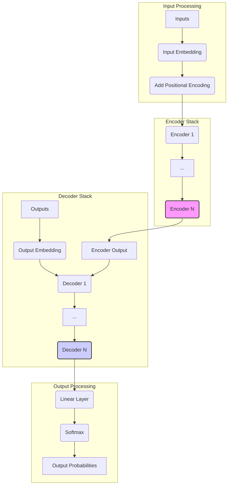
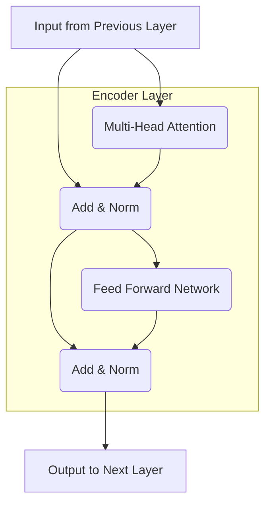
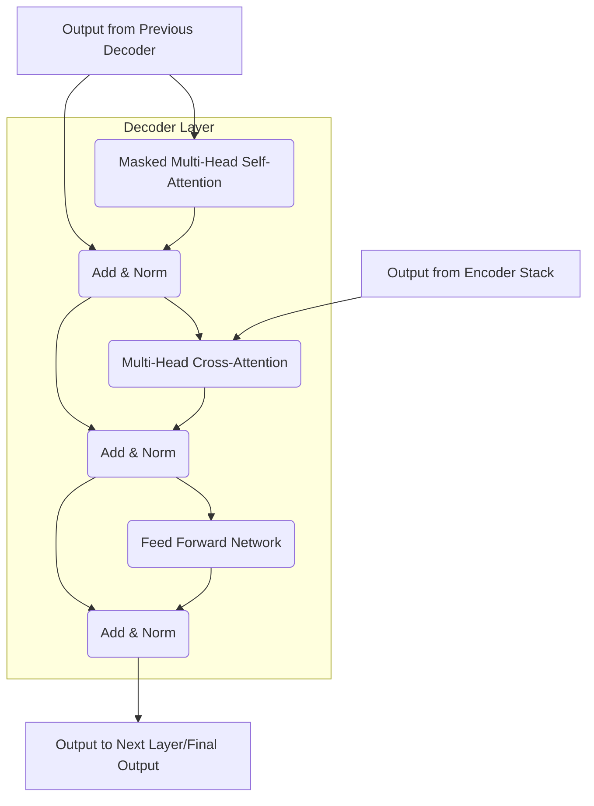
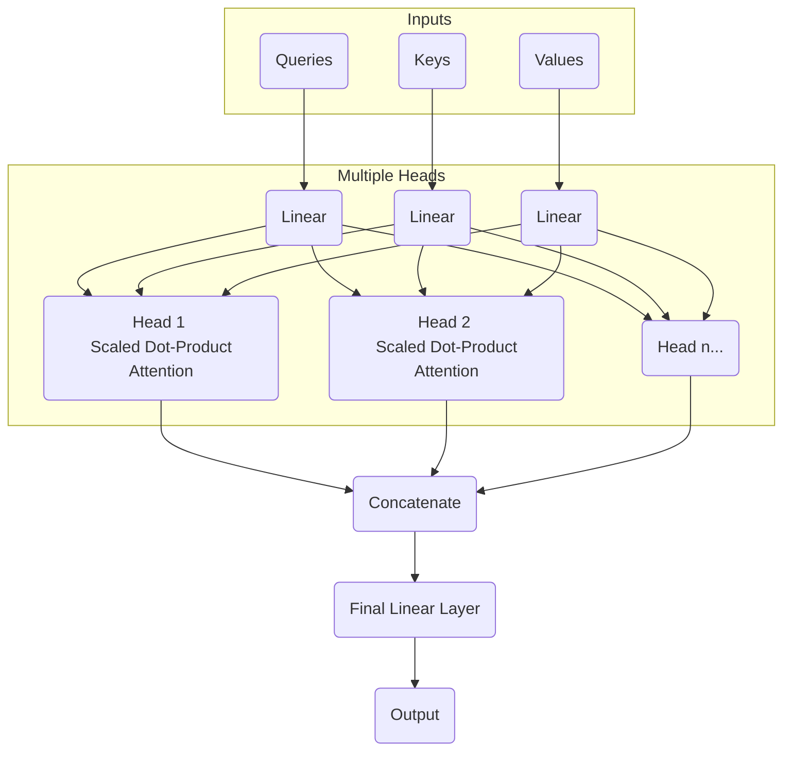

### High-Level Transformer Architecture

```mermaid
graph TD
    subgraph Input Processing
        A[Inputs] --> B(Input Embedding) --> C(Add Positional Encoding);
    end

    subgraph Encoder Stack
        E1(Encoder 1) --> E_dots[...] --> EN(Encoder N);
    end

    subgraph Decoder Stack
        F[Encoder Output];
        G[Outputs] --> OE(Output Embedding);
        
        OE --> D1(Decoder 1);
        F --> D1;

        D1 --> D_dots2[...] --> DN(Decoder N);
    end

    subgraph Output Processing
        H(Linear Layer) --> I(Softmax) --> J[Output Probabilities];
    end

    %% --- Define connections between the main blocks ---
    C --> E1;
    EN --> F;
    DN --> H;

    %% --- Styling to match original ---
    style EN fill:#f9f,stroke:#333,stroke-width:2px;
    style DN fill:#ccf,stroke:#333,stroke-width:2px;
```

### The Encoder Layer

```mermaid
graph TD
    A[Input from Previous Layer] --> B(Multi-Head Attention);
    A --> C(Add & Norm);
    B --> C;
    C --> D(Feed Forward Network);
    C --> E(Add & Norm);
    D --> E;
    E --> F[Output to Next Layer];

    subgraph "Encoder Layer"
        B
        C
        D
        E
    end
```

### The Decoder Layer

```mermaid
graph TD
    A[Output from Previous Decoder] --> B(Masked Multi-Head Self-Attention);
    A --> C(Add & Norm);
    B --> C;
    
    D[Output from Encoder Stack] --> E(Multi-Head Cross-Attention);
    C --> E;
    
    C --> F(Add & Norm);
    E --> F;
    
    F --> G(Feed Forward Network);
    F --> H(Add & Norm);
    G --> H;
    
    H --> I[Output to Next Layer/Final Output];

    subgraph "Decoder Layer"
        B
        C
        E
        F
        G
        H
    end
```

### Multi-Head Attention Mechanism

```mermaid
graph TD
    subgraph Inputs
        Q(Queries);
        K(Keys);
        V(Values);
    end

    Q --> L1(Linear);
    K --> L2(Linear);
    V --> L3(Linear);

    subgraph "Multiple Heads"
        direction LR
        L1 --> H1_Attn(Head 1 <br> Scaled Dot-Product Attention);
        L2 --> H1_Attn;
        L3 --> H1_Attn;

        L1 --> H2_Attn(Head 2 <br> Scaled Dot-Product Attention);
        L2 --> H2_Attn;
        L3 --> H2_Attn;
        
        L1 --> Hn_Attn(Head n...);
        L2 --> Hn_Attn;
        L3 --> Hn_Attn;
    end

    H1_Attn --> Concat(Concatenate);
    H2_Attn --> Concat;
    Hn_Attn --> Concat;

    Concat --> FinalLinear(Final Linear Layer);
    FinalLinear --> Output(Output);
```
