### Shifting from Supervised Learning to Reinforcement Learning

### Emergence of Sophisticated Reasoning Behaviors

```mermaid
graph TD
    A[Base LLM] --> B["Incentivized by RL on <br> Hard Problems with Simple Rewards"];
    B --> C(Emergent Reasoning Engine);

    subgraph " "
        direction LR
        C --> D["📈 Increased Thinking Time <br> (Generates Longer Chain-of-Thought)"];
        C --> E["🕵️ Self-Verification <br> (Checks its own <br> calculations and logic)"];
        C --> F["🤔 Self-Reflection <br> (Identifies mistakes and <br> re-evaluates)"];
        C --> G["💡 'Aha Moment' <br> (Sudden strategy shifts, <br> e.g., using 'Wait, let's <br> reevaluate...')"];
    end

    style C fill:#cce5ff,stroke:#004085,stroke-width:2px
    style D fill:#fff3cd,stroke:#856404
    style E fill:#fff3cd,stroke:#856404
    style F fill:#fff3cd,stroke:#856404
    style G fill:#fff3cd,stroke:#856404
```

### The Two-Model Development Pipeline

```mermaid
graph TD
    A[DeepSeek-V3 <br> Base Model] --> B{"Stage 1: Pure <br> Reinforcement Learning"};
    B -- "on reasoning tasks" --> C[DeepSeek-R1-Zero];
    C -- "Inherits Core Reasoning" --> D{"Stage 2: Multi-stage <br> Refinement & Alignment"};
    D -- "Includes SFT, Rejection <br> Sampling & Secondary RL" --> E[DeepSeek-R1];

    subgraph Model Properties
        direction LR
        P1["<b>R1-Zero:</b> ✅ Powerful <br> Reasoner | ❌ Poor <br> Readability"]
        P2["<b>R1:</b> ✅ Powerful Reasoner <br> | ✅ Human-Aligned & <br> Readable"]
    end

    C -.-> P1;
    E -.-> P2;

    style A fill:#e0e0e0,stroke:#333
    style C fill:#cce5ff,stroke:#004085
    style E fill:#d4edda,stroke:#155724```
```

### Efficient Training with Group Relative Policy Optimization (GRPO)

Source:

- [DeepSeek-R1 incentivizes reasoning in LLMs through reinforcement learning](https://www.nature.com/articles/s41586-025-09422-z)
