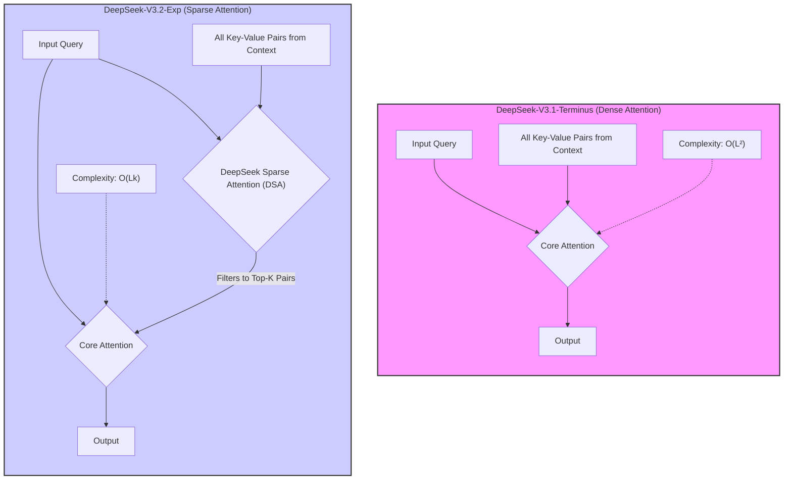
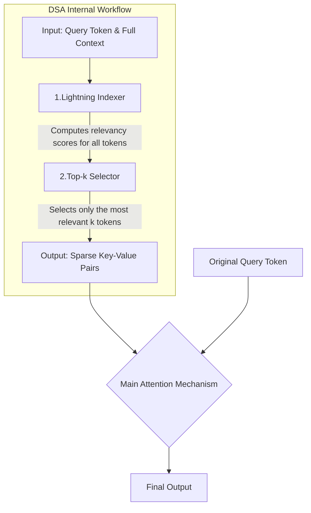
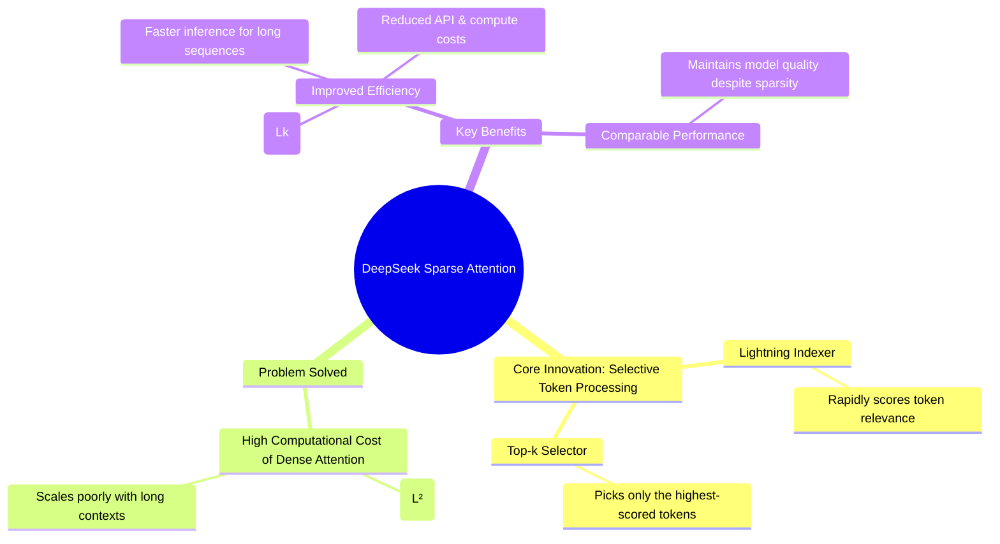

### High-Level Architectural Shift

### Inside DeepSeek Sparse Attention (DSA)

### Core Innovation and Benefits

Source:

- [DeepSeek-V3.2-Exp: Boosting Long-Context Efficiency with DeepSeek Sparse Attention](https://github.com/deepseek-ai/DeepSeek-V3.2-Exp)
