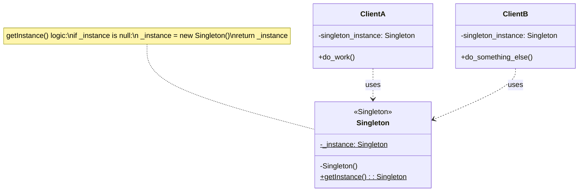
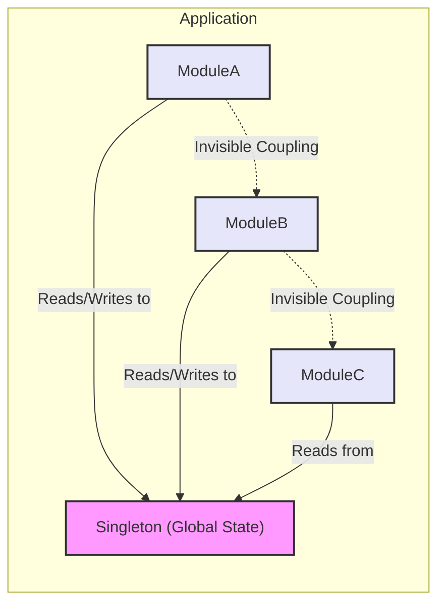
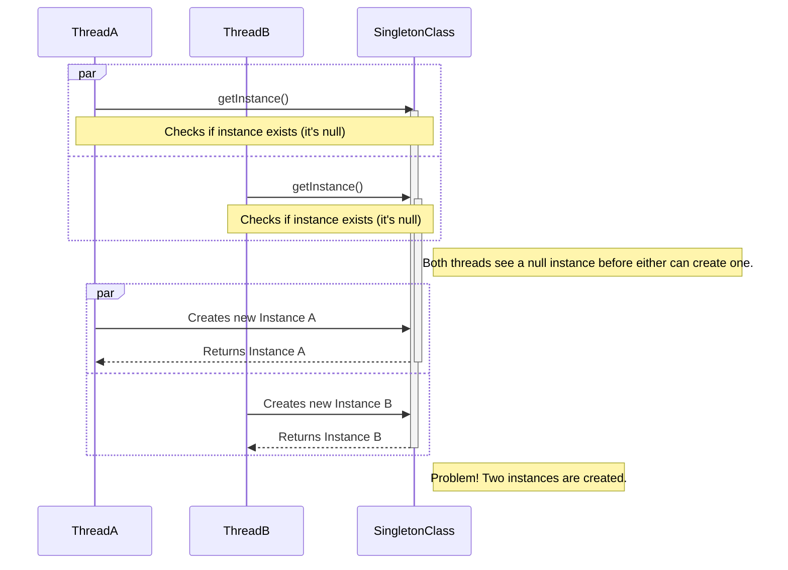
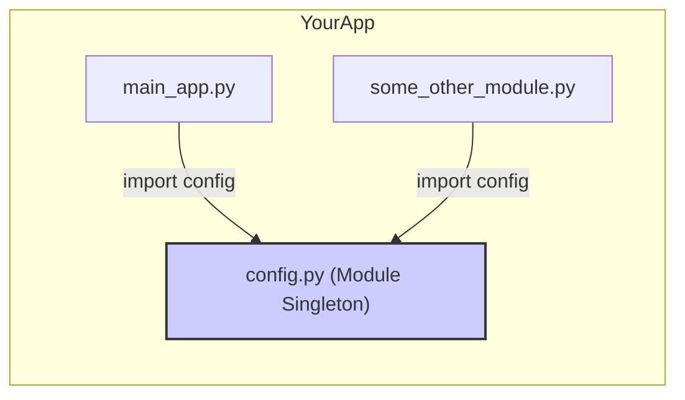
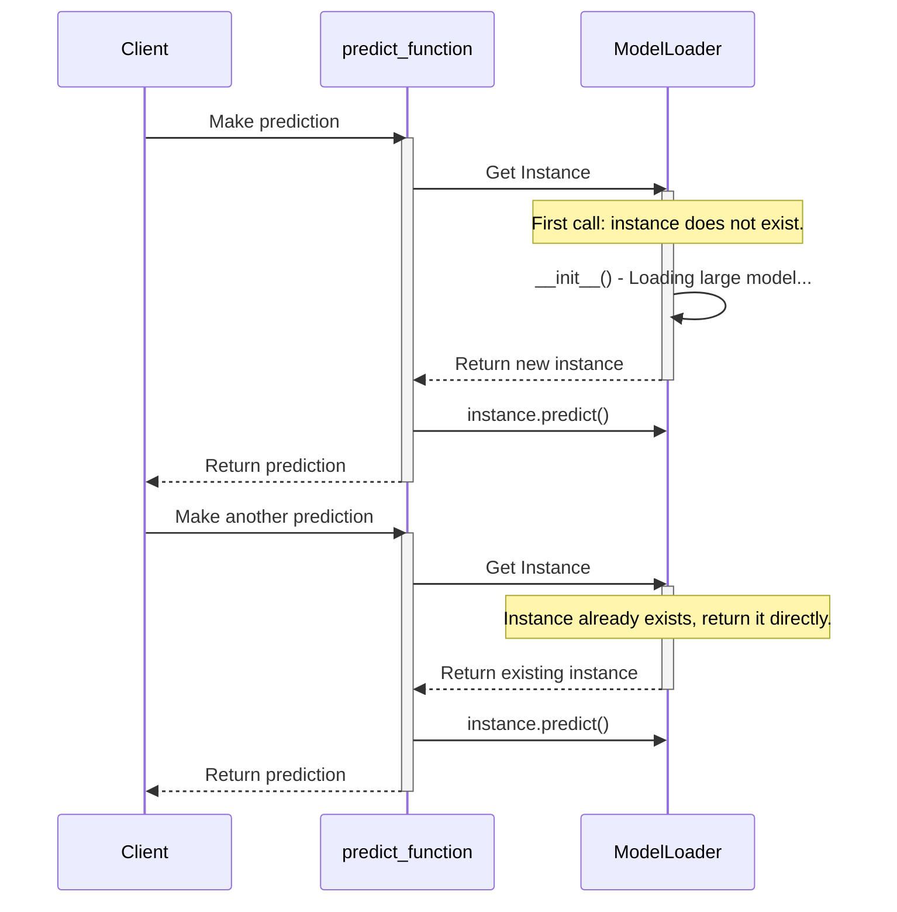
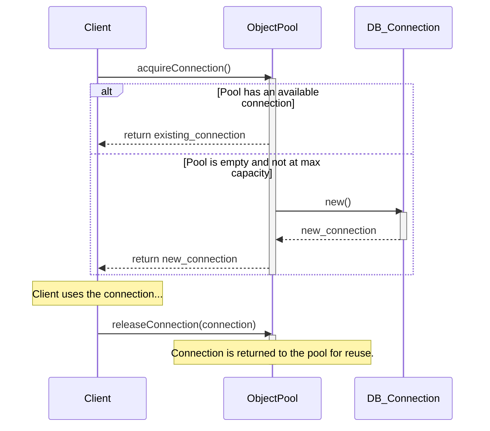

### The Classic Singleton Pattern

### The Anti-Pattern Problem: Global Shared State

### The Multi-threading Race Condition

### The "Pythonic" Singleton: A Module

### The Real Reason: Controlled Instantiation (Lazy Loading)

### Related Pattern: The Object Pool

