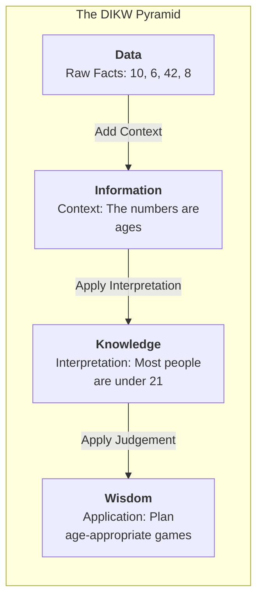
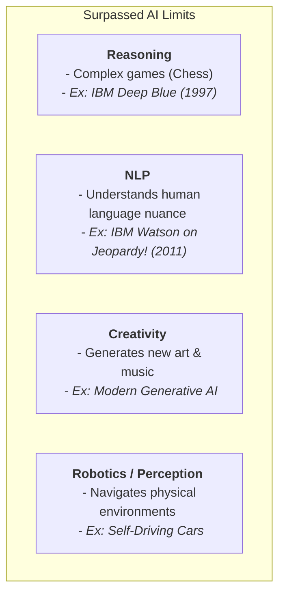
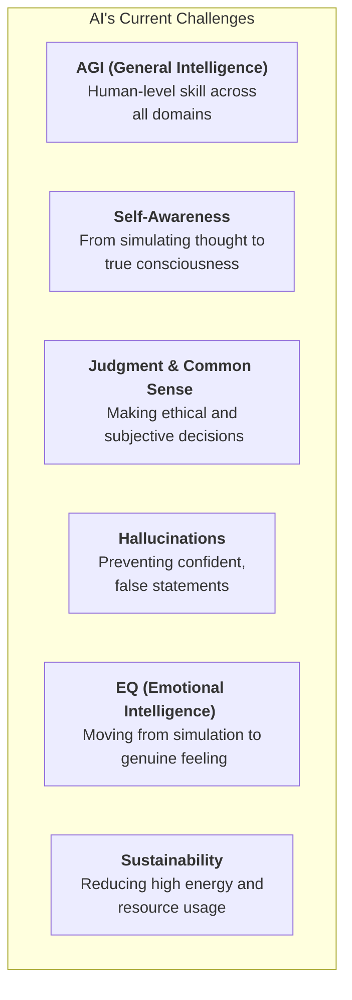
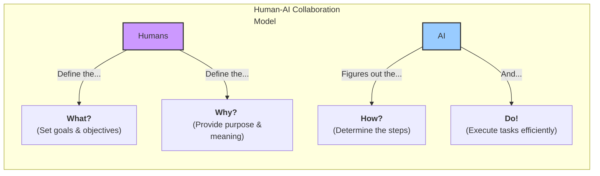

### The DIKW Pyramid

### Surpassed "Limits" of AI

### Current & Future AI Challenges

### Human-AI Collaboration Model

Source:

- [The Limits of AI: Generative AI, NLP, AGI, & What’s Next?](https://www.youtube.com/watch?v=rBlCOLfMYfw)
