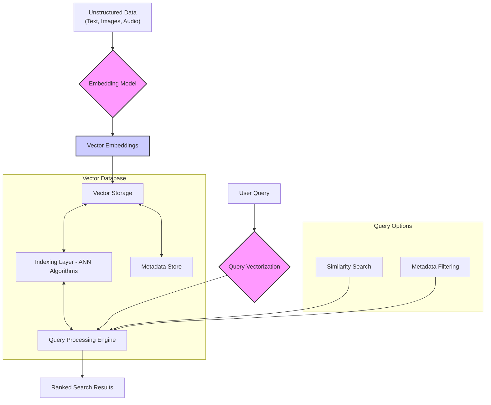
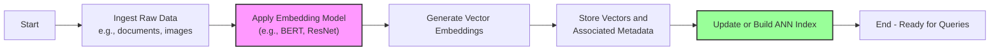
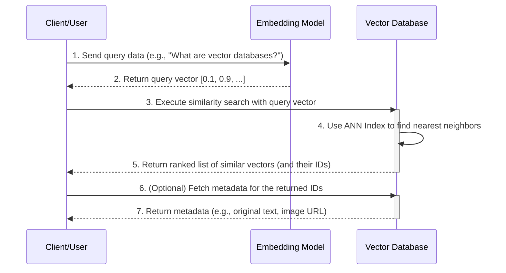

### High-Level Architecture of a Vector Database

```mermaid
graph TD
    subgraph "Vector Database"
        A[Vector Storage]
        B[Indexing Layer - ANN Algorithms]
        C[Query Processing Engine]
        D[Metadata Store]
    end

    E["Unstructured Data <br/>(Text, Images, Audio)"] --> F{Embedding Model};
    F --> G[Vector Embeddings];
    G --> A;
    A <--> B;
    B <--> C;
    A <--> D;

    H[User Query] --> I{Query Vectorization};
    I --> C;
    C --> J[Ranked Search Results];

    subgraph "Query Options"
        K[Similarity Search]
        L[Metadata Filtering]
    end

    K --> C;
    L --> C;


    style F fill:#f9f,stroke:#333,stroke-width:2px
    style G fill:#ccf,stroke:#333,stroke-width:2px
    style I fill:#f9f,stroke:#333,stroke-width:2px
```

### The Data Ingestion and Indexing Pipeline

```mermaid
graph LR
    A[Start] --> B["Ingest Raw Data <br/> e.g., documents, images"];
    B --> C["Apply Embedding Model <br/> (e.g., BERT, ResNet)"];
    C --> D[Generate Vector Embeddings];
    D --> E["Store Vectors and <br/> Associated Metadata"];
    E --> F[Update or Build ANN Index];
    F --> G[End - Ready for Queries];

    style C fill:#f9f,stroke:#333,stroke-width:2px
    style F fill:#9f9,stroke:#333,stroke-width:2px
```

### Similarity Search Query Process

```mermaid
sequenceDiagram
    participant Client as Client/User
    participant EmbeddingModel as Embedding Model
    participant VectorDB as Vector Database

    Client->>EmbeddingModel: 1. Send query data (e.g., "What are vector databases?")
    EmbeddingModel-->>Client: 2. Return query vector [0.1, 0.9, ...]

    Client->>VectorDB: 3. Execute similarity search with query vector
    activate VectorDB
    VectorDB->>VectorDB: 4. Use ANN Index to find nearest neighbors
    VectorDB-->>Client: 5. Return ranked list of similar vectors (and their IDs)
    deactivate VectorDB

    Client->>VectorDB: 6. (Optional) Fetch metadata for the returned IDs
    activate VectorDB
    VectorDB-->>Client: 7. Return metadata (e.g., original text, image URL)
    deactivate VectorDB
```

ANN: Approximate Nearest Neighbor
