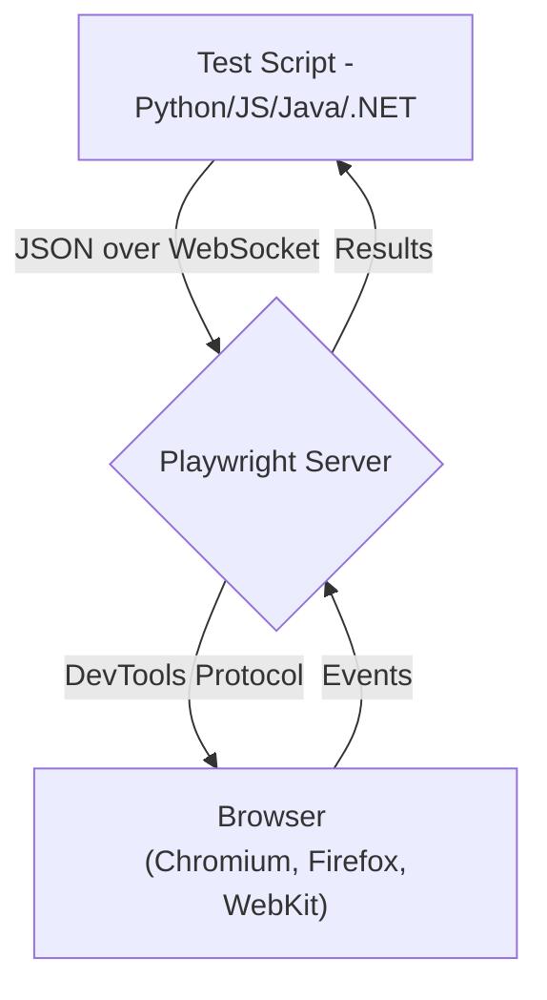
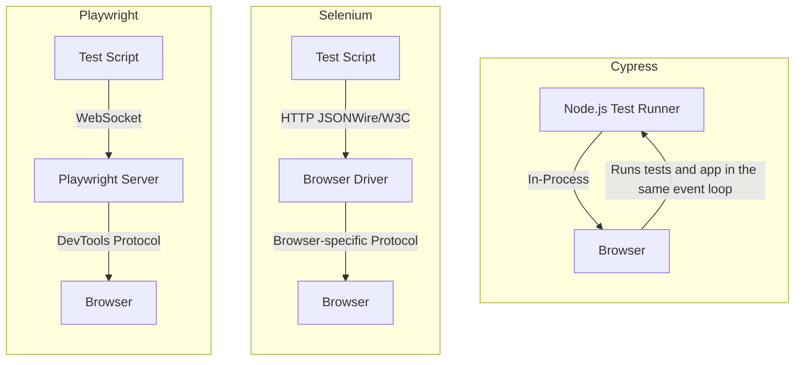
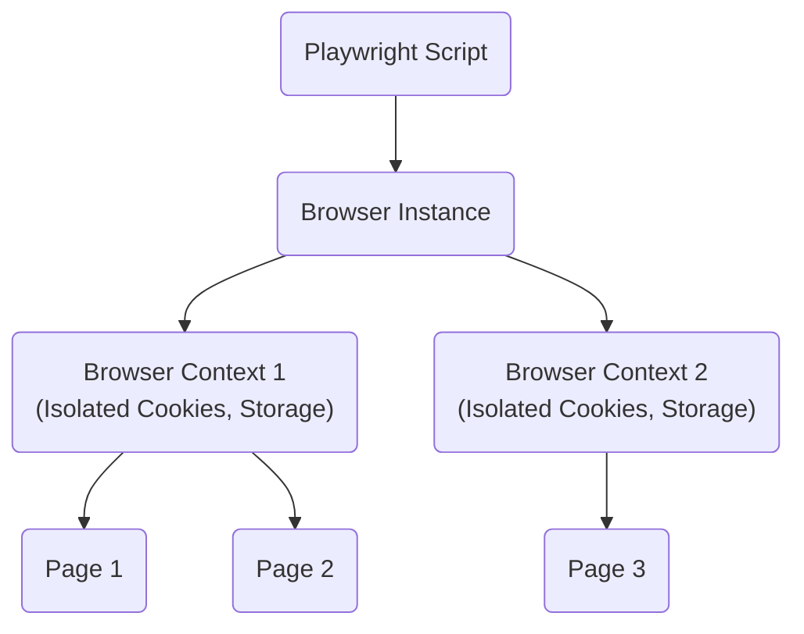
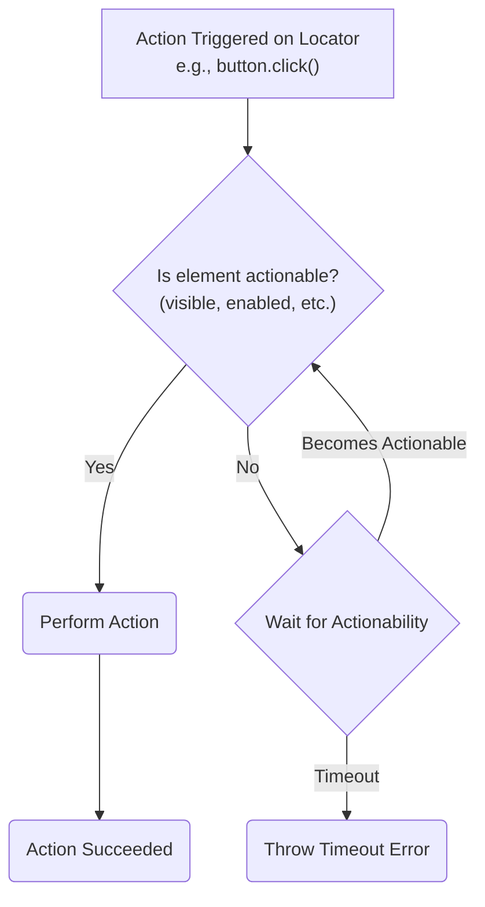
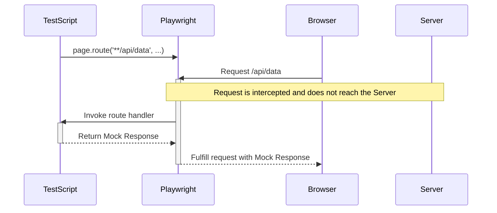

### Playwright's Core Architecture

### Architectural Comparison: Playwright vs. Selenium vs. Cypress

### Playwright's Browser Context Isolation

### Playwright's Locator Auto-Waiting Mechanism

### Playwright's Network Interception

