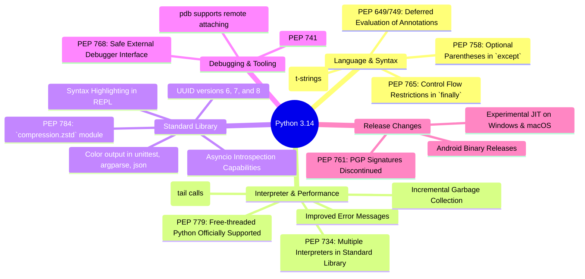
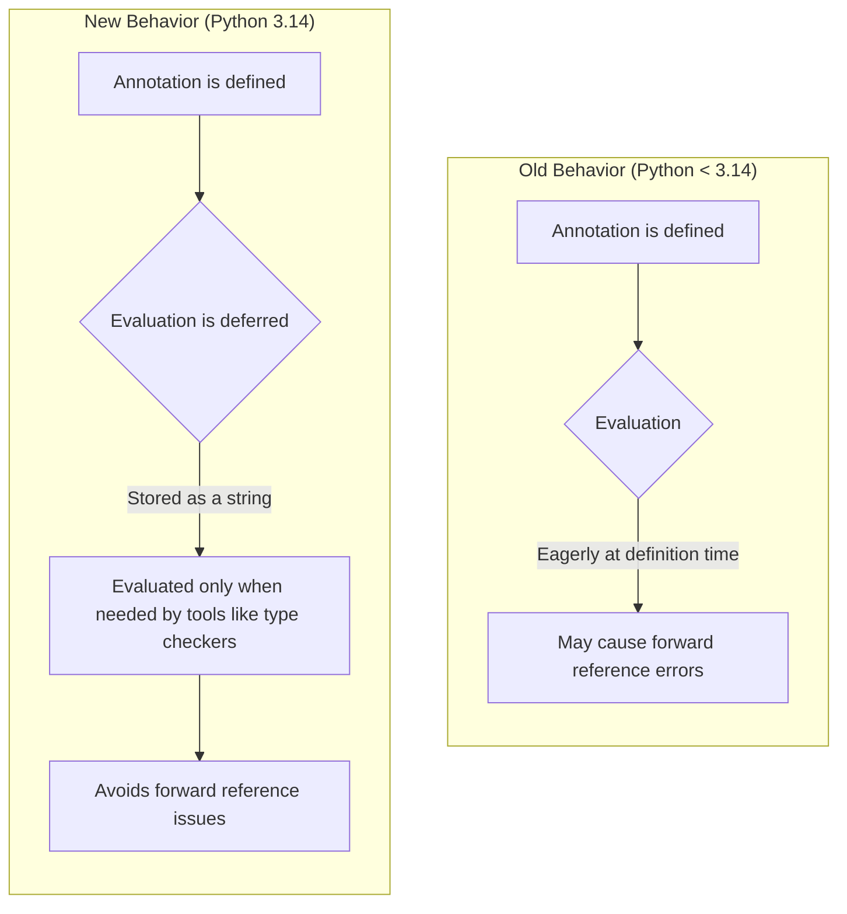
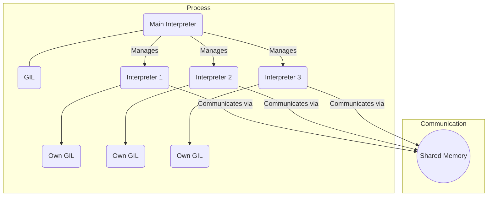
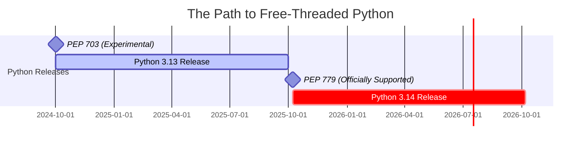
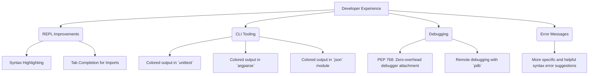

### Overview of Python 3.14 Major Features

### Deferred Evaluation of Annotations (PEP 649 & PEP 749)

### Multiple Interpreters in the Standard Library (PEP 734)

### The Road to a GIL-less Python

### Enhanced Developer Experience

