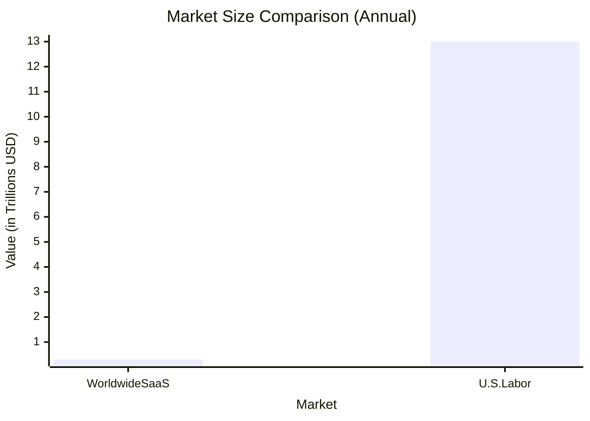
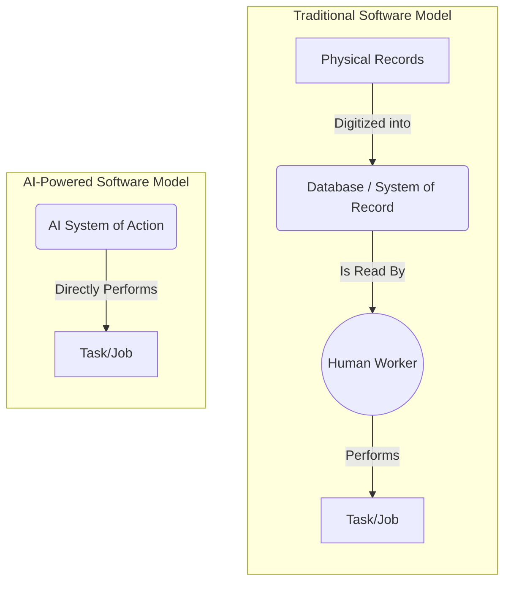
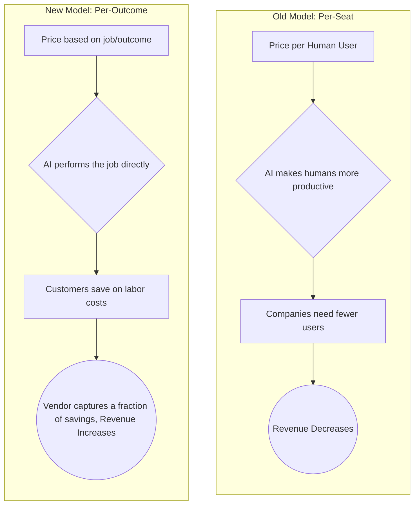
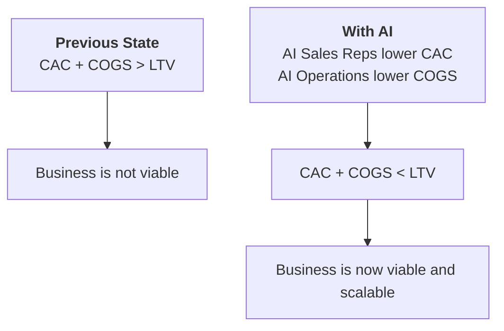

### Market Size: Labor vs. Software

### The Evolution of Software's Role

### The New Economic Formula: "Software Eats Labor"

### Changing the Software Business Model

### How AI Expands the Addressable Market

- CAC: Customer Acquisition Cost
- COGS: Cost of Goods Sold
- LTV: Lifetime Value

Sources:

- [Software is Eating Labor](https://www.youtube.com/watch?v=dhyhR4Bzc0I&t=2s)
