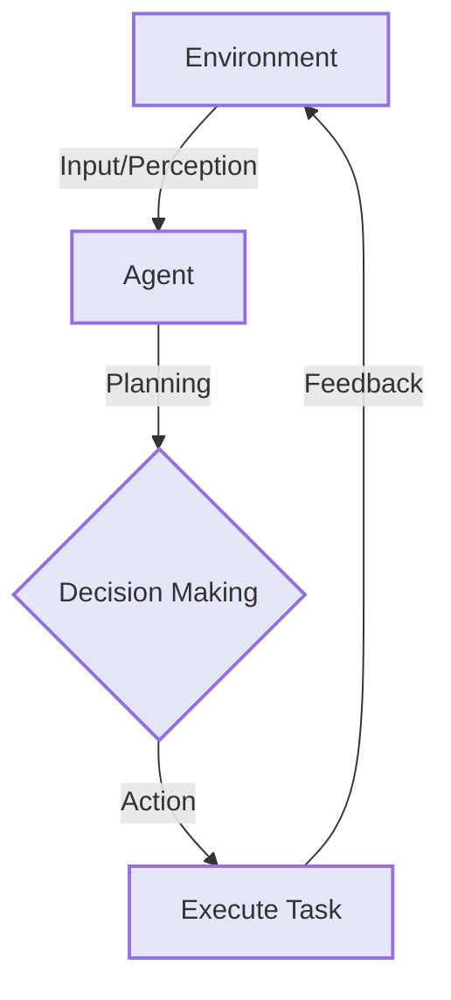
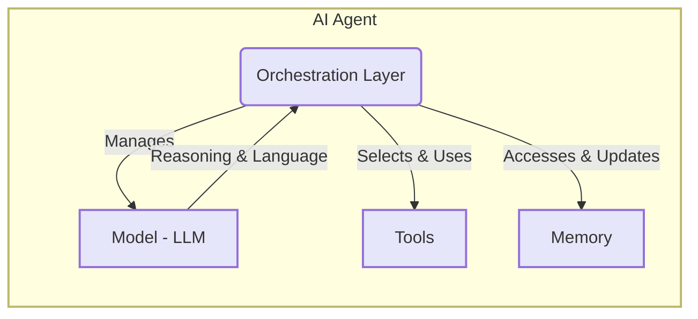

### AI Agent: Perceive-Plan-Act Loop

```mermaid
graph TD
    %% Define a style class for the nodes
    classDef purpleNodes fill:#E6E6FA,stroke:#9370DB,stroke-width:2px;

    %% The diagram definition
    Environment -- Input/Perception --> Agent;
    Agent -- Planning --> DecisionMaking{Decision Making};
    DecisionMaking -- Action --> ExecuteTask[Execute Task];
    ExecuteTask -- Feedback --> Environment;

    %% Apply the style class to all nodes
    class Environment,Agent,DecisionMaking,ExecuteTask purpleNodes;
```

### Core Components of an AI Agent

```mermaid
graph TD
    %% Define a style class for the purple nodes
    classDef purpleNodes fill:#E6E6FA,stroke:#9370DB,stroke-width:2px;

    %% The diagram definition within a subgraph
    subgraph AIAgent[AI Agent]
        direction TB
        Orchestration(Orchestration Layer)
        Model[Model - LLM]
        Tools[Tools]
        Memory[Memory]
    end

    %% Define the relationships with labels
    Orchestration -- Manages --> Model;
    Orchestration -- Selects & Uses --> Tools;
    Orchestration -- Accesses & Updates --> Memory;
    Model -- Reasoning & Language --> Orchestration;

    %% Apply the style class to the nodes
    class Orchestration,Model,Tools,Memory purpleNodes;
    
    %% Style the subgraph itself
    style AIAgent fill:#FFFFE0,stroke:#BDB76B,stroke-width:2px
```
