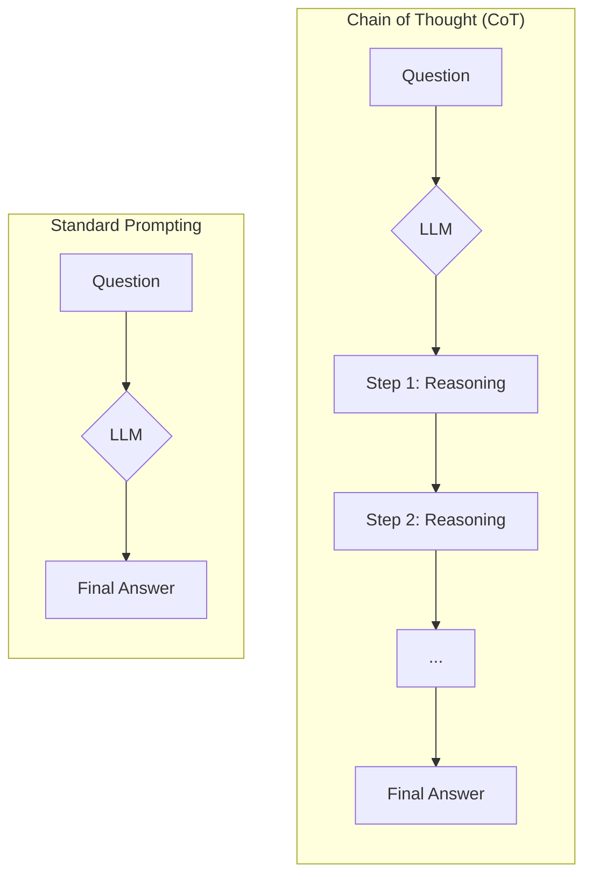
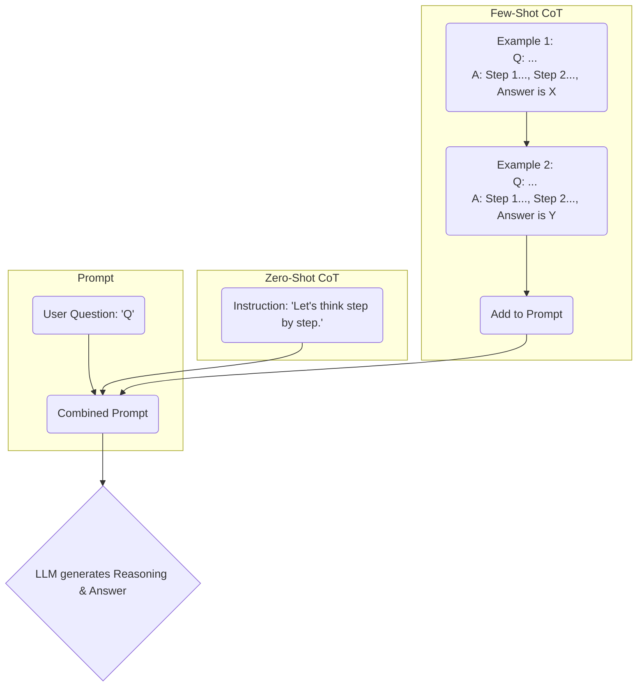
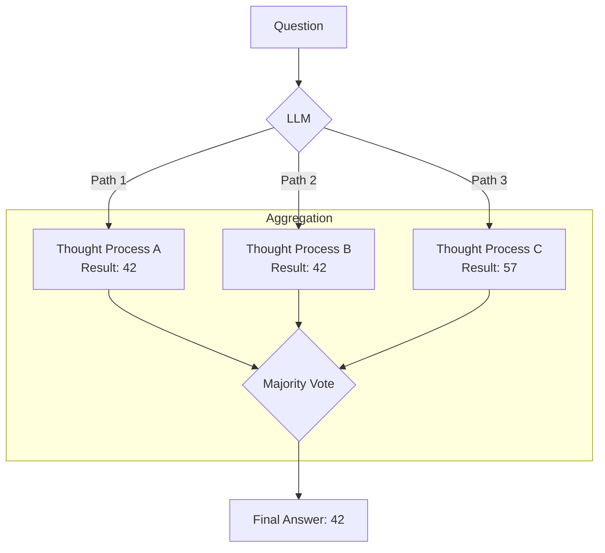
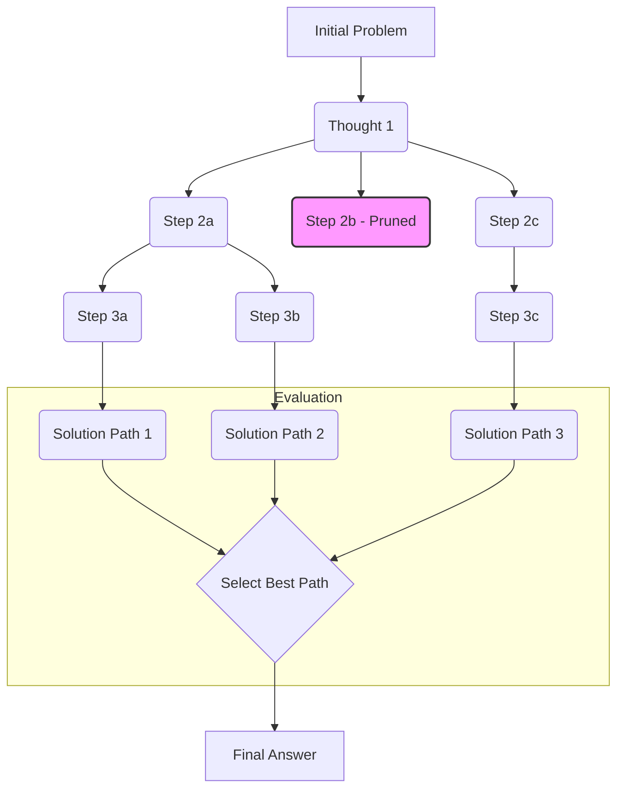

### 1. Standard Prompting vs. Chain of Thought (CoT)

```mermaid
graph TD
    subgraph "Chain of Thought (CoT)"
        direction TB
        A[Question] --> B{LLM}
        B --> C[Step 1: Reasoning]
        C --> D[Step 2: Reasoning]
        D --> E[...]
        E --> F[Final Answer]
    end

    subgraph Standard Prompting
        direction TB
        G[Question] --> H{LLM}
        H --> I[Final Answer]
    end
```

### 2. Zero-Shot vs. Few-Shot CoT

```mermaid
flowchart TD
    subgraph Prompt
        A("User Question: 'Q'")
        A --> B("Combined Prompt")
    end

    subgraph Zero-Shot CoT
        C("Instruction: 'Let's think step by step.'")
        C --> B
    end
    
    subgraph Few-Shot CoT
        D("Example 1: <br>Q: ... <br>A: Step 1..., Step 2..., Answer is X")
        E("Example 2: <br>Q: ... <br>A: Step 1..., Step 2..., Answer is Y")
        D --> E --> F("Add to Prompt")
        F --> B
    end

    B --> G{LLM generates Reasoning & Answer}
```

### 3. Self-Consistency with CoT

```mermaid
graph TD
    A[Question] --> B{LLM};
    B -- "Path 1" --> C["Thought Process A<br>Result: 42"];
    B -- "Path 2" --> D["Thought Process B<br>Result: 42"];
    B -- "Path 3" --> E["Thought Process C<br>Result: 57"];
    
    subgraph Aggregation
        C --> F{Majority Vote};
        D --> F;
        E --> F;
    end

    F --> G[Final Answer: 42];
```

### 4. Tree of Thoughts (ToT)

```mermaid
graph TD
    A[Initial Problem] --> B(Thought 1);
    B --> C(Step 2a);
    B --> D(Step 2b - Pruned);
    B --> E(Step 2c);
    
    style D fill:#f9f,stroke:#333,stroke-width:2px;
    
    C --> F(Step 3a);
    %% The image shows Step 2a branching to both 3a and 3b
    C --> G(Step 3b);
    E --> H(Step 3c);
    
    subgraph Evaluation
        I(Solution Path 1)
        J(Solution Path 2)
        K(Solution Path 3)
        L{Select Best Path}
        
        I --> L;
        J --> L;
        K --> L;
    end
    
    %% Connect the steps from outside the subgraph to the nodes inside it
    F --> I;
    G --> J;
    H --> K;
    
    L --> M[Final Answer];
```
