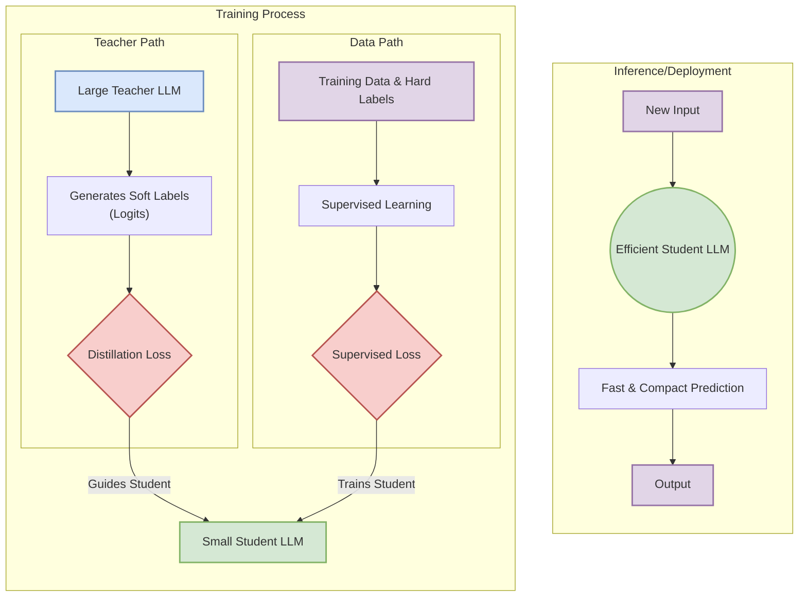
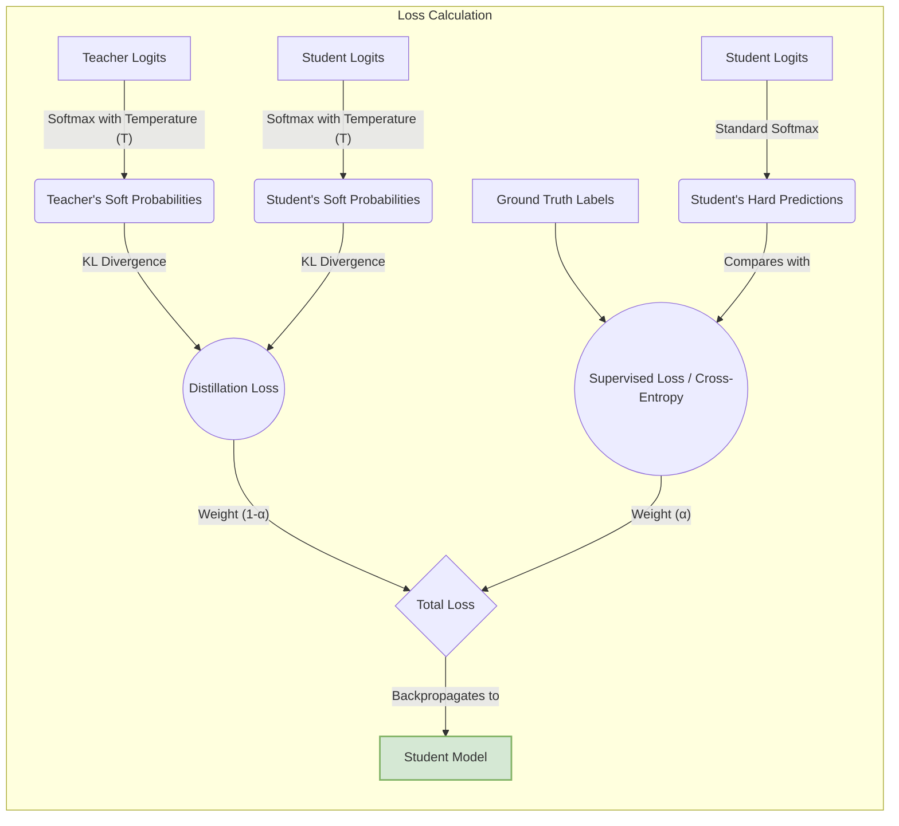
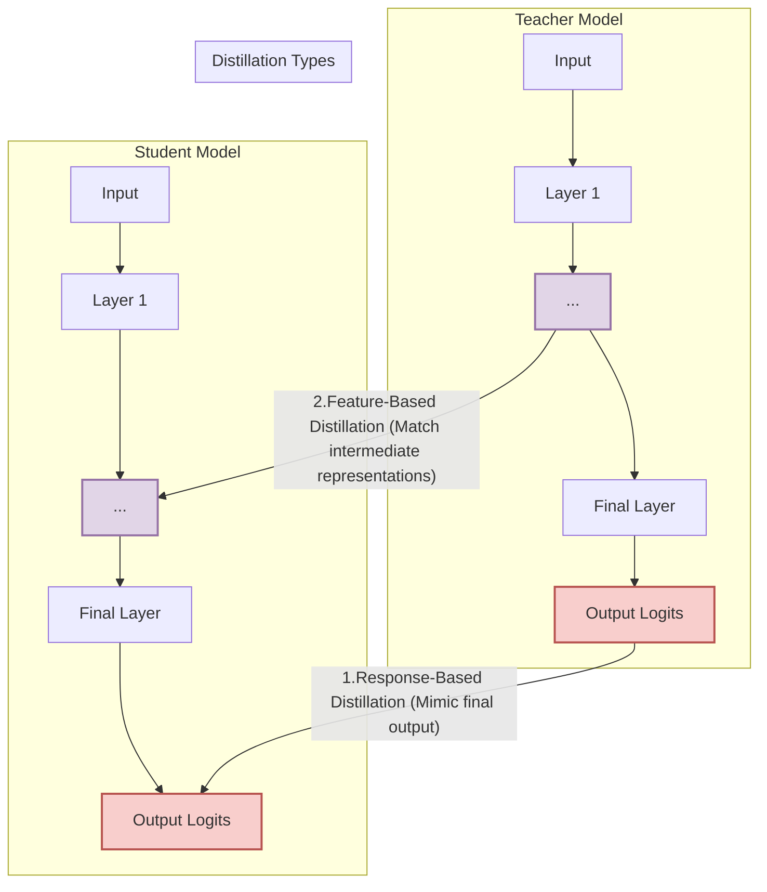
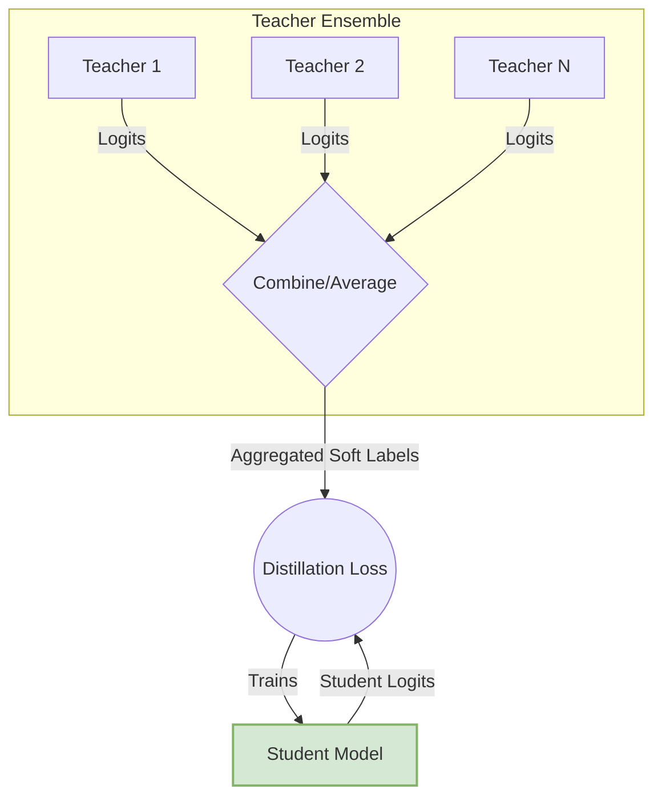
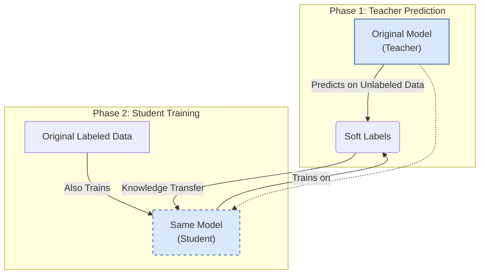

### 1. The Core Teacher-Student Paradigm

### 2. The Distillation Loss Function

### 3. Comparison of Distillation Techniques

### 4. Advanced Distillation Strategies

#### Multi-Teacher Distillation

#### Self-Distillation

