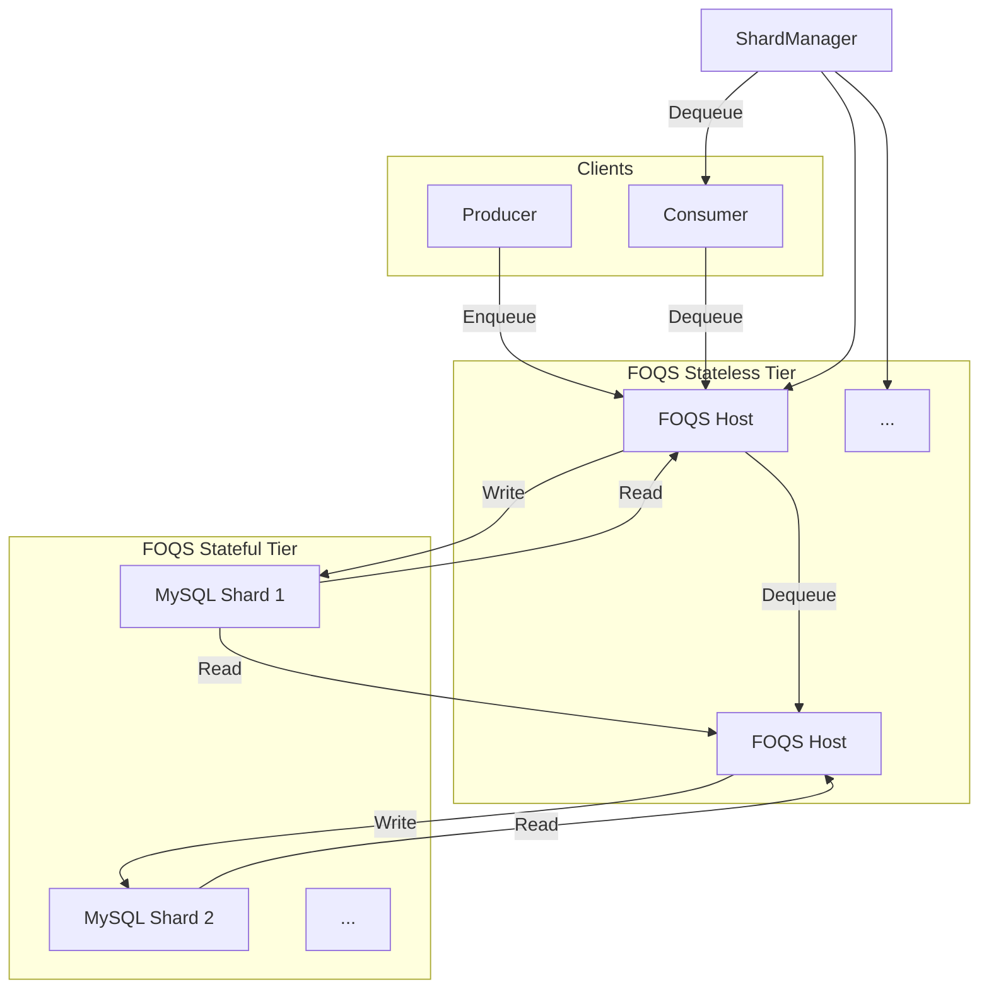
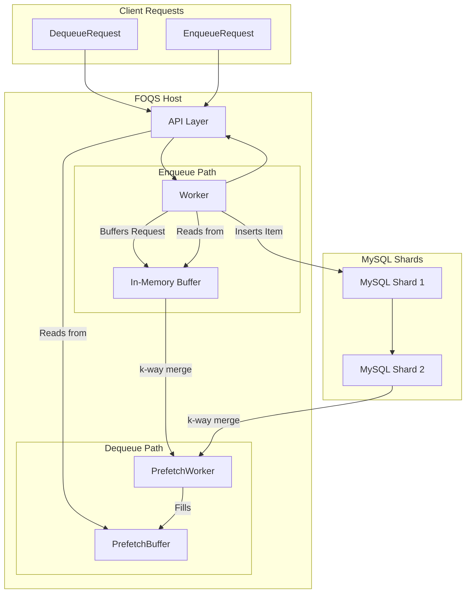
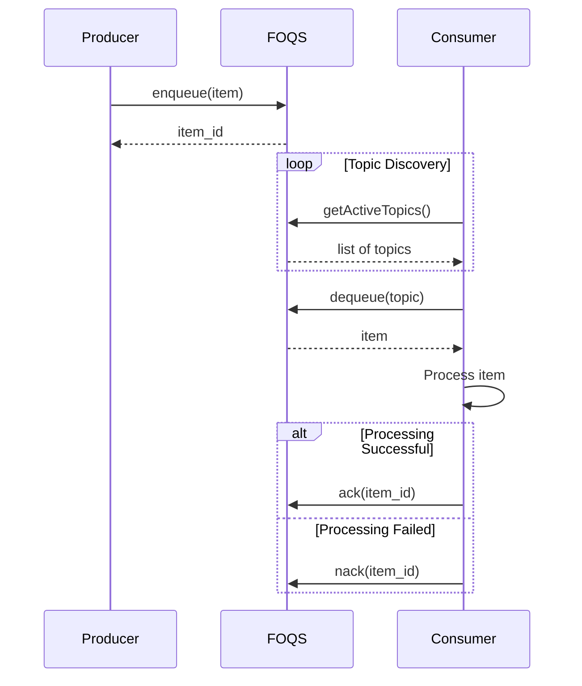

### High-Level FOQS Architecture

### Single Host Architecture for Enqueue and Dequeue

### Client Interaction Sequence Diagram

Sources:

- [FOQS: Scaling a distributed priority queue](https://engineering.fb.com/2021/02/22/production-engineering/foqs-scaling-a-distributed-priority-queue/)
