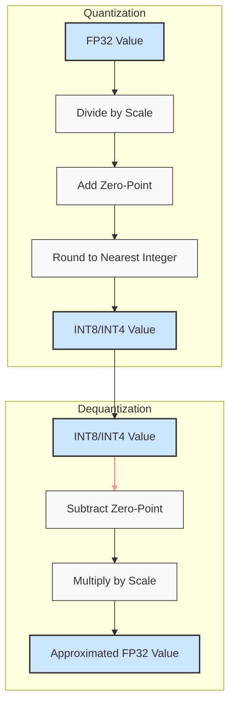
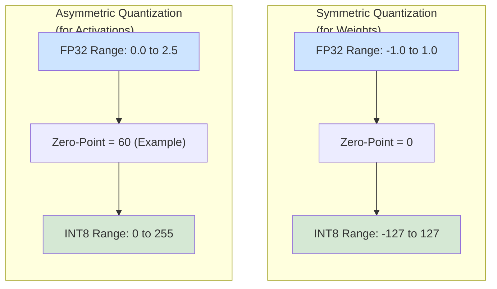
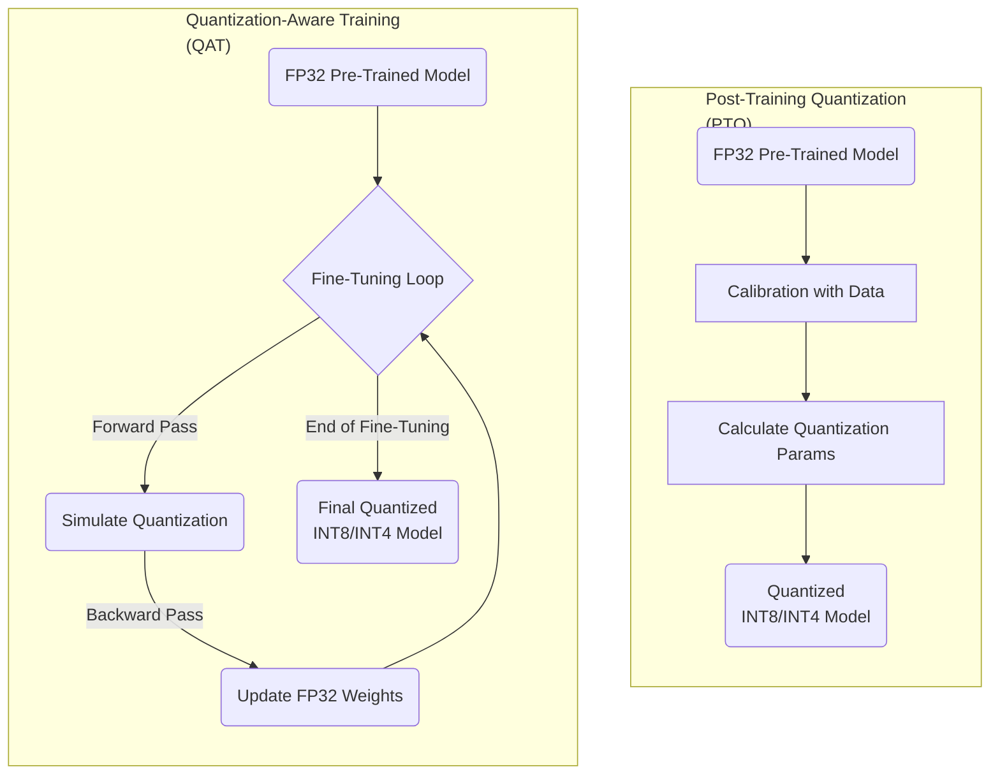
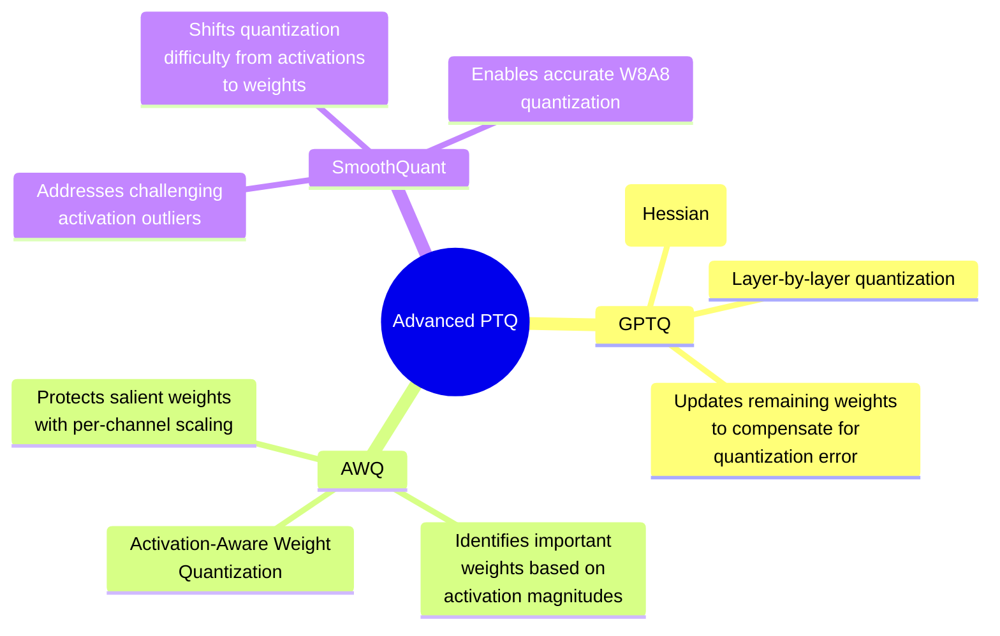
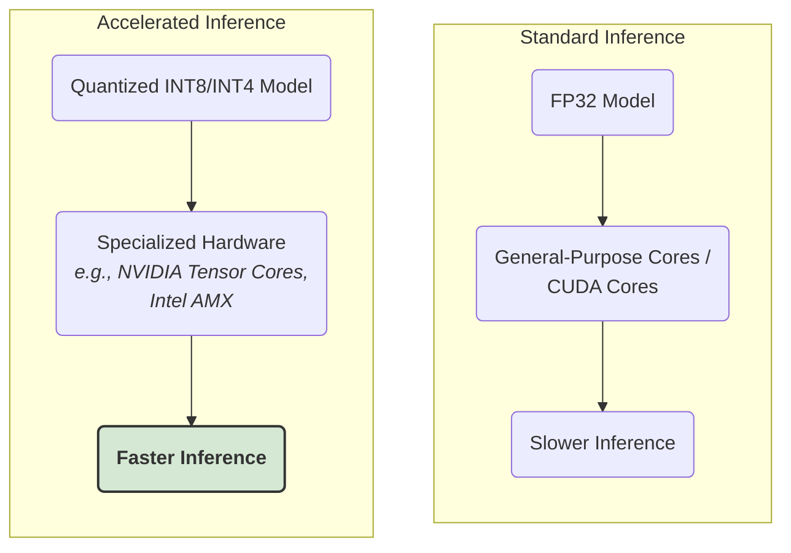

### 1. The Core Quantization and Dequantization Process

### 2. Symmetric vs. Asymmetric Quantization

### 3. Comparison of Quantization Strategies: PTQ vs. QAT

### 4. Overview of Advanced PTQ Techniques

### 5. Hardware Acceleration for Quantized Models

