### 1. The Core Reinforcement Learning Loop

### 2. Markov Decision Process (MDP)

### 3. Taxonomy of RL Algorithms

### 4. Actor-Critic Architecture

```mermaid
graph LR

    %% 1. Define subgraphs and their contents
    subgraph sg_interaction [Interaction]
        Environment
    end

    subgraph sg_agent [Agent]
        %% No internal direction needed; it will inherit LR
        Critic("Critic<br>Value Function Q or V")
        Actor("Actor<br>Policy π")
    end

    %% 2. Define all connections between components
    Environment -- State --> Actor
    Actor -- Action --> Environment
    Environment -- "State, Reward" --> Critic
    Critic -- "TD Error / Advantage" --> Actor

    %% 3. Define and apply styling for the subgraphs
    classDef pinkBox fill:#fce8f5,stroke:#333,stroke-width:2px;
    classDef yellowBox fill:#ffffe0,stroke:#a8a8a8,stroke-width:1px;
    
    class sg_agent pinkBox;
    class sg_interaction yellowBox;
```

### 5. Deep Q-Network (DQN) Architecture

- DDPG: Deep Deterministic Policy Gradient
- TRPO: Trust Region Policy Optimization
- PPO: Proximal Policy Optimization
- TD Error: Temporal Difference Error
- DQN: Deep Q-Network
