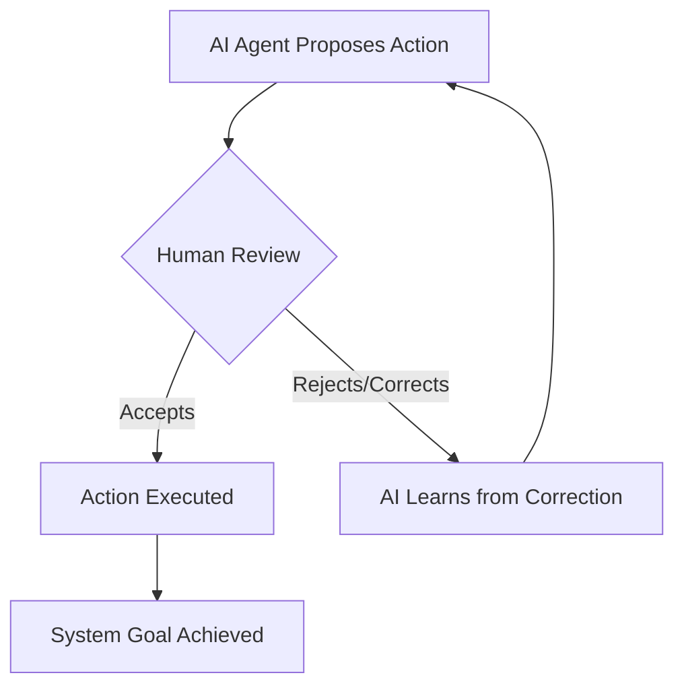
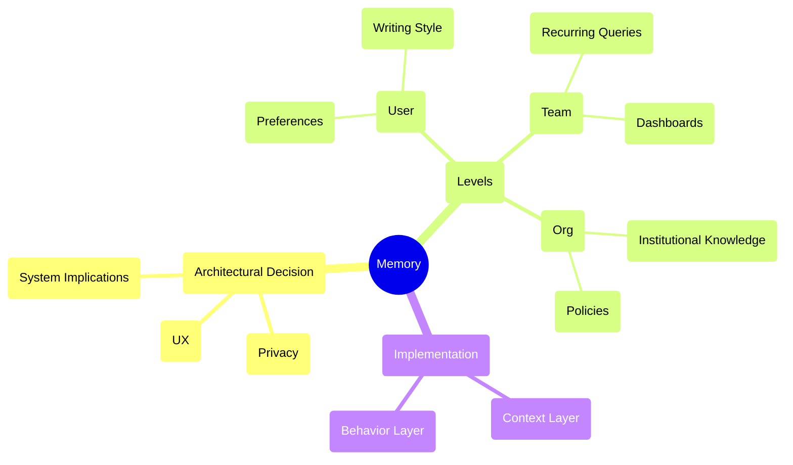
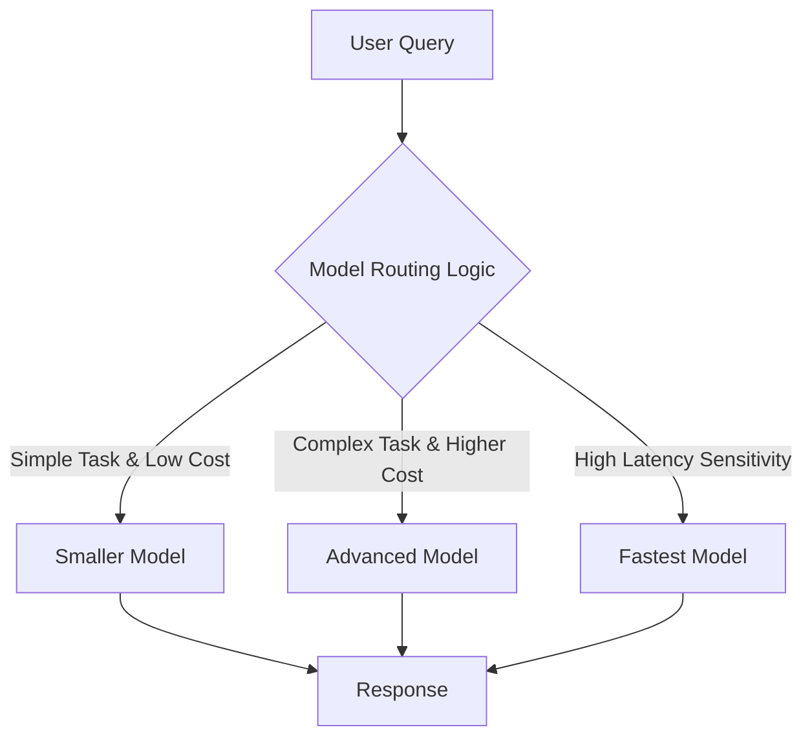
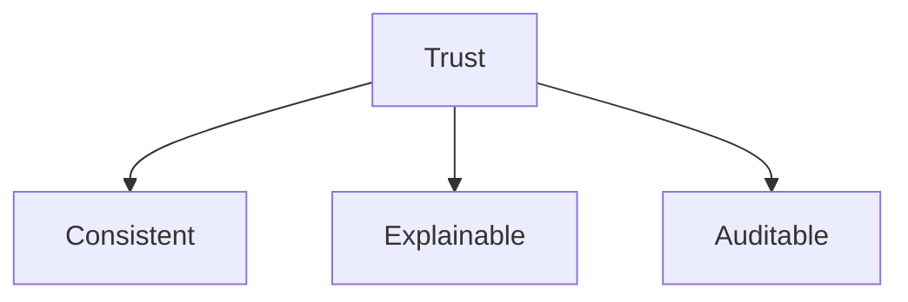

### 1. Human-in-the-Loop Design

### 2. Memory as an Architectural Decision

*   **User level:** Preferences like chart types, writing tone.
*   **Team level:** Recurring queries, dashboards.
*   **Org level:** Institutional knowledge and policies.

### 3. Multi-Model Inference and Orchestration

### 4. The Importance of Trust

Sources:

- [What Makes 5% of AI Agents Actually Work in Production?](https://www.motivenotes.ai/p/what-makes-5-of-ai-agents-actually)
