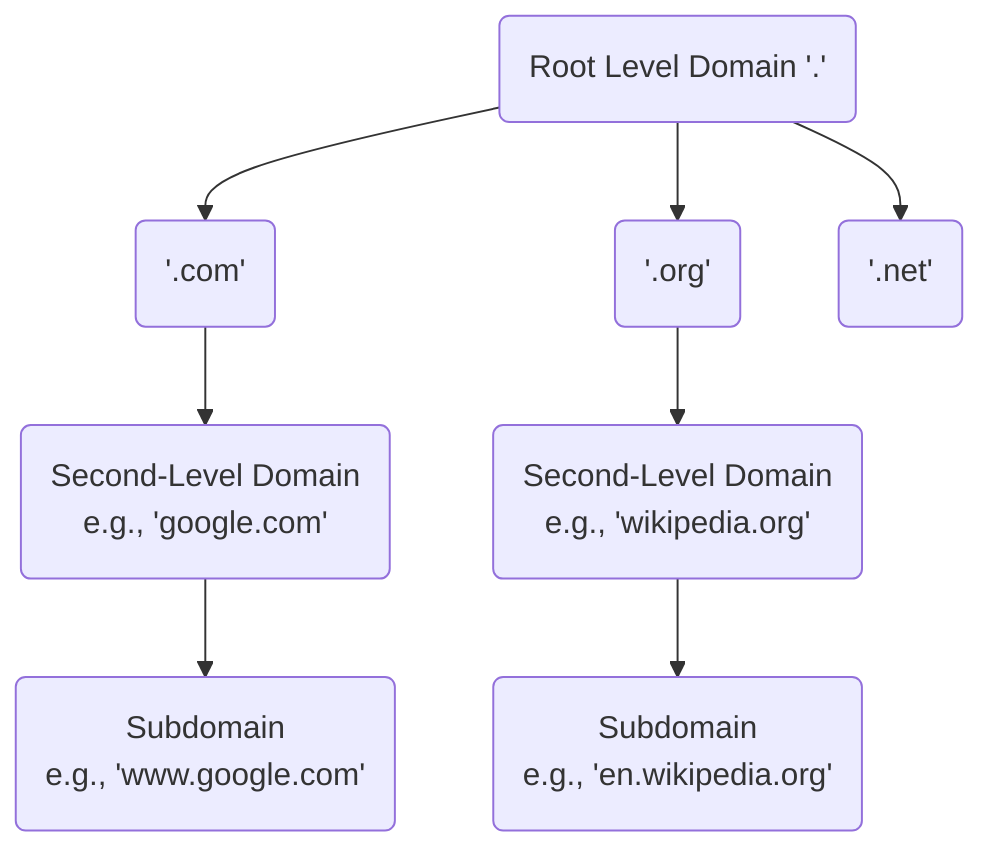
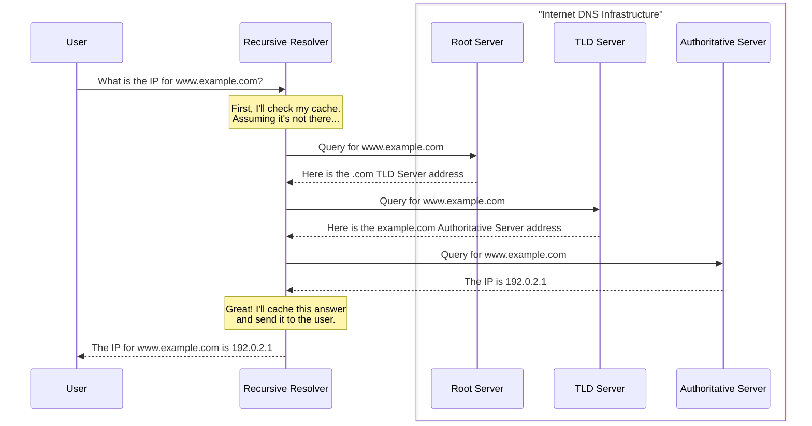
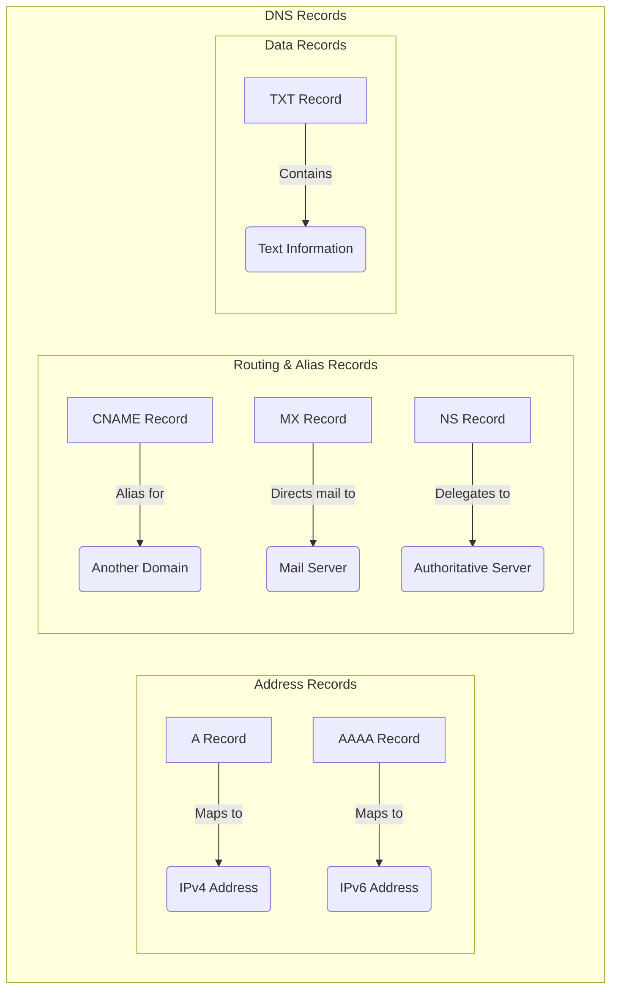
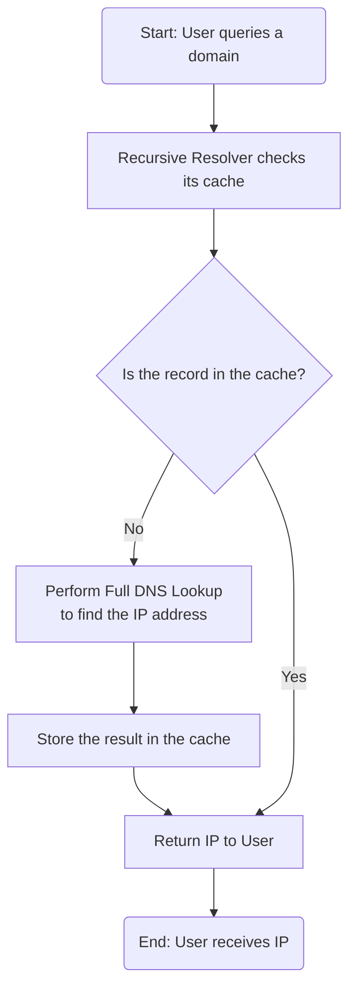
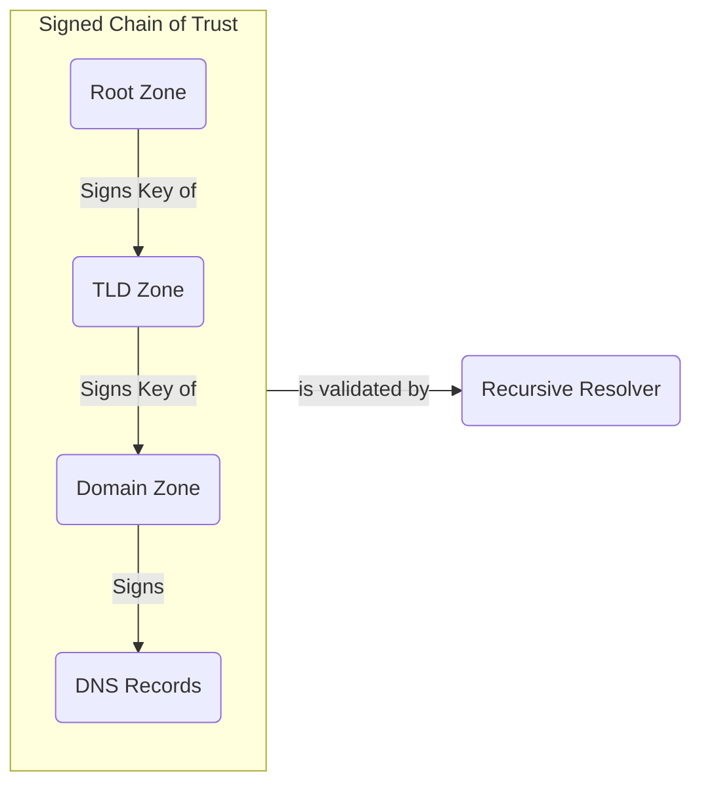

### DNS Hierarchy

```mermaid
graph TD
    A(Root Level Domain '.') --> B('.com');
    A --> C('.org');
    A --> D('.net');

    B --> E(Second-Level Domain<br>e.g., 'google.com');
    E --> F(Subdomain<br>e.g., 'www.google.com');

    C --> G(Second-Level Domain<br>e.g., 'wikipedia.org');
    G --> H(Subdomain<br>e.g., 'en.wikipedia.org');
```

### DNS Query Path

```mermaid
sequenceDiagram
    participant User
    participant RecursiveResolver as Recursive Resolver
    
    box "Internet DNS Infrastructure"
        participant RootServer as Root Server
        participant TLDServer as TLD Server
        participant AuthoritativeServer as Authoritative Server
    end

    User->>RecursiveResolver: What is the IP for www.example.com?
    
    note over RecursiveResolver: First, I'll check my cache.<br/>Assuming it's not there...

    RecursiveResolver->>RootServer: Query for www.example.com
    RootServer-->>RecursiveResolver: Here is the .com TLD Server address
    RecursiveResolver->>TLDServer: Query for www.example.com
    TLDServer-->>RecursiveResolver: Here is the example.com Authoritative Server address
    RecursiveResolver->>AuthoritativeServer: Query for www.example.com
    AuthoritativeServer-->>RecursiveResolver: The IP is 192.0.2.1

    note over RecursiveResolver: Great! I'll cache this answer<br/>and send it to the user.

    RecursiveResolver-->>User: The IP for www.example.com is 192.0.2.1
```

### Common DNS Record Types

```mermaid
graph TD
    subgraph "DNS Records"
        direction LR
        subgraph "Address Records"
            direction TB
            A[A Record] -->|Maps to| B(IPv4 Address);
            C[AAAA Record] -->|Maps to| D(IPv6 Address);
        end

        subgraph "Routing & Alias Records"
            direction TB
            E[CNAME Record] -->|Alias for| F(Another Domain);
            G[MX Record] -->|Directs mail to| H(Mail Server);
            I[NS Record] -->|Delegates to| J(Authoritative Server);
        end

        subgraph "Data Records"
            direction TB
            K[TXT Record] -->|Contains| L(Text Information);
        end
    end
```

### DNS Caching

```mermaid
flowchart TD
    A(Start: User queries a domain) --> B[Recursive Resolver checks its cache];
    B --> C{Is the record in the cache?};
    C -- No --> D[Perform Full DNS Lookup<br>to find the IP address];
    D --> E[Store the result in the cache];
    E --> F[Return IP to User];
    C -- Yes --> F;
    F --> G(End: User receives IP);
```

### DNSSEC Chain of Trust

```mermaid
graph LR
    subgraph sg [Signed Chain of Trust]
        direction TB
        A(Root Zone) -- Signs Key of --> B(TLD Zone);
        B -- Signs Key of --> C(Domain Zone);
        C -- Signs --> D(DNS Records);
    end

    E(Recursive Resolver);

    sg -- is validated by --> E;
```

- TLD: Top-Level Domain
- SLD: Second-Level Domain
