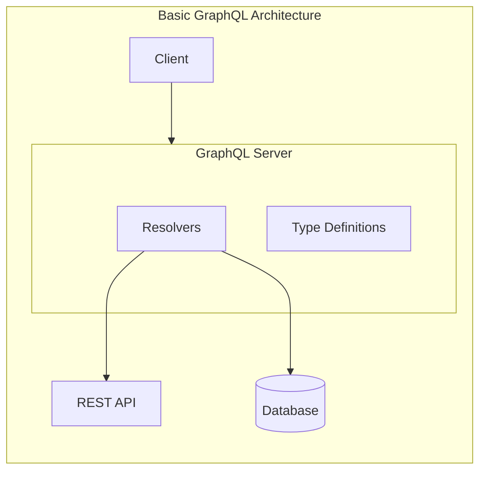
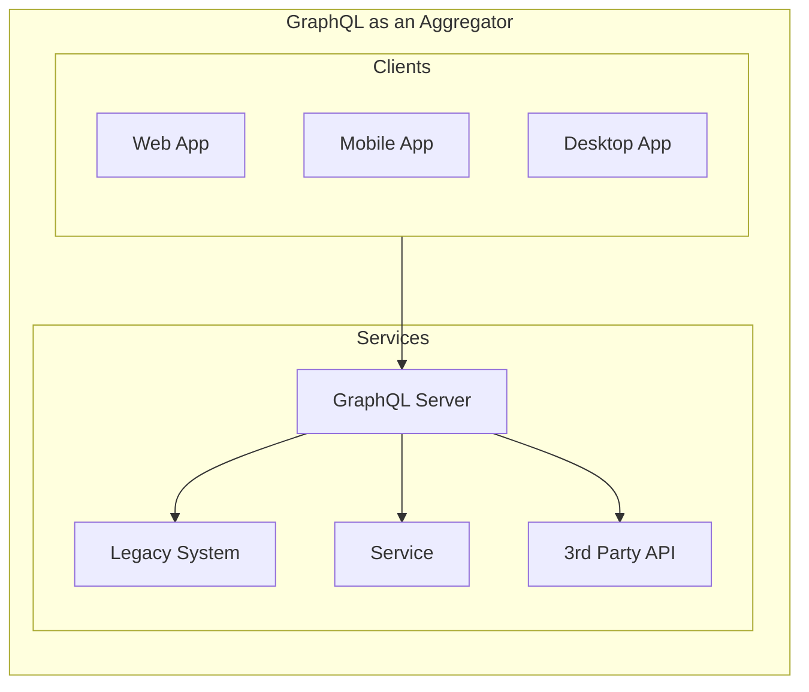
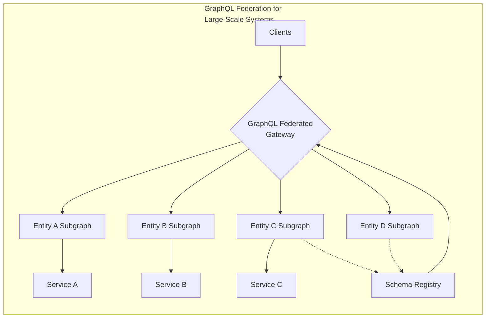

### Basic GraphQL Architecture

```mermaid
graph TD
    subgraph Basic GraphQL Architecture
        direction TB
        Client --> GraphQL_Server
        
        subgraph GraphQL_Server [GraphQL Server]
            direction TB
            
            subgraph Components [ ]
                direction LR
                R[Resolvers]
                TD[Type Definitions]
            end
        end

        R --> REST[REST API]
        R --> DB[(Database)]
    end
    
    style Components fill:none,stroke:none
```

### GraphQL as an Aggregator

```mermaid
graph TD
    subgraph GraphQL as an Aggregator
        direction TB
        subgraph Clients
            direction TB
            WebApp[Web App]
            MobileApp[Mobile App]
            DesktopApp[Desktop App]
        end

        subgraph Services
            direction TB
            GraphQL_Server[GraphQL Server]
            Legacy[Legacy System]
            Svc[Service]
            API[3rd Party API]
            
            GraphQL_Server --> Legacy
            GraphQL_Server --> Svc
            GraphQL_Server --> API
        end

        Clients --> GraphQL_Server
    end
```

### GraphQL Federation for Large-Scale Systems

```mermaid
graph TD
    subgraph "GraphQL Federation for <br/>Large-Scale Systems"
        direction TB
        Clients --> Gateway{"GraphQL Federated <br/>Gateway"}
        
        Gateway --> SubA["Entity A Subgraph"]
        Gateway --> SubB["Entity B Subgraph"]
        Gateway --> SubC["Entity C Subgraph"]
        Gateway --> SubD["Entity D Subgraph"]

        SubA --> SvcA["Service A"]
        SubB --> SvcB["Service B"]
        SubC --> SvcC["Service C"]

        %% Schema Registry Interactions
        Registry["Schema Registry"] --> Gateway
        SubC -.-> Registry
        SubD -.-> Registry
    end
```
