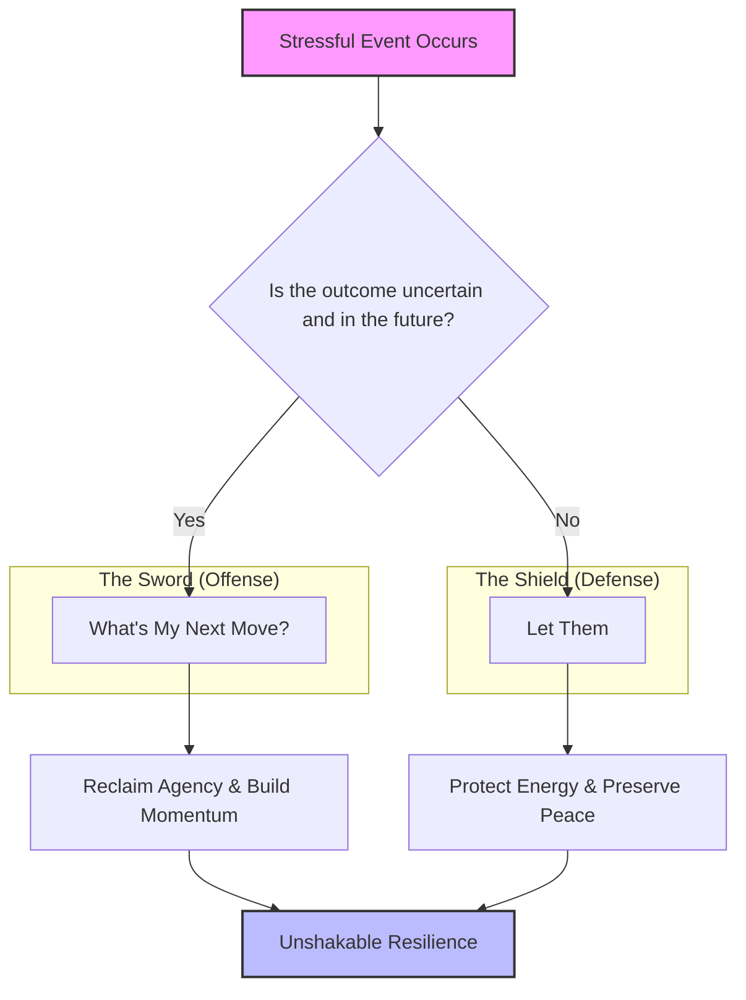
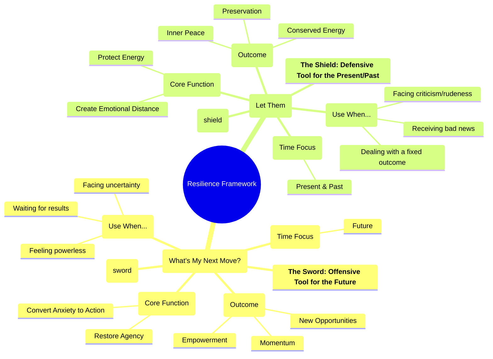

In our lives, we face two distinct types of stressful situations: the anxious waiting for an uncertain future and the sharp pain of a difficult present reality. To handle both, we need more than a single mantra; we need a complete mental framework.

This guide outlines a powerful two-part system designed to give us the right tool for the right challenge. It combines an **offensive** tool to reclaim control of our future and a **defensive** tool to protect our peace in the present.

---

### Step 1: Identify the Challenge with The Decision Flowchart

When a stressful event occurs, our first step is to diagnose the situation. Are we dealing with an unknown future or a known present? This flowchart is our in-the-moment guide to choosing the correct tool.

---

### Step 2: Understand and Apply The Tools

Once we've identified the nature of our challenge, we can apply the specific tool designed for it. This mind map provides a complete overview of each tool's function, purpose, and outcome.

#### **The Sword: "What's My Next Move?"**

This is our offensive tool for confronting the anxiety of an **unknown future**. Anxiety thrives on a feeling of powerlessness. This mantra shatters that feeling by immediately reframing us as a strategist in control. It turns passive waiting into active preparation.

*   **How to Use It:** The moment we feel the stress of waiting, ask ourselves firmly: **"What's my next move?"** Then, immediately take a small, productive action. Implement a new project, learn a new skill for 15 minutes, or go for a walk. This channels nervous energy into forward momentum.
*   **The Result:** Empowerment. We build a safety net of new opportunities, making the outcome we're waiting for less critical to our success and well-being.

#### **The Shield: "Let Them"**

This is our defensive tool for protecting our energy from a **fixed present or past reality**. When something bad has happened or someone is behaving poorly, resistance is a waste of energy. This mantra is not about approval; it's a strategic decision to conserve our inner peace.

*   **How to Use It:** When we receive bad news or face negativity, create emotional distance by telling ourselves, **"Let them."** Let him make that decision. Let her shout. Let him be rude. Let she think that way. Let them do whatever they want. We are not condoning the behavior; we are simply refusing to let it poison our own mind.
*   **The Result:** Preservation. We stop the event from inflicting a "second wound" of pointless rumination and anger. We save our most valuable resource—our energy—for what truly matters.

### The System in Action

Imagine we're waiting for a promotion decision.

1.  **The Waiting Period (The Future):** We're anxious. We use our sword: **"What's my next move?"** We spend the week updating our portfolio and networking.
2.  **The Bad News (The Present):** We don't get the promotion. It hurts. We raise our shield: **"Let them choose someone else."** We refuse to waste energy on bitterness.
3.  **The Re-engagement:** Because our shield preserved our energy, we are now clear-headed and ready to pick up our sword again. We ask, **"What's my next move?"** And we already have the answer—we use the portfolio we built and the connections we made to find our next opportunity.

By mastering this two-part system, we ensure that we are never truly powerless. We are either actively shaping our future or wisely protecting our present. That is the foundation of unshakable resilience.
