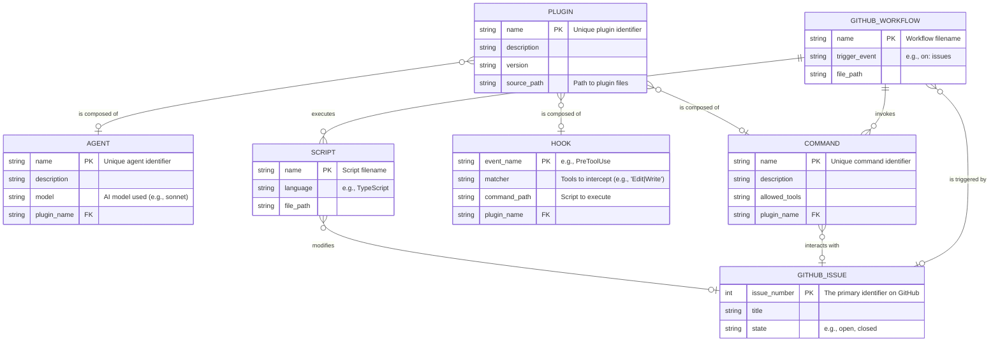

### Entity Relationship Diagram

### Component Diagram

### Sequence Diagram: Build a Feature from a Description

### Sequence Diagram: Debug and Fix an Issue

### Sequence Diagram for Issue Dedupe Workflow

### Sequence Diagram for PreToolUse Hook

### Sequence Diagram for PR Review Workflow

### Sequence Diagram for Auto-Close Workflow

```mermaid
sequenceDiagram
    participant Scheduler
    participant WorkflowRunner as GitHub Workflow Runner
    participant AutoCloseScript as auto-close-duplicates.ts
    participant GitHubAPI as GitHub API

    Scheduler->>WorkflowRunner: Trigger workflow (daily at 9 AM)
    activate WorkflowRunner

    WorkflowRunner->>AutoCloseScript: Executes the script
    activate AutoCloseScript

    loop For each open issue
        AutoCloseScript->>GitHubAPI: 1. Fetch comments for an issue
        activate GitHubAPI
        GitHubAPI-->>AutoCloseScript: Returns comments
        deactivate GitHubAPI

        AutoCloseScript->>AutoCloseScript: 2. Check for "duplicate" bot comment older than 3 days
        AutoCloseScript->>AutoCloseScript: 3. Check for new comments or '👎' reactions

        opt Conditions met (stale duplicate)
            AutoCloseScript->>GitHubAPI: 4. Close issue as duplicate
            activate GitHubAPI
            GitHubAPI-->>AutoCloseScript: Success
            deactivate GitHubAPI
        end
    end

    deactivate AutoCloseScript
    deactivate WorkflowRunner
```

### C4 System Context Diagram

### State Machine Diagram for the Interactive CLI

### Activity Diagram for Plugin Loading & Command Dispatch

### Deployment Diagram

### Data Flow Diagram

Sources:

- [https://github.com/anthropics/claude-code](https://github.com/anthropics/claude-code)
