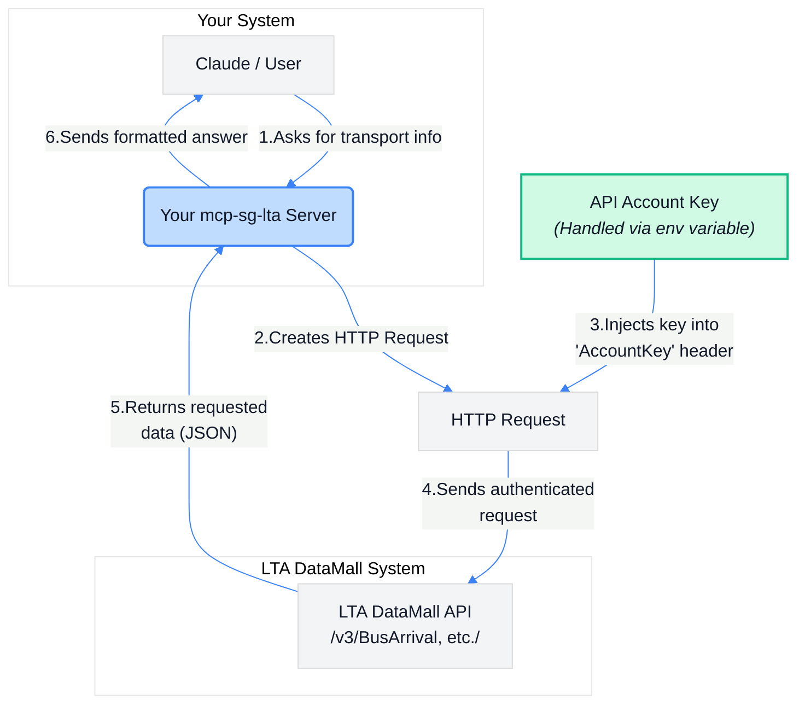
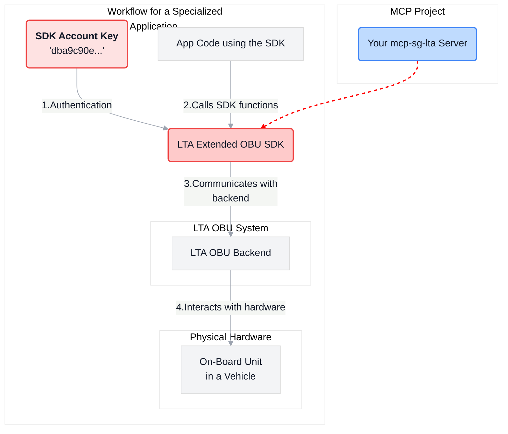

### LTA API Account Key Usage

```mermaid
%%{ init: { 'theme': 'base', 'themeVariables': { 'primaryColor': '#f3f4f6', 'primaryTextColor': '#111827', 'lineColor': '#3b82f6', 'textColor': '#1f2937'}}}%%
graph TD
    subgraph Your System
        A[Claude / User] -- 1.Asks for transport info --> B("Your mcp-sg-lta Server")
    end

    subgraph LTA DataMall System
        D[LTA DataMall API<br>/v3/BusArrival, etc./]
    end

    C["API Account Key<br><i>(Handled via env variable)</i>"]

    B -- 2.Creates HTTP Request --> E[HTTP Request]
    C -- 3.Injects key into<br>'AccountKey' header --> E
    E -- 4.Sends authenticated<br>request --> D
    D -- 5.Returns requested<br>data (JSON) --> B
    B -- 6.Sends formatted answer --> A

    style B fill:#bfdbfe,stroke:#3b82f6,stroke-width:2px
    style C fill:#d1fae5,stroke:#10b981,stroke-width:2px
```

### SDK Account Key Usage

```mermaid
%%{ init: { 'theme': 'base', 'themeVariables': { 'primaryColor': '#f3f4f6', 'primaryTextColor': '#111827', 'lineColor': '#9ca3af', 'textColor': '#1f2937'}}}%%
graph TD
    subgraph "Workflow for a Specialized<br>SDK Application"
        direction LR
        H(<b>SDK Account Key</b><br>'dba9c90e...')
        F[App Code using the SDK]
        
        subgraph LTA OBU System
            I[LTA OBU Backend]
        end
        
        G(LTA Extended OBU SDK)
        
        subgraph Physical Hardware
            J[On-Board Unit<br>in a Vehicle]
        end

        H -- "1.Authentication" --> G
        F -- "2.Calls SDK functions" --> G
        G -- "3.Communicates with<br>backend" --> I
        I -- "4.Interacts with hardware" --> J
    end

    subgraph "MCP Project"
        direction LR
        K(Your mcp-sg-lta Server)
    end
    
    %% This makes the dotted line more prominent
    K -.-> G
    linkStyle 4 stroke:red,stroke-width:2px,stroke-dasharray: 5 5;

    style G fill:#fecaca,stroke:#ef4444,stroke-width:2px
    style H fill:#fee2e2,stroke:#ef4444,stroke-width:2px
    style K fill:#bfdbfe,stroke:#3b82f6,stroke-width:2px
```
