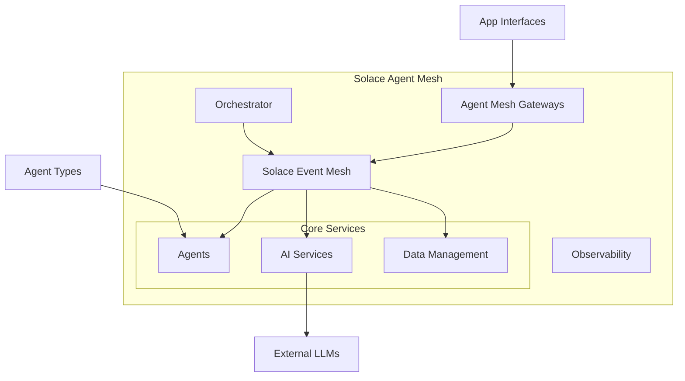
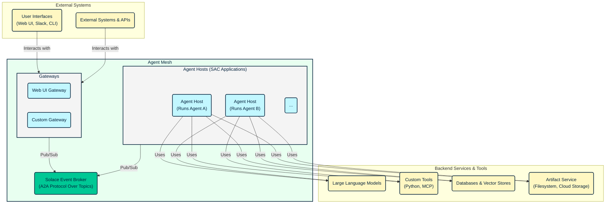
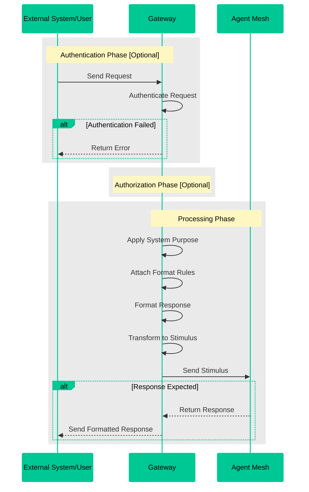
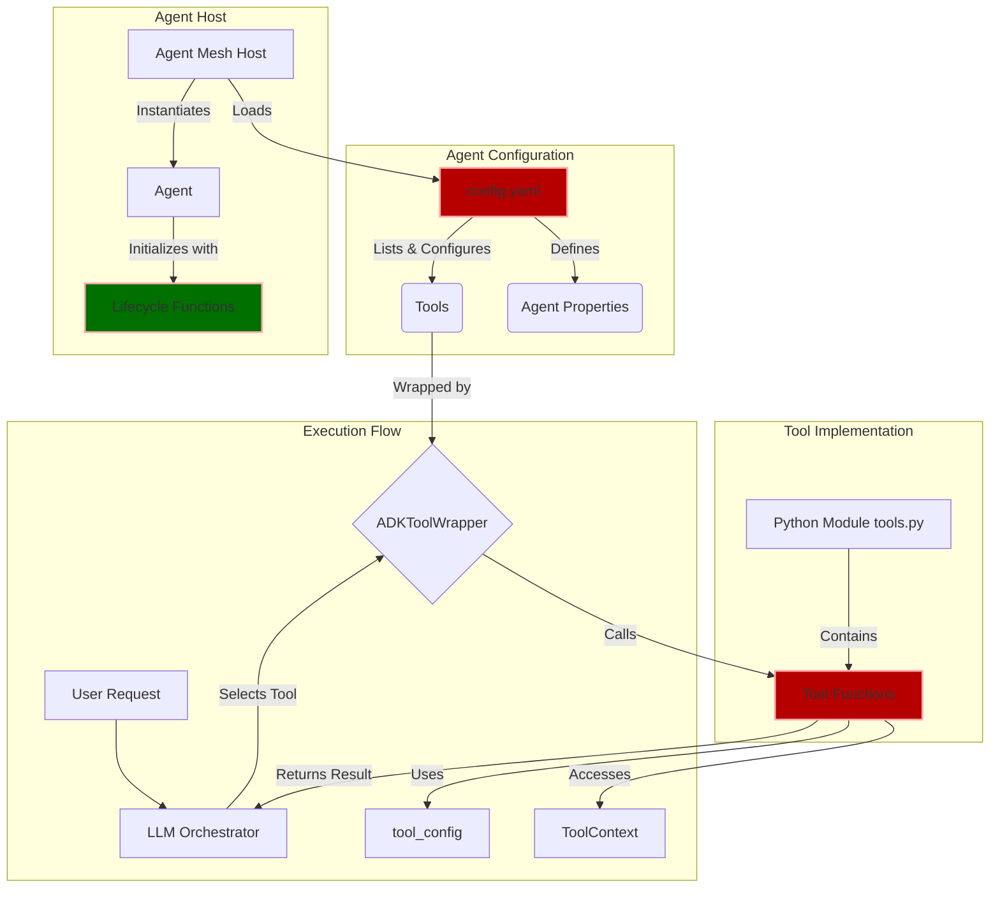

### What is Solace Agent Mesh?

```mermaid
graph TD
    App_Interfaces["App Interfaces"]
    Agent_Types["Agent Types"]
    External_LLMs["External LLMs"]

    subgraph "Solace Agent Mesh"
        Agent_Mesh_Gateways["Agent Mesh Gateways"]
        Orchestrator
        Solace_Event_Mesh["Solace Event Mesh"]
        
        subgraph "Core Services"
            Agents
            AI_Services["AI Services"]
            Data_Management["Data Management"]
        end

        Observability
    end

    App_Interfaces --> Agent_Mesh_Gateways
    Agent_Mesh_Gateways --> Solace_Event_Mesh
    Orchestrator --> Solace_Event_Mesh
    Solace_Event_Mesh --> Agents
    Solace_Event_Mesh --> AI_Services
    Solace_Event_Mesh --> Data_Management
    
    Agent_Types --> Agents
    AI_Services --> External_LLMs
```

### System Components

```mermaid
graph TB
    subgraph External Systems
        direction TB
        UserInterfaces("User Interfaces<br/>(Web UI, Slack, CLI)")
        APIs("External Systems & APIs")
    end

    subgraph SolaceAgentMesh ["Agent Mesh"]
        direction TB
        subgraph Gateways
            WebUIGateway("Web UI Gateway")
            CustomGateway("Custom Gateway")
        end

        Broker("Solace Event Broker<br/>(A2A Protocol Over Topics)")

        subgraph AgentHosts ["Agent Hosts (SAC Applications)"]
            AgentHost1("Agent Host<br/>(Runs Agent A)")
            AgentHost2("Agent Host<br/>(Runs Agent B)")
            AgentHostN("...")
        end
    end

    subgraph BackendServices [Backend Services & Tools]
        direction TB
        LLM("Large Language Models")
        CustomTools("Custom Tools<br/>(Python, MCP)")
        DataStores("Databases & Vector Stores")
        ArtifactService("Artifact Service<br/>(Filesystem, Cloud Storage)")
    end

    %% Connections
    UserInterfaces -- Interacts with --> Gateways
    APIs -- Interacts with --> Gateways

    Gateways -- Pub/Sub --> Broker
    AgentHosts -- Pub/Sub --> Broker

    AgentHost1 -- Uses --> LLM
    AgentHost1 -- Uses --> CustomTools
    AgentHost1 -- Uses --> DataStores
    AgentHost1 -- Uses --> ArtifactService

    AgentHost2 -- Uses --> LLM
    AgentHost2 -- Uses --> CustomTools
    AgentHost2 -- Uses --> DataStores
    AgentHost2 -- Uses --> ArtifactService


    %% Styling
    classDef externalBoxes fill:#FFF7C2,stroke:#03213B,stroke-width:2px,color:#03213B;
    classDef gatewayContainer fill:#F4F4F4,stroke:#03213B,stroke-width:2px,color:#03213B;
    classDef gatewayBoxes fill:#C2F7FF,stroke:#03213B,stroke-width:2px,color:#03213B;
    classDef mesh fill:#E8FFF0,stroke:#03213B,stroke-width:2px,color:#03213B;
    classDef broker fill:#00C895,stroke:#03213B,stroke-width:2px,color:#03213B;
    classDef agentContainer fill:#F4F4F4,stroke:#03213B,stroke-width:2px,color:#03213B;
    classDef agentBoxes fill:#C2F7FF,stroke:#03213B,stroke-width:2px,color:#03213B;
    classDef serviceBoxes fill:#FFF7C2,stroke:#03213B,stroke-width:2px,color:#03213B

    class UserInterfaces,APIs externalBoxes;
    class WebUIGateway,CustomGateway gatewayBoxes;
    class Gateways gatewayContainer;
    class Broker broker;
    class SolaceAgentMesh mesh;
    class AgentHosts agentContainer;
    class AgentHost1,AgentHost2,AgentHostN agentBoxes;
    class LLM,CustomTools,DataStores,ArtifactService serviceBoxes;
```

### How Gateways Work

```mermaid
sequenceDiagram
    participant External as External System/User
    participant Gateway
    participant Mesh as Agent Mesh

    rect rgba(234, 234, 234, 1)
        Note over External,Gateway: Authentication Phase [Optional]
        External->>Gateway: Send Request
        Gateway->> Gateway: Authenticate Request
        alt Authentication Failed
            Gateway-->>External: Return Error
        end
    end

    rect rgba(234, 234, 234, 1)
        Note over Gateway: Authorization Phase [Optional]
    end

    rect rgba(234, 234, 234, 1)
        Note over Gateway,Mesh: Processing Phase
        Gateway->>Gateway: Apply System Purpose
        Gateway->>Gateway: Attach Format Rules
        Gateway->>Gateway: Format Response
        Gateway->>Gateway: Transform to Stimulus
        Gateway->>Mesh: Send Stimulus

        alt Response Expected
            Mesh-->>Gateway: Return Response
            Gateway-->>External: Send Formatted Response
        end
    end

    %%{init: {
        'theme': 'base',
        'themeVariables': {
            'actorBkg': '#00C895',
            'actorBorder': '#00C895',
            'actorTextColor': '#000000',
            'noteBkgColor': '#FFF7C2',
            'noteTextColor': '#000000',
            'noteBorderColor': '#FFF7C2'
        }
    }}%%

```

### Creating Agents

```mermaid
graph TD
    subgraph Agent Configuration
        direction LR
        A[config.yaml] -->|Defines| B(Agent Properties);
        A -->|Lists & Configures| C(Tools);
    end

    subgraph Agent Host
        direction TB
        D[Agent Mesh Host] -->|Loads| A;
        D -->|Instantiates| E[Agent];
        E -->|Initializes with| F[Lifecycle Functions];
    end

    subgraph Tool Implementation
        direction LR
        G[Python Module tools.py] -->|Contains| H[Tool Functions];
    end

    subgraph Execution Flow
        direction TB
        I[User Request] --> J[LLM Orchestrator];
        J -->|Selects Tool| K{ADKToolWrapper};
        K -->|Calls| H;
        H -->|Accesses| L[ToolContext];
        H -->|Uses| M[tool_config];
        H -->|Returns Result| J;
    end

    C -->|Wrapped by| K;

    style A fill:#b60000,stroke:#faa,stroke-width:2px
    style H fill:#b60000,stroke:#faa,stroke-width:2px
    style F fill:#007000,stroke:#faa,stroke-width:2px
```
