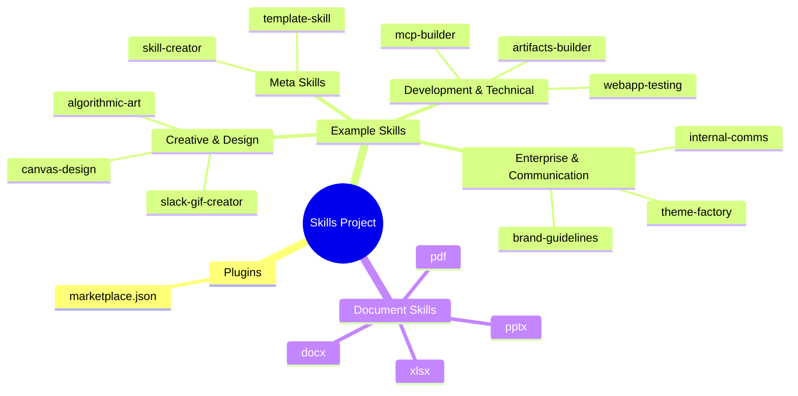
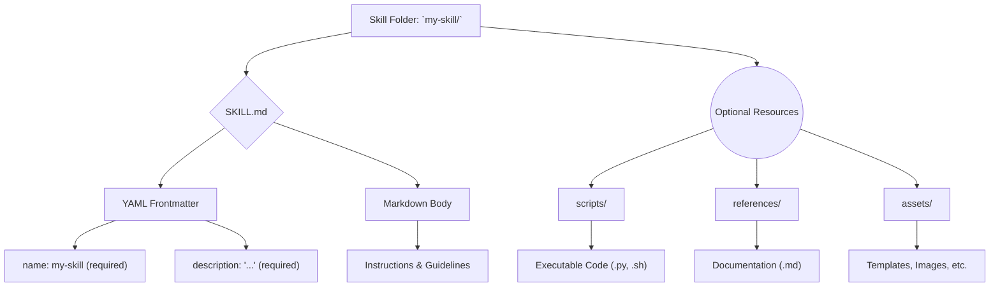
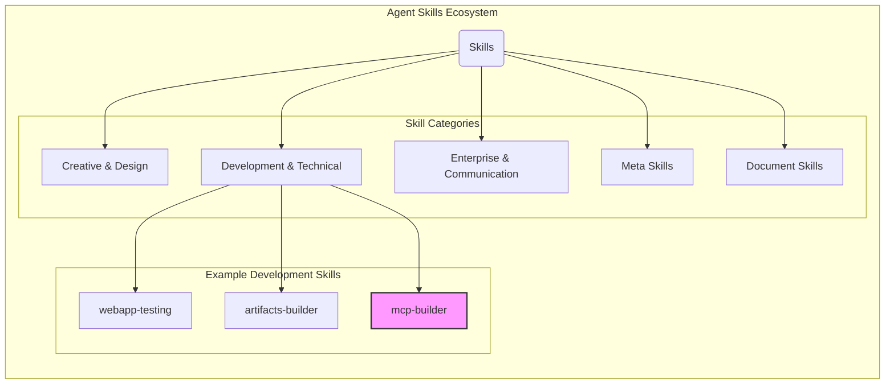
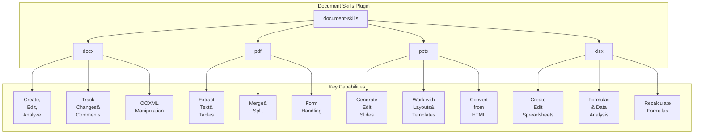

### High-Level Project Structure

```mermaid
mindmap
  root((Skills Project))
    Plugins
      marketplace.json
    Example Skills
      Creative & Design
        algorithmic-art
        canvas-design
        slack-gif-creator
      Development & Technical
        artifacts-builder
        mcp-builder
        webapp-testing
      Enterprise & Communication
        brand-guidelines
        internal-comms
        theme-factory
      Meta Skills
        skill-creator
        template-skill
    Document Skills
      docx
      pdf
      pptx
      xlsx
```

### The Anatomy of a Skill

```mermaid
graph TD
    A[Skill Folder: `my-skill/`] --> B{SKILL.md};
    B --> C[YAML Frontmatter];
    B --> D[Markdown Body];
    C --> E["name: my-skill (required)"];
    C --> F["description: '...' (required)"];
    D --> G[Instructions & Guidelines];
    A --> H((Optional Resources));
    H --> I[scripts/];
    H --> J[references/];
    H --> K[assets/];
    I --> L["Executable Code (.py, .sh)"];
    J --> M["Documentation (.md)"];
    K --> N[Templates, Images, etc.];
```

### "Skills" as a Superset of MCP

```mermaid
graph TD
    subgraph "Agent Skills Ecosystem"
        direction TB
        A(Skills)
        subgraph "Skill Categories"
            B[Creative & Design]
            C[Development & Technical]
            D[Enterprise & Communication]
            E[Meta Skills]
            F[Document Skills]
        end

        A --> B
        A --> C
        A --> D
        A --> E
        A --> F

        subgraph "Example Development Skills"
            direction TB
            C --> G[webapp-testing]
            C --> H[artifacts-builder]
            C --> I[mcp-builder]
        end
    end

    style I fill:#f9f,stroke:#333,stroke-width:2px
```

### Deep Dive into Document Skills

```mermaid
graph TD
    subgraph Document Skills Plugin
        A[document-skills] --> B[docx];
        A --> C[pdf];
        A --> D[pptx];
        A --> E[xlsx];
    end

    subgraph Key Capabilities
        B --> B1[Create,<br/>Edit,<br/>Analyze];
        B --> B2[Track<br/>Changes&<br/>Comments];
        B --> B3[OOXML<br/>Manipulation];

        C --> C1[Extract<br/>Text&<br/>Tables];
        C --> C2[Merge&<br/>Split];
        C --> C3[Form<br/>Handling];

        D --> D1[Generate<br/>Edit<br/>Slides];
        D --> D2[Work with<br/>Layouts&<br/>Templates];
        D --> D3[Convert<br/>from<br/>HTML];

        E --> E1[Create<br/>Edit<br/>Spreadsheets];
        E --> E2[Formulas<br/>& Data<br/>Analysis];
        E --> E3[Recalculate<br/>Formulas];
    end
```
