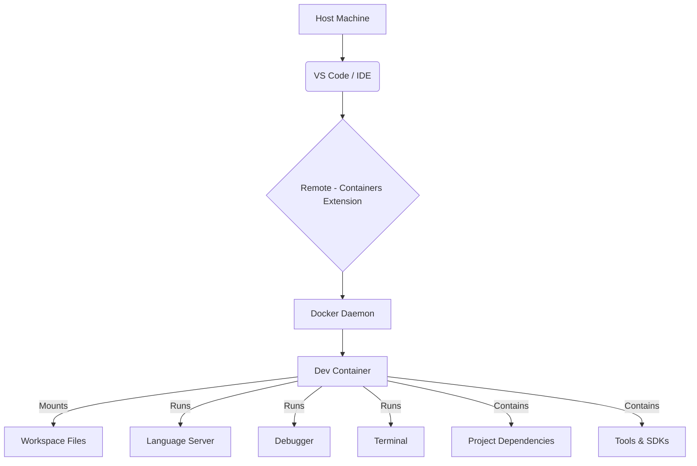
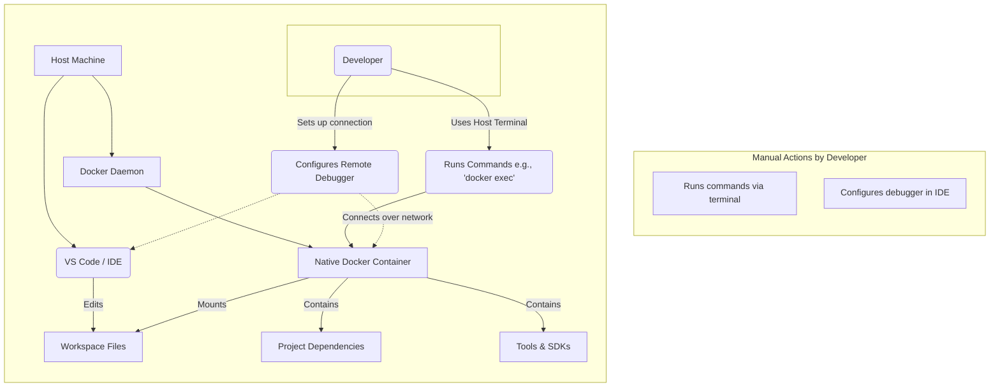

### Dev Container Setup

```mermaid
graph TD
    A[Host Machine] --> B(VS Code / IDE)
    B --> C{Remote - Containers Extension}
    C --> D[Docker Daemon]
    D --> E[Dev Container]
    E -- Mounts --> F[Workspace Files]
    E -- Runs --> G[Language Server]
    E -- Runs --> H[Debugger]
    E -- Runs --> I[Terminal]
    E -- Contains --> J[Project Dependencies]
    E -- Contains --> K[Tools & SDKs]
```

### Native Docker Setup

```mermaid
graph TD
    subgraph Legend["Manual Actions by Developer"]
        direction TB
        L1[Runs commands via terminal]
        L2[Configures debugger in IDE]
    end

    subgraph " "
        direction TB
        A[Host Machine] --> B(VS Code / IDE)
        A --> D[Docker Daemon]

        B -- Edits --> F[Workspace Files]

        D --> E[Native Docker Container]

        E -- Mounts --> F
        E -- Contains --> J[Project Dependencies]
        E -- Contains --> K[Tools & SDKs]

        subgraph " "
            direction TB
            Dev(Developer)
        end

        Dev -- "Uses Host Terminal" --> Cmd(Runs Commands e.g., 'docker exec')
        Cmd --> E

        Dev -- "Sets up connection" --> Dbg(Configures Remote Debugger)
        Dbg -.-> B
        Dbg -. "Connects over network" .-> E
    end
```
