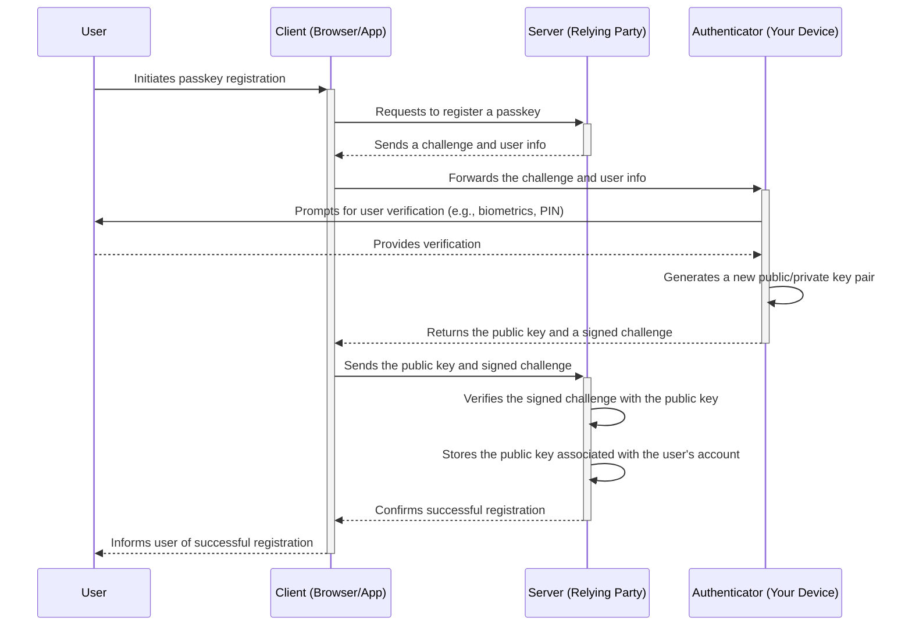
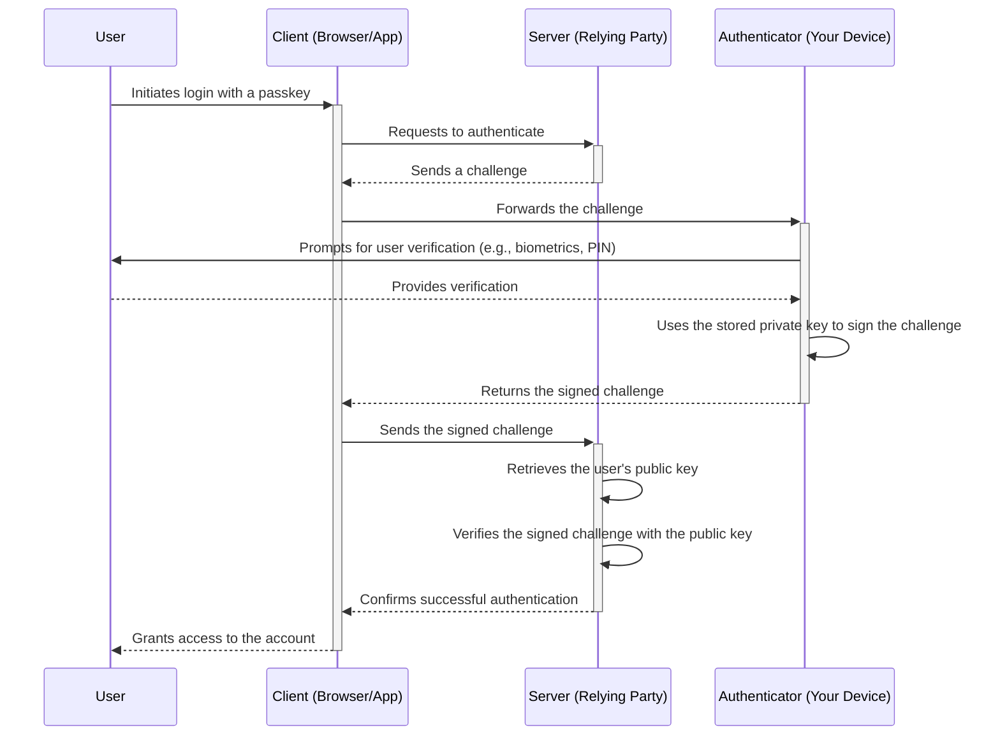

### The Registration Process: Setting Up a Passkey

```mermaid
sequenceDiagram
    participant User
    participant Client (Browser/App)
    participant Server (Relying Party)
    participant Authenticator (Your Device)

    User->>+Client (Browser/App): Initiates passkey registration
    Client (Browser/App)->>+Server (Relying Party): Requests to register a passkey
    Server (Relying Party)-->>-Client (Browser/App): Sends a challenge and user info
    Client (Browser/App)->>+Authenticator (Your Device): Forwards the challenge and user info
    Authenticator (Your Device)->>User: Prompts for user verification (e.g., biometrics, PIN)
    User-->>Authenticator (Your Device): Provides verification
    Authenticator (Your Device)->>Authenticator (Your Device): Generates a new public/private key pair
    Authenticator (Your Device)-->>-Client (Browser/App): Returns the public key and a signed challenge
    Client (Browser/App)->>+Server (Relying Party): Sends the public key and signed challenge
    Server (Relying Party)->>Server (Relying Party): Verifies the signed challenge with the public key
    Server (Relying Party)->>Server (Relying Party): Stores the public key associated with the user's account
    Server (Relying Party)-->>-Client (Browser/App): Confirms successful registration
    Client (Browser/App)-->>-User: Informs user of successful registration
```

### The Authentication Process: Logging In with a Passkey

```mermaid
sequenceDiagram
    participant User
    participant Client (Browser/App)
    participant Server (Relying Party)
    participant Authenticator (Your Device)

    User->>+Client (Browser/App): Initiates login with a passkey
    Client (Browser/App)->>+Server (Relying Party): Requests to authenticate
    Server (Relying Party)-->>-Client (Browser/App): Sends a challenge
    Client (Browser/App)->>+Authenticator (Your Device): Forwards the challenge
    Authenticator (Your Device)->>User: Prompts for user verification (e.g., biometrics, PIN)
    User-->>Authenticator (Your Device): Provides verification
    Authenticator (Your Device)->>Authenticator (Your Device): Uses the stored private key to sign the challenge
    Authenticator (Your Device)-->>-Client (Browser/App): Returns the signed challenge
    Client (Browser/App)->>+Server (Relying Party): Sends the signed challenge
    Server (Relying Party)->>Server (Relying Party): Retrieves the user's public key
    Server (Relying Party)->>Server (Relying Party): Verifies the signed challenge with the public key
    Server (Relying Party)-->>-Client (Browser/App): Confirms successful authentication
    Client (Browser/App)-->>-User: Grants access to the account
```
