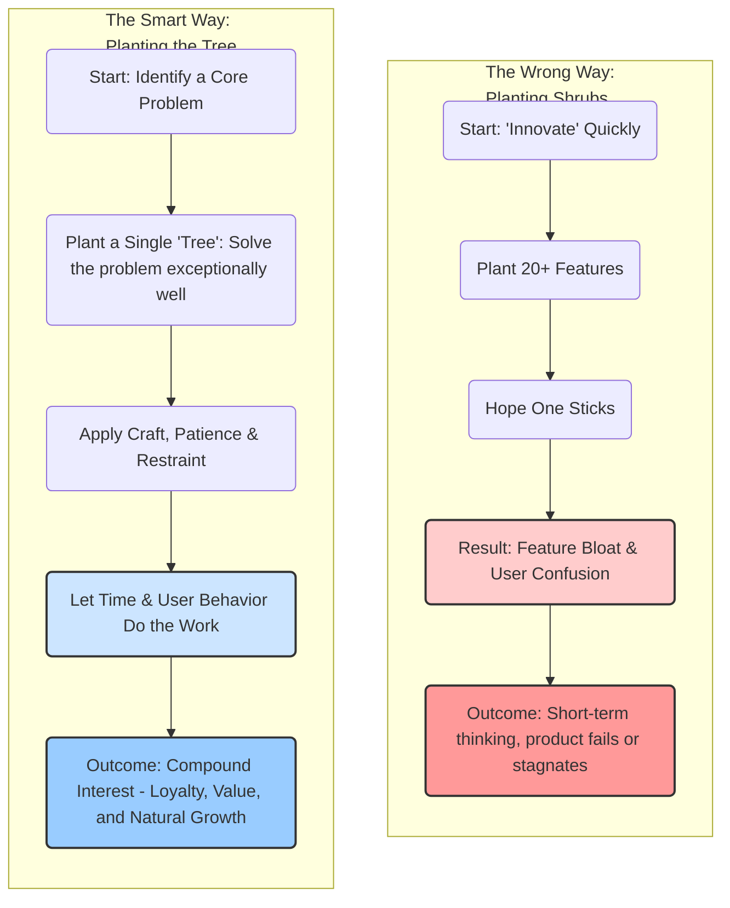
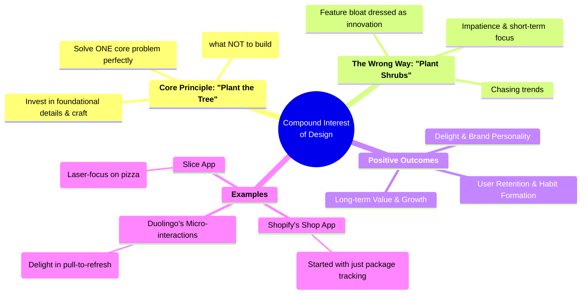
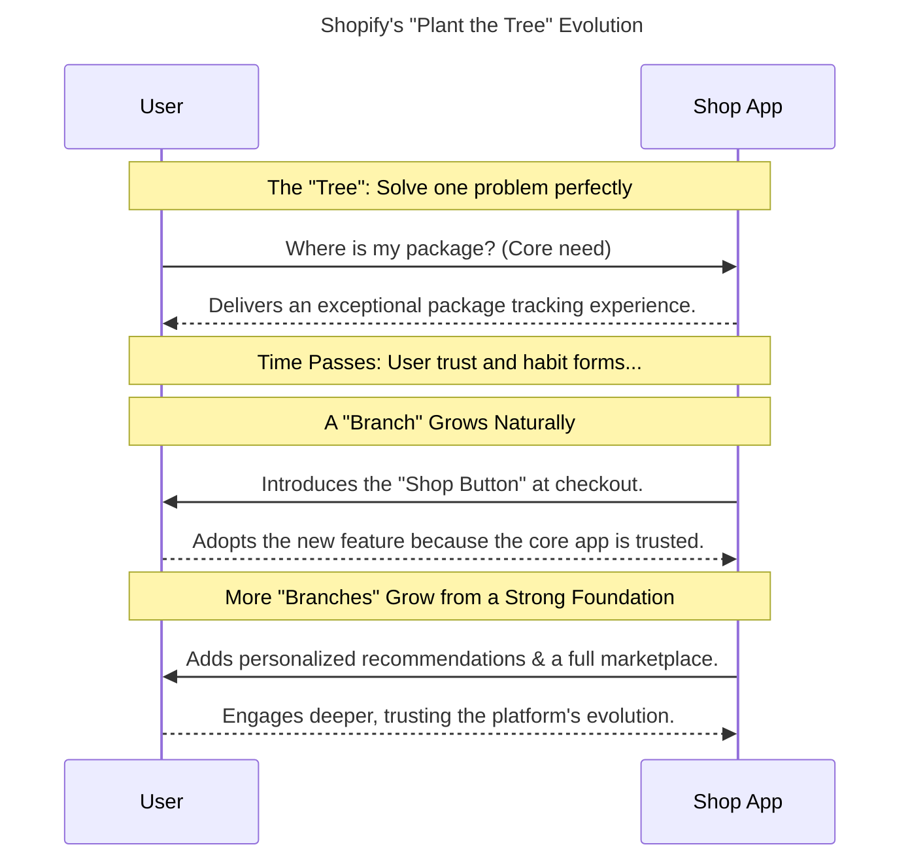

### Two Paths of Product Design

### The Core Principles of Compound Interest Design

### Evolution of a Well-Planted "Tree" (Shopify Example)

Sources:

- [The compound interest of design: what not to build](https://designobserver.com/the-compound-interest-of-design-what-not-to-build/)
