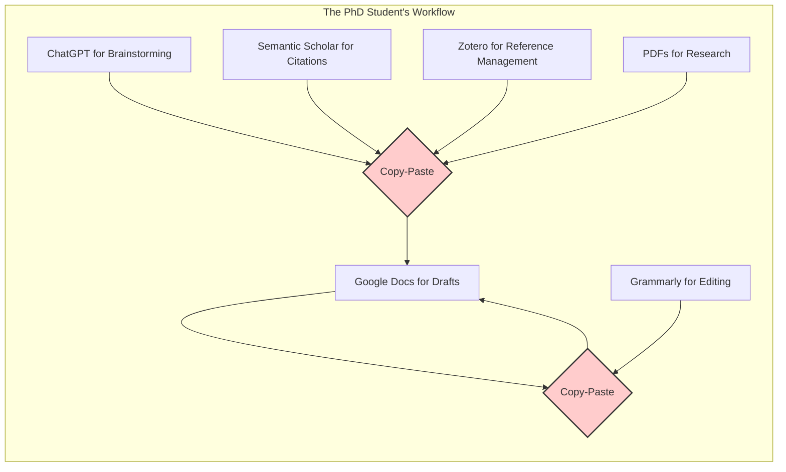
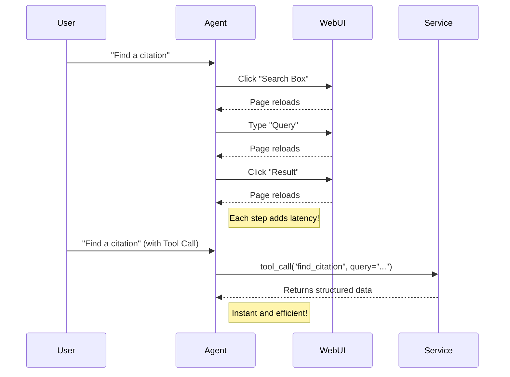
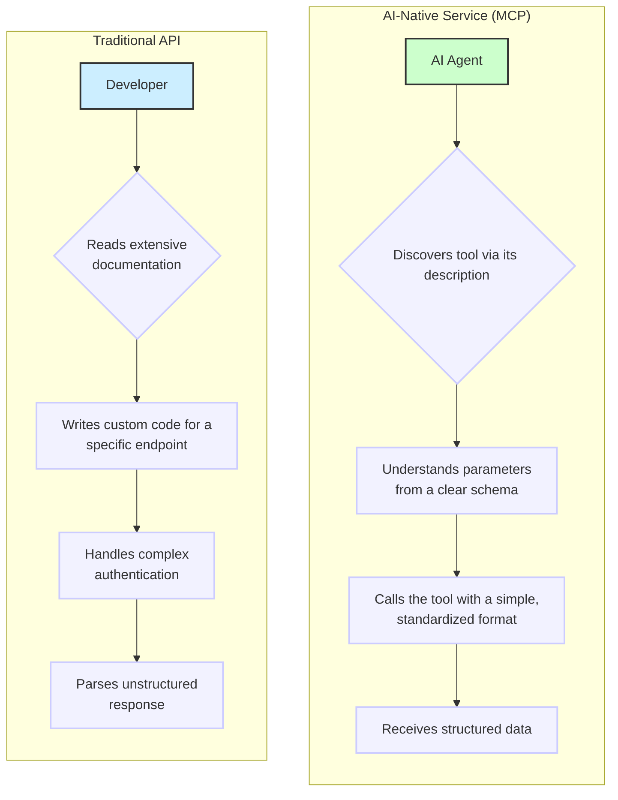
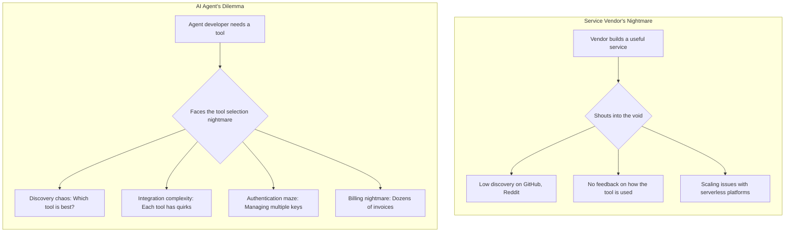
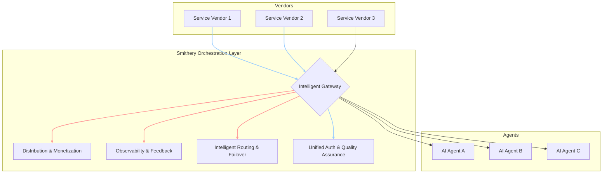
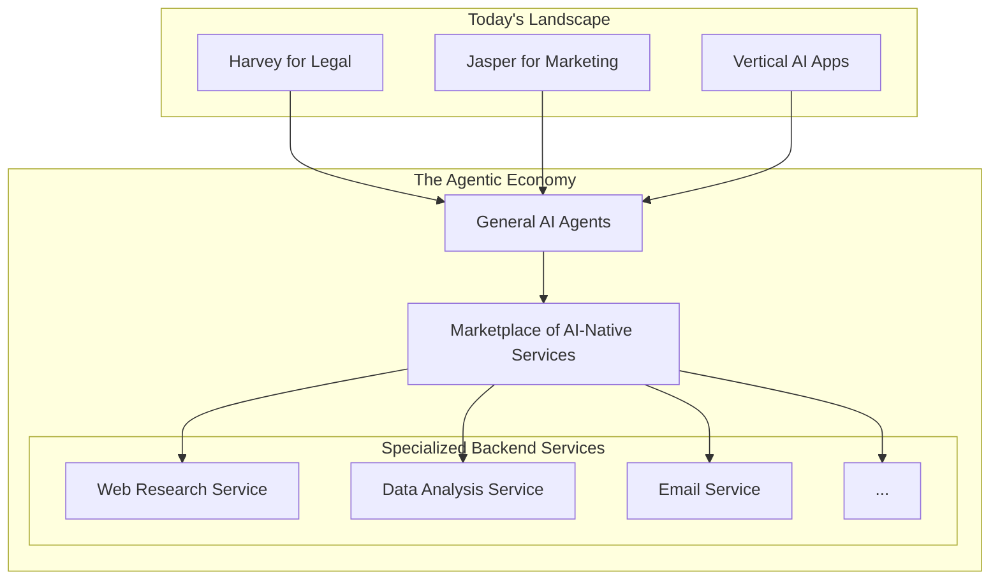

### The "Copy-Paste Hell" of Knowledge Work

###  The Inefficiency of UI Automation

### Traditional APIs vs. AI-Native Services (MCP)

### The Challenges for Service Vendors and AI Agents

### Smithery's Orchestration Layer as the Solution

### The Evolution to an Agentic Economy

Sources:

- [Tool Calls Are the New Clicks](https://smithery.ai/blog/tool-calls-are-the-new-clicks)
