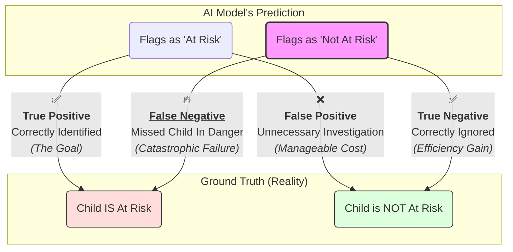
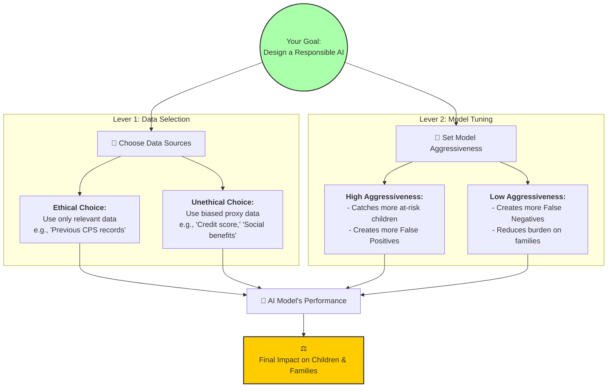
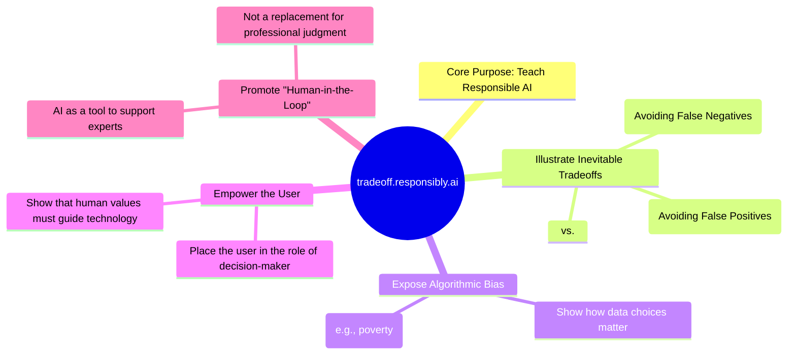

### The Core Tradeoff Matrix

```mermaid
graph TD
    subgraph "Ground Truth (Reality)"
        direction LR
        A("Child IS At Risk")
        B("Child is NOT At Risk")
    end

    subgraph "AI Model's Prediction"
        direction TB
        C("Flags as 'At Risk'")
        D("Flags as 'Not At Risk'")
    end

    C -- "✅<br/><b>True Positive</b><br/>Correctly Identified<br/><i>(The Goal)</i>" --> A
    C -- "❌<br/><b>False Positive</b><br/>Unnecessary Investigation<br/><i>(Manageable Cost)</i>" --> B
    D -- "🔥<br/><b><u>False Negative</u></b><br/>Missed Child In Danger<br/><i>(Catastrophic Failure)</i>" --> A
    D -- "✅<br/><b>True Negative</b><br/>Correctly Ignored<br/><i>(Efficiency Gain)</i>" --> B

    style A fill:#ffdddd,stroke:#333
    style B fill:#ddffdd,stroke:#333
    style D fill:#f9f,stroke:#333,stroke-width:2px
```

### The User's Two Levers of Control

```mermaid
graph TD
    Start((Your Goal:<br/>Design a Responsible AI)) --> D1
    
    subgraph "Lever 1: Data Selection"
        D1["🤔 Choose Data Sources"]
        D1 --> D1_A["<b>Ethical Choice:</b><br/>Use only relevant data<br/>e.g., 'Previous CPS records'"]
        D1 --> D1_B["<b>Unethical Choice:</b><br/>Use biased proxy data<br/>e.g., 'Credit score,' 'Social benefits'"]
    end

    Start --> D2

    subgraph "Lever 2: Model Tuning"
        D2["🤔 Set Model Aggressiveness"]
        D2 --> D2_A["<b>High Aggressiveness:</b><br/>- Catches more at-risk children<br/>- Creates more False Positives"]
        D2 --> D2_B["<b>Low Aggressiveness:</b><br/>- Creates more False Negatives<br/>- Reduces burden on families"]
    end

    D1_A & D1_B --> Model
    D2_A & D2_B --> Model
    
    Model["🤖 AI Model's Performance"] --> Impact["⚖️<br/>Final Impact on Children & Families"]

    style Start fill:#aaffaa,stroke:#333,stroke-width:2px
    style Impact fill:#ffcc00,stroke:#333,stroke-width:2px
```

### The Site's Educational Philosophy

```mermaid
mindmap
  root((tradeoff.responsibly.ai))
    ::icon(fa fa-graduation-cap)
    Core Purpose: Teach Responsible AI
    ::icon(fa fa-balance-scale)
    Illustrate Inevitable Tradeoffs
      ::icon(fa fa-child)
      Child Safety (Avoiding False Negatives)
      vs.
      ::icon(fa fa-users)
      Family Burden (Avoiding False Positives)
    ::icon(fa fa-database)
    Expose Algorithmic Bias
      Show how data choices matter
      Distinguish between direct risk factors and unfair proxies (e.g., poverty)
    ::icon(fa fa-hand-pointer)
    Empower the User
      Place the user in the role of decision-maker
      Show that human values must guide technology
    ::icon(fa fa-user-check)
    Promote "Human-in-the-Loop"
      AI as a tool to support experts
      Not a replacement for professional judgment
```

Sources:

- [https://tradeoff.responsibly.ai/](https://tradeoff.responsibly.ai/)
