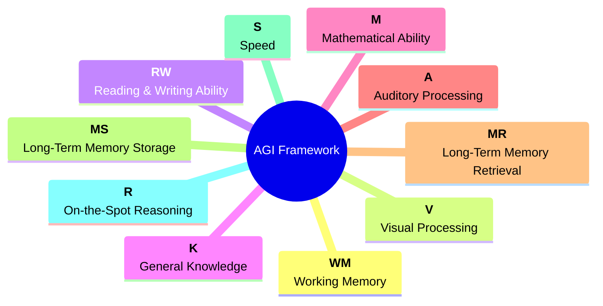
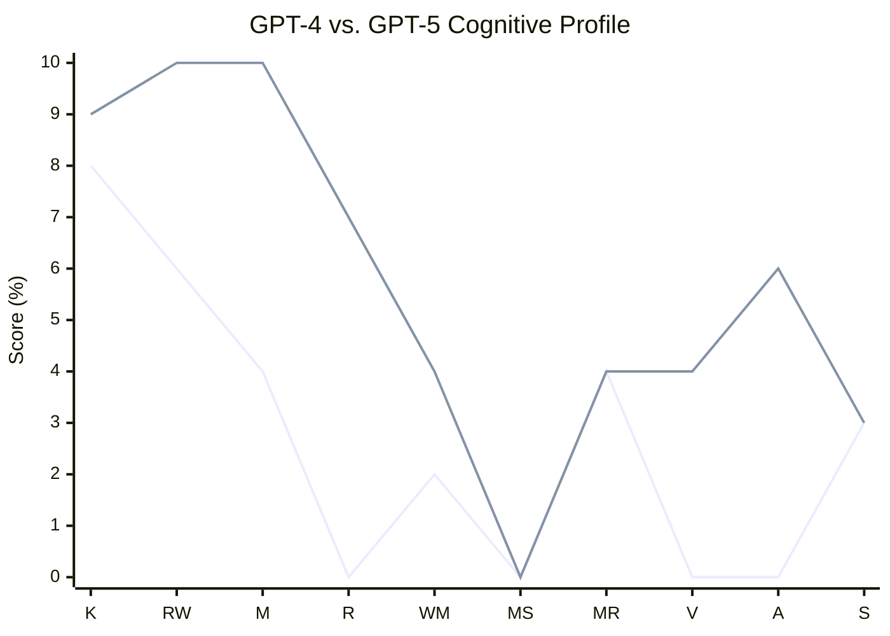
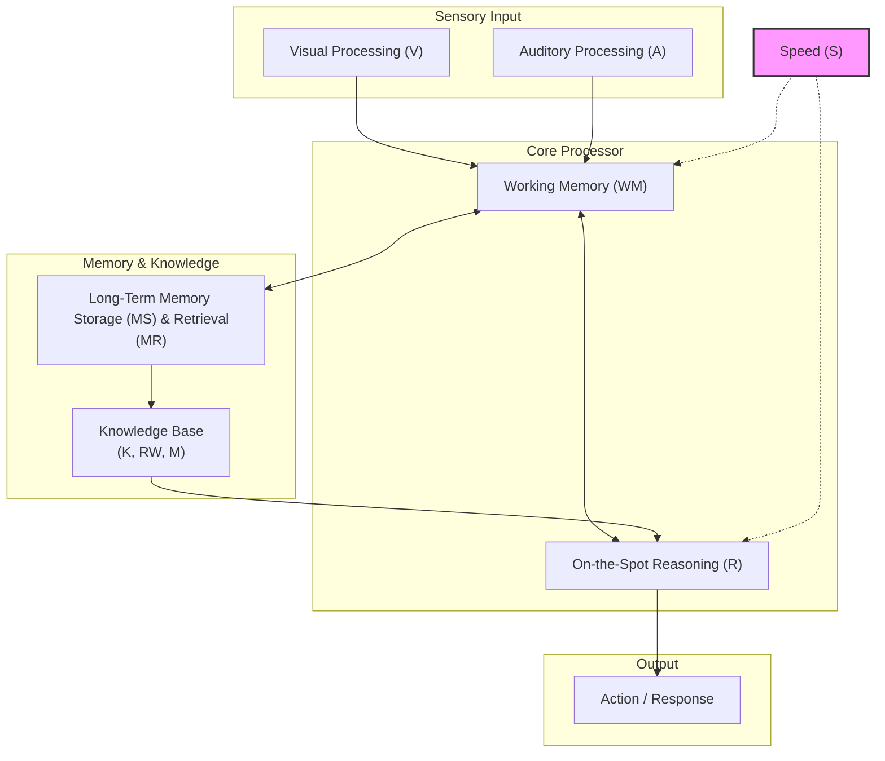
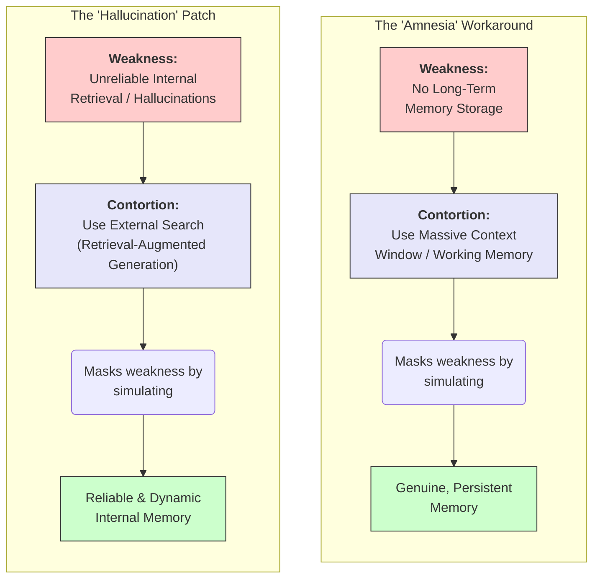

### The Ten Core Components of AGI

### "Jagged" Cognitive Profile of Current AI

### Intelligence as a Cognitive Processor

### Capability Contortions: Masking AI's Weaknesses

Sources:

- [A Definition of AGI](https://arxiv.org/html/2510.18212v2)
