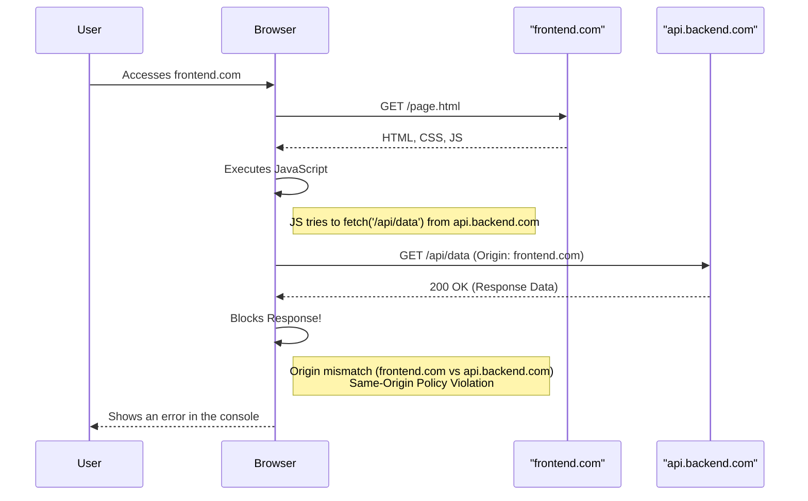
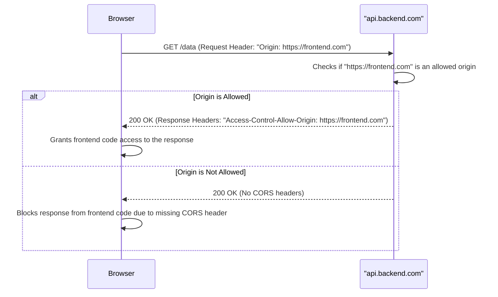
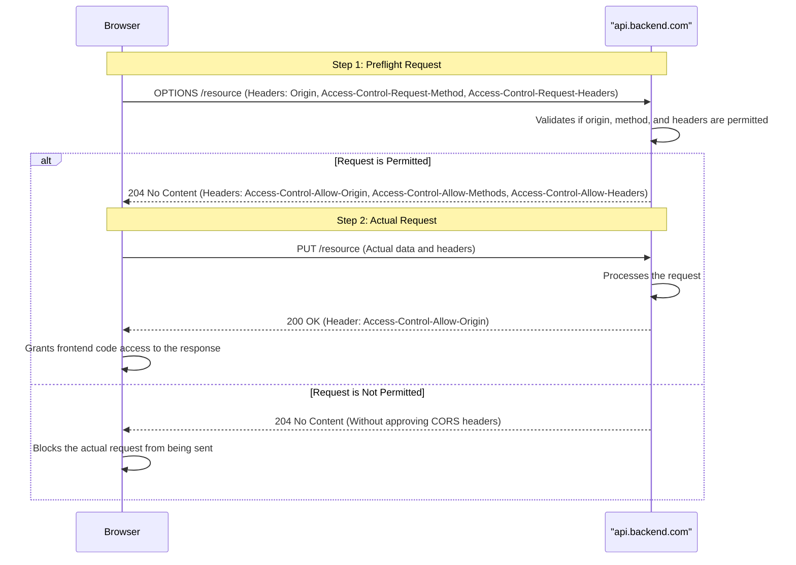
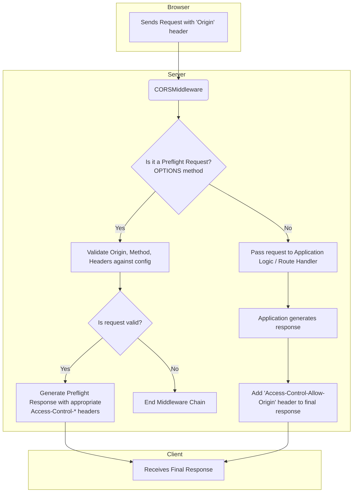

### The Same-Origin Policy (SOP)

```mermaid
sequenceDiagram
    participant User
    participant Browser
    participant FrontendServer as "frontend.com"
    participant ApiServer as "api.backend.com"

    User->>Browser: Accesses frontend.com
    Browser->>FrontendServer: GET /page.html
    FrontendServer-->>Browser: HTML, CSS, JS
    Browser->>Browser: Executes JavaScript
    Note right of Browser: JS tries to fetch('/api/data') from api.backend.com
    Browser->>ApiServer: GET /api/data (Origin: frontend.com)
    ApiServer-->>Browser: 200 OK (Response Data)
    Browser->>Browser: Blocks Response!
    Note right of Browser: Origin mismatch (frontend.com vs api.backend.com)<br/>Same-Origin Policy Violation
    Browser-->>User: Shows an error in the console
```

### CORS "Simple" Request Flow

```mermaid
sequenceDiagram
    participant Browser
    participant Server as "api.backend.com"

    Browser->>Server: GET /data (Request Header: "Origin: https://frontend.com")
    Server->>Server: Checks if "https://frontend.com" is an allowed origin
    alt Origin is Allowed
        Server-->>Browser: 200 OK (Response Headers: "Access-Control-Allow-Origin: https://frontend.com")
        Browser->>Browser: Grants frontend code access to the response
    else Origin is Not Allowed
        Server-->>Browser: 200 OK (No CORS headers)
        Browser->>Browser: Blocks response from frontend code due to missing CORS header
    end
```

### CORS "Preflight" Request Flow

```mermaid
sequenceDiagram
    participant Browser
    participant Server as "api.backend.com"

    Note over Browser,Server: Step 1: Preflight Request
    Browser->>Server: OPTIONS /resource (Headers: Origin, Access-Control-Request-Method, Access-Control-Request-Headers)
    Server->>Server: Validates if origin, method, and headers are permitted
    alt Request is Permitted
      Server-->>Browser: 204 No Content (Headers: Access-Control-Allow-Origin, Access-Control-Allow-Methods, Access-Control-Allow-Headers)

      Note over Browser,Server: Step 2: Actual Request
      Browser->>Server: PUT /resource (Actual data and headers)
      Server->>Server: Processes the request
      Server-->>Browser: 200 OK (Header: Access-Control-Allow-Origin)
      Browser->>Browser: Grants frontend code access to the response
    else Request is Not Permitted
      Server-->>Browser: 204 No Content (Without approving CORS headers)
      Browser->>Browser: Blocks the actual request from being sent
    end
```

### How CORSMiddleware Works on the Server

```mermaid
graph TD
    subgraph Browser
        A[Sends Request with 'Origin' header]
    end

    subgraph Server
        B(CORSMiddleware)
        C{Is it a Preflight Request? <br/> OPTIONS method}
        D[Validate Origin, Method, Headers against config]
        E{Is request valid?}
        F[Generate Preflight Response with appropriate<br/>Access-Control-* headers]
        G[Pass request to Application Logic / Route Handler]
        H[Application generates response]
        I[Add 'Access-Control-Allow-Origin' header to final response]
        J[End Middleware Chain]
    end

    subgraph Client
        K[Receives Final Response]
    end

    A --> B
    B --> C
    C -- Yes --> D
    D --> E
    E -- Yes --> F
    F --> K
    C -- No --> G
    E -- No --> J
    G --> H
    H --> I
    I --> K
```
