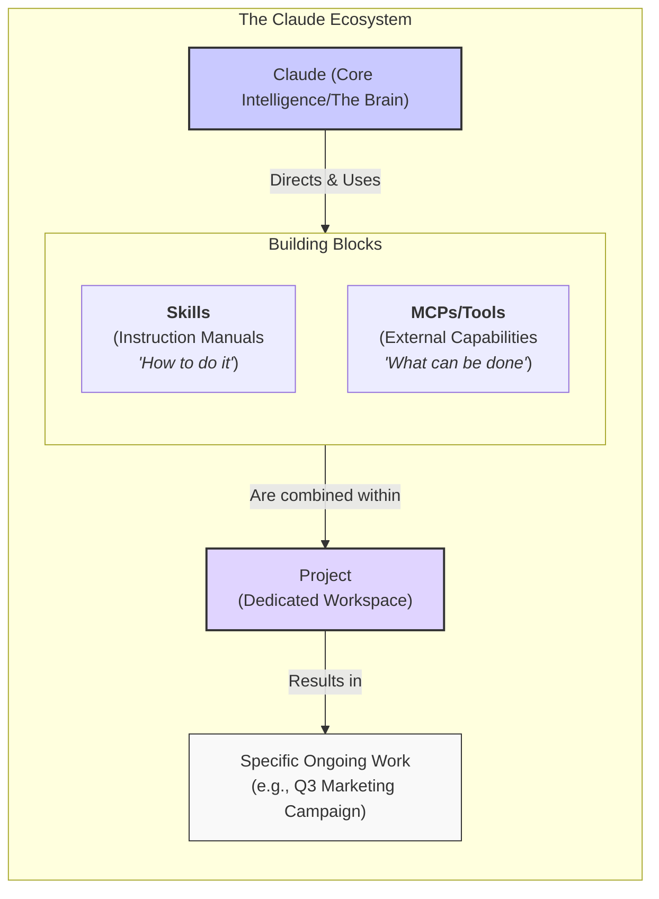
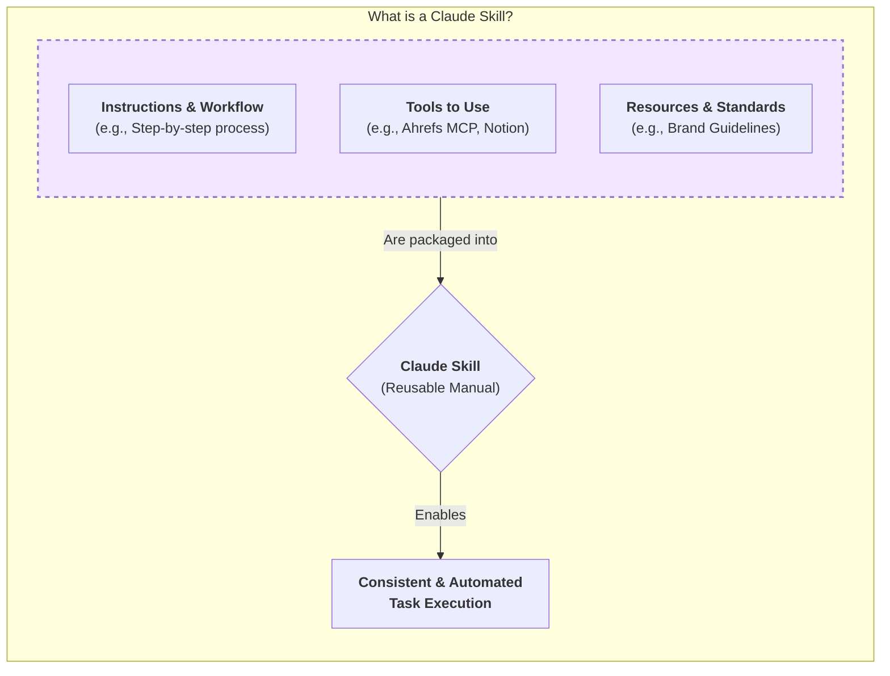
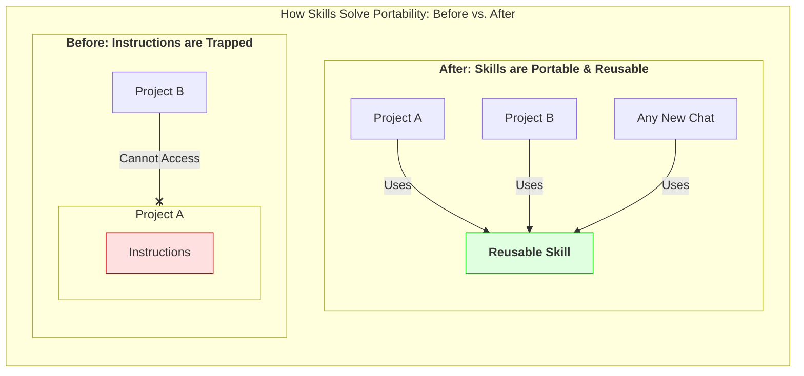
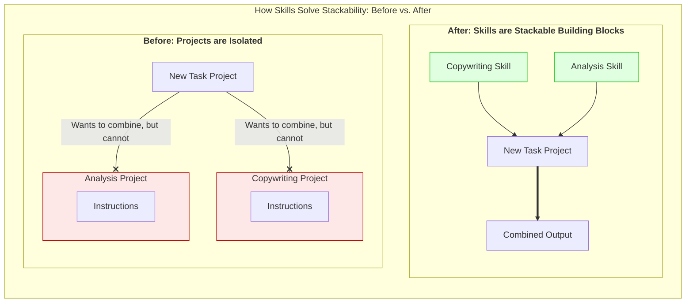
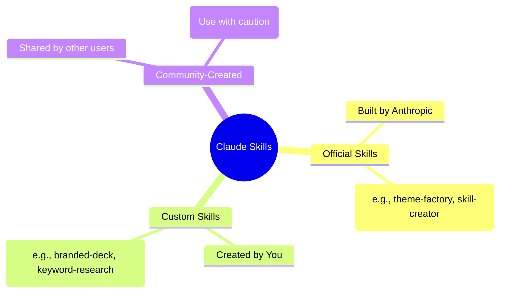

### The Claude Ecosystem: A Modular "Building Block" Architecture

### What is a Claude Skill?

### How Skills Solve Portability Issues

### How Skills Solve Stackability Issues

### The Three Types of Claude Skills

