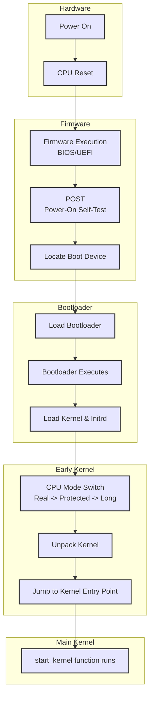
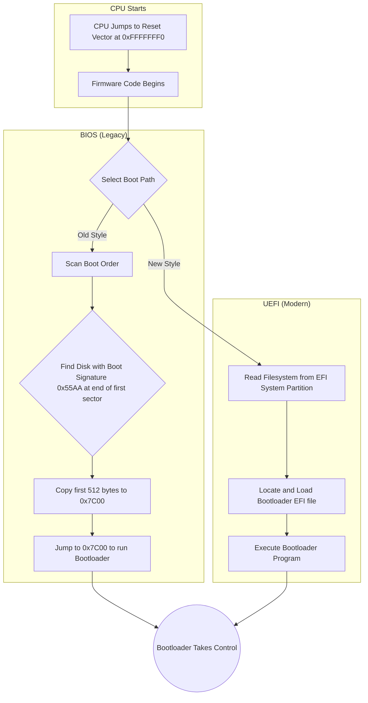
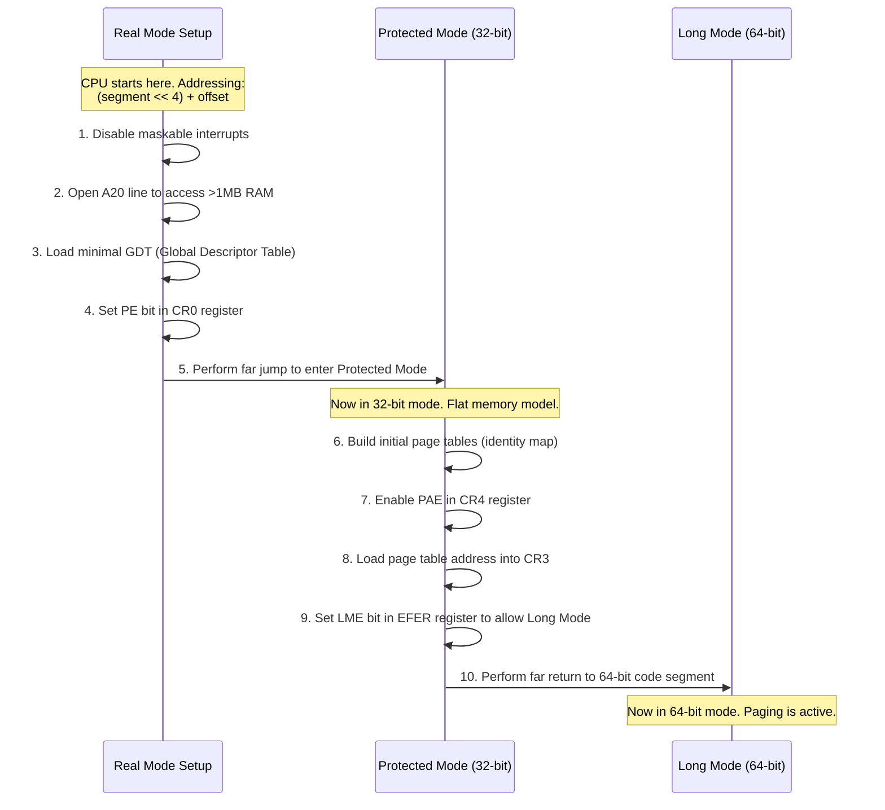
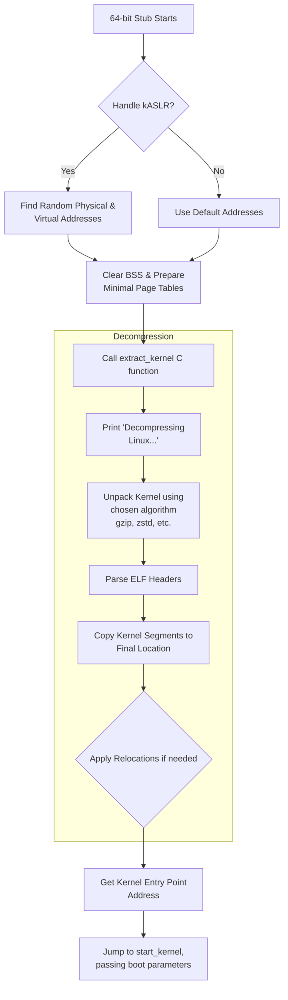
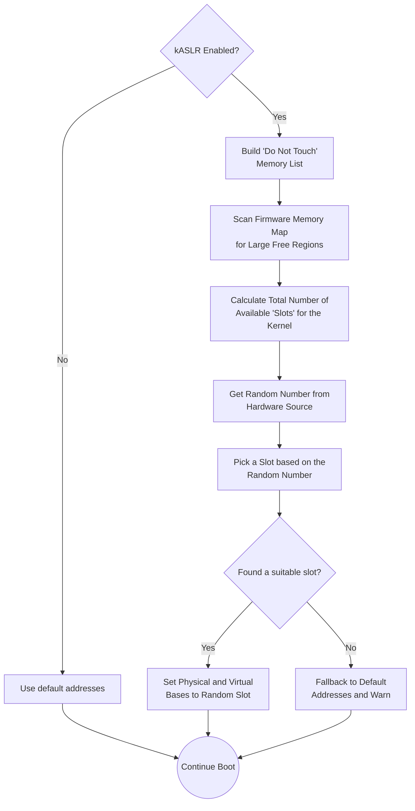

### High-Level Overview of the Boot Process

### Firmware Hand-off: BIOS vs. UEFI

### CPU Mode Transition Sequence

### Kernel Unpacking and Execution

### Kernel Address Space Layout Randomization (kASLR) Logic

