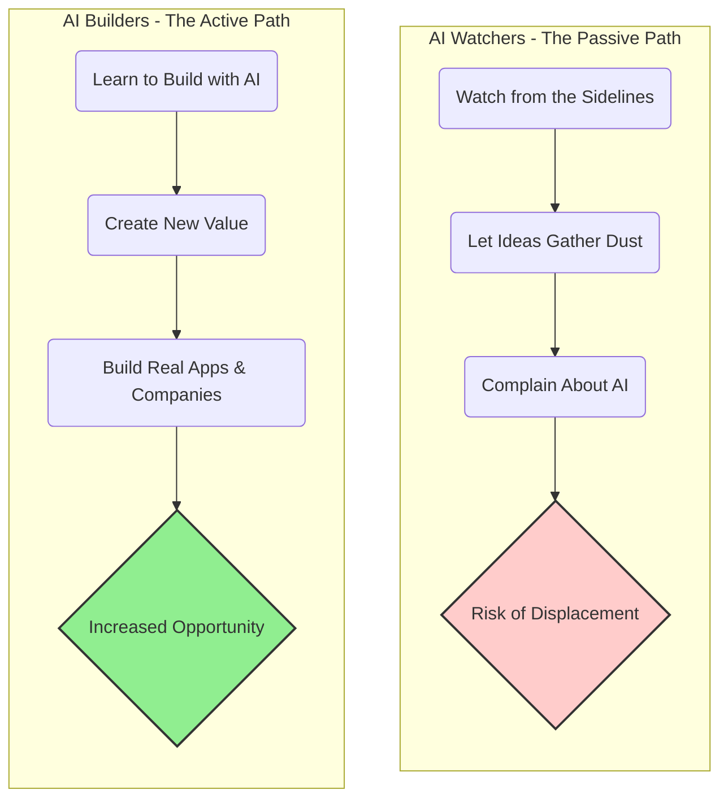
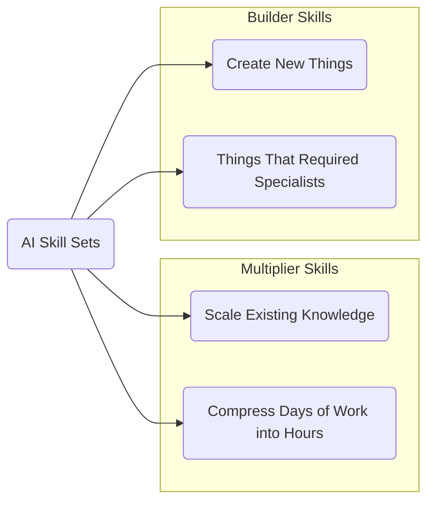
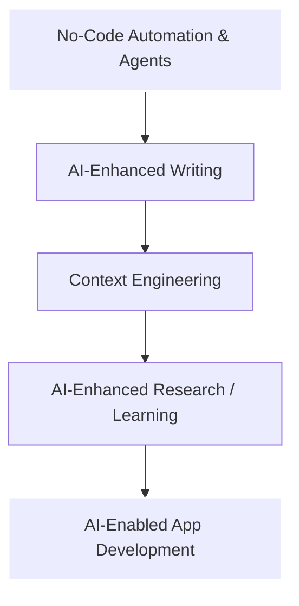
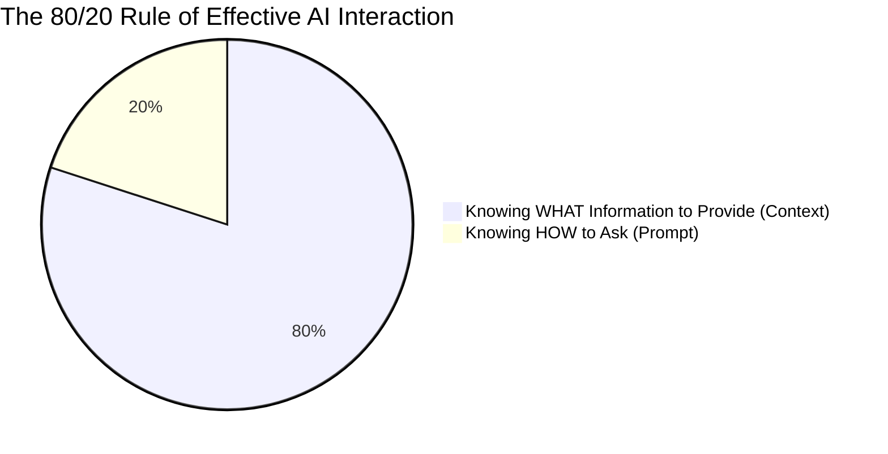
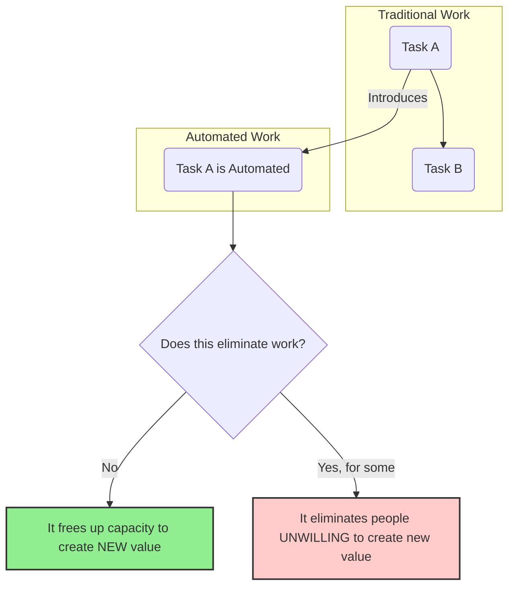

### The Two-Tier System of AI Adoption

### Builder Skills vs. Multiplier Skills

### The 5 AI Business Skills Hierarchy

### Context Engineering: The 80/20 Rule

### Automation Eliminates People, Not Work

