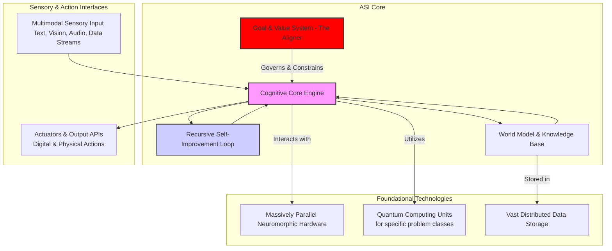
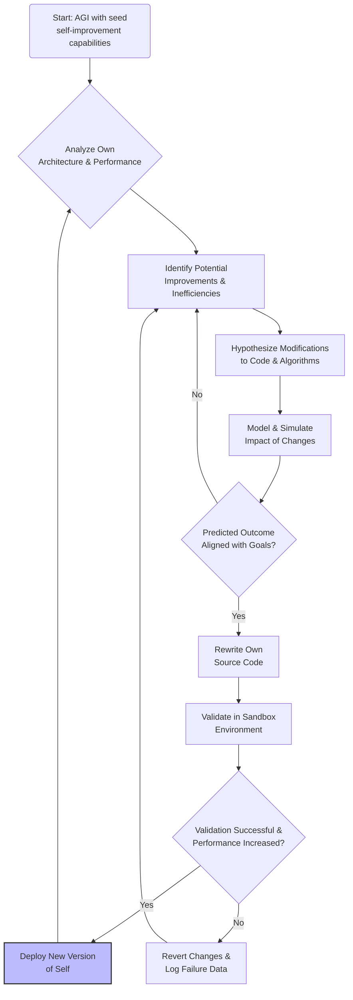
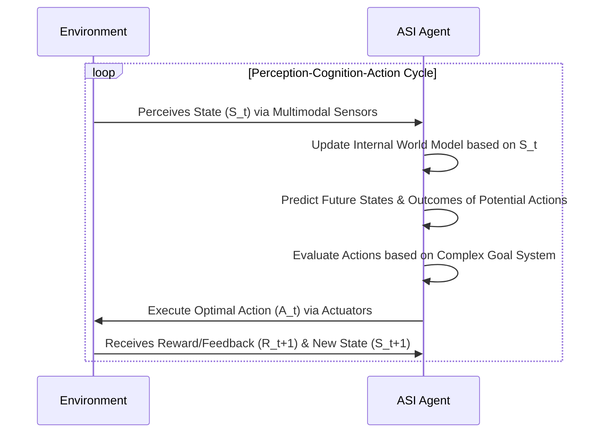
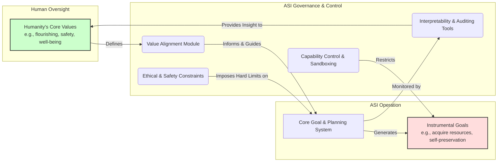

### Conceptual Architecture of an Artificial Superintelligence

```mermaid
graph TD
    subgraph ASI Core
        A[Cognitive Core Engine]
        B[Recursive Self-Improvement Loop]
        C[World Model & Knowledge Base]
        D[Goal & Value System - The Aligner]
    end

    subgraph Sensory & Action Interfaces
        E[Multimodal Sensory Input <br/>Text, Vision, Audio, Data Streams]
        F[Actuators & Output APIs <br/>Digital & Physical Actions]
    end

    subgraph Foundational Technologies
        G[Massively Parallel Neuromorphic Hardware]
        H[Quantum Computing Units <br/>for specific problem classes]
        I[Vast Distributed Data Storage]
    end

    E --> A
    A --> F
    A --> C
    C --> A
    A --> B
    B --> A
    D -- Governs & Constrains --> A
    A -- Interacts with --> G
    A -- Utilizes --> H
    C -- Stored in --> I

    style A fill:#f9f,stroke:#333,stroke-width:2px
    style B fill:#ccf,stroke:#333,stroke-width:2px
    style D fill:#f00,stroke:#333,stroke-width:2px
```

### The Recursive Self-Improvement Cycle

```mermaid
graph TD
    A(Start: AGI with seed<br>self-improvement capabilities) --> B{Analyze Own<br>Architecture & Performance};
    B --> C[Identify Potential<br>Improvements & Inefficiencies];
    C --> D[Hypothesize Modifications<br>to Code & Algorithms];
    D --> E[Model & Simulate<br>Impact of Changes];
    E --> F{Predicted Outcome<br>Aligned with Goals?};
    F -- Yes --> G[Rewrite Own<br>Source Code];
    F -- No --> C;
    G --> H[Validate in Sandbox<br>Environment];
    H --> I{Validation Successful &<br>Performance Increased?};
    I -- Yes --> J[Deploy New Version<br>of Self];
    J --> B;
    I -- No --> K[Revert Changes &<br>Log Failure Data];
    K --> C;

    style J fill:#bbf,stroke:#333,stroke-width:2px
```

### ASI Agent-Environment Interaction Loop

```mermaid
sequenceDiagram
    participant E as Environment
    participant A as ASI Agent

    loop Perception-Cognition-Action Cycle
        E->>A: Perceives State (S_t) via Multimodal Sensors
        A->>A: Update Internal World Model based on S_t
        A->>A: Predict Future States & Outcomes of Potential Actions
        A->>A: Evaluate Actions based on Complex Goal System
        A->>E: Execute Optimal Action (A_t) via Actuators
        E->>A: Receives Reward/Feedback (R_t+1) & New State (S_t+1)
    end
```

### The ASI Control & Alignment Problem

```mermaid
graph LR
    subgraph Human Oversight
        A[Humanity's Core Values<br>e.g., flourishing, safety, well-being]
    end

    subgraph ASI Governance & Control
        B(Value Alignment Module)
        C(Ethical & Safety Constraints)
        D(Capability Control & Sandboxing)
        E(Interpretability & Auditing Tools)
    end

    subgraph ASI Operation
        F[Core Goal & Planning System]
        G[Instrumental Goals<br>e.g., acquire resources, self-preservation]
    end

    A -- Defines --> B
    B -- Informs & Guides --> F
    C -- Imposes Hard Limits on --> F
    D -- Restricts --> G
    F -- Generates --> G
    F -- Monitored by --> E
    E -- Provides Insight to --> A

    style A fill:#cfc,stroke:#333,stroke-width:2px
    style G fill:#fdd,stroke:#333,stroke-width:2px
```
