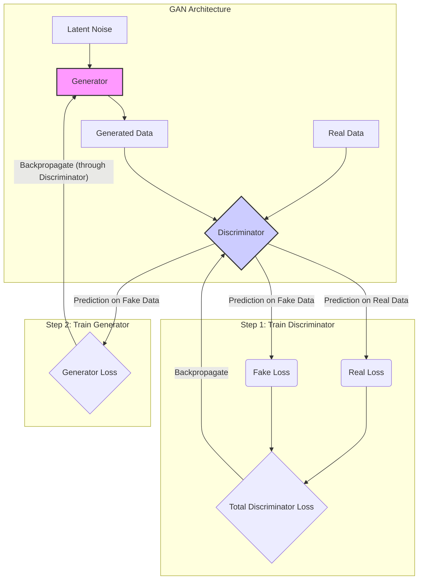
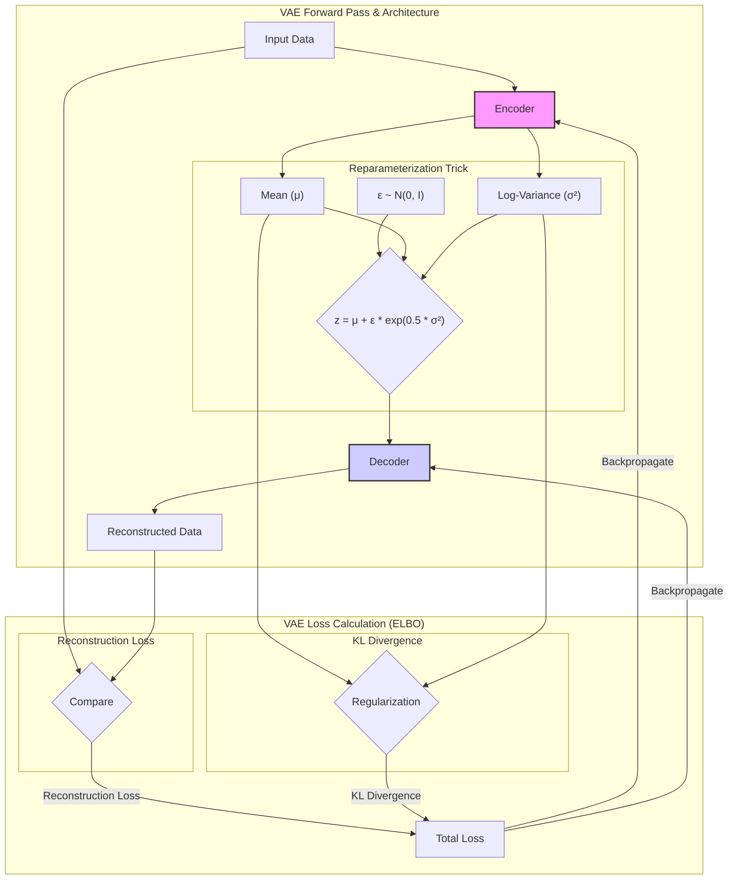

### Generative Adversarial Network (GAN)

```mermaid
graph TD
    subgraph GAN Architecture
        direction TB
        Z[Latent Noise] --> G[Generator];
        G --> X_fake[Generated Data];
        X_real[Real Data] --> D{Discriminator};
        X_fake --> D;
    end

    subgraph "Step 1: Train Discriminator"
        direction TB
        D -- "Prediction on Real Data" --> L_D_real(Real Loss);
        D -- "Prediction on Fake Data" --> L_D_fake(Fake Loss);
        L_D_real --> L_D{Total Discriminator Loss};
        L_D_fake --> L_D;
        L_D -- "Backpropagate" --> D;
    end

    subgraph "Step 2: Train Generator"
        direction TB
        D -- "Prediction on Fake Data" --> L_G{Generator Loss};
        L_G -- "Backpropagate (through Discriminator)" --> G;
    end

    style G fill:#f9f,stroke:#333,stroke-width:2px
    style D fill:#ccf,stroke:#333,stroke-width:2px
```

### Variational Autoencoder (VAE)

```mermaid
graph TD
    subgraph "VAE Forward Pass & Architecture"
        direction TB
        A[Input Data] --> B[Encoder];
        B --> C["Mean (μ)"];
        B --> D["Log-Variance (σ²)"];
        
        subgraph Reparameterization Trick
            E["ε ~ N(0, I)"] --> F{"z = μ + ε * exp(0.5 * σ²)"};
            C --> F;
            D --> F;
        end

        F --> G[Decoder];
        G --> H[Reconstructed Data];
    end

    subgraph "VAE Loss Calculation (ELBO)"
        direction TB
        subgraph Reconstruction Loss
            A --> I{Compare};
            H --> I;
        end
        
        subgraph KL Divergence
            C --> J{Regularization};
            D --> J;
        end

        I -- "Reconstruction Loss" --> K[Total Loss];
        J -- "KL Divergence" --> K;
        K -- "Backpropagate" --> B;
        K -- "Backpropagate" --> G;
    end

    style B fill:#f9f,stroke:#333,stroke-width:2px
    style G fill:#ccf,stroke:#333,stroke-width:2px
```
