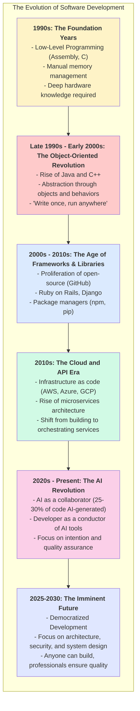
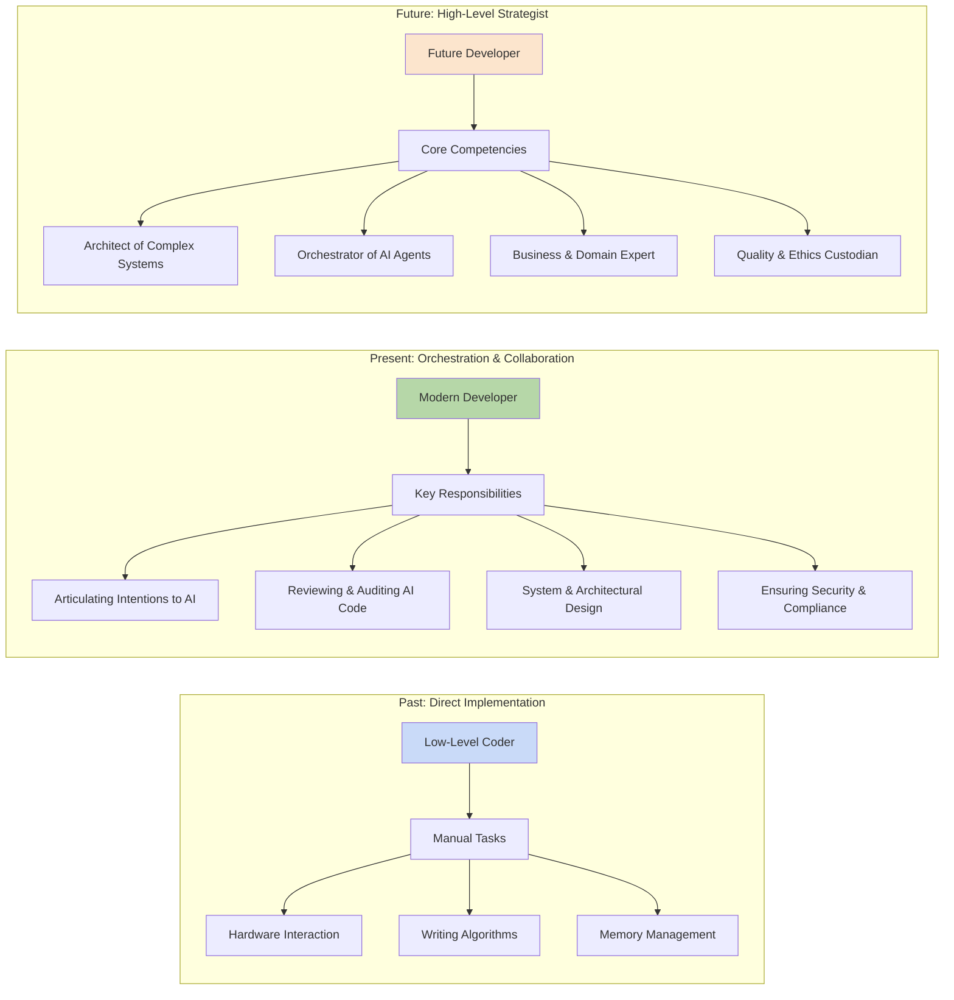

### The Evolution of Software Development

### The Shifting Role of the Software Developer

Sources:

- [The Evolution of Software Development: From Machine Code to AI Orchestration](https://guptadeepak.com/the-evolution-of-software-development-from-machine-code-to-ai-orchestration/)
