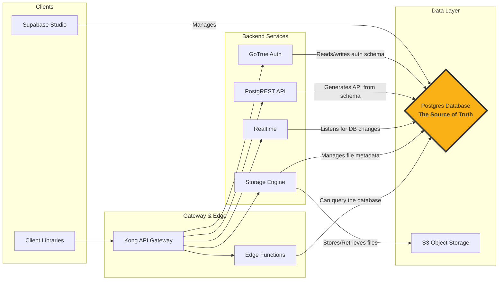
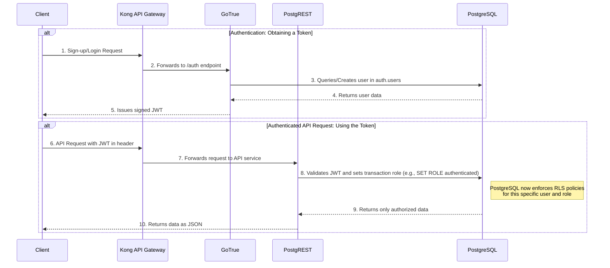
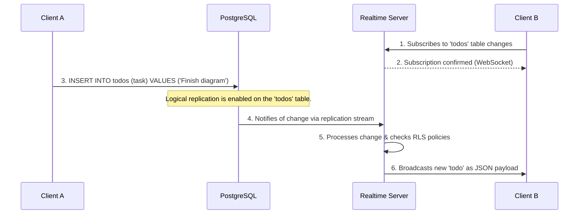
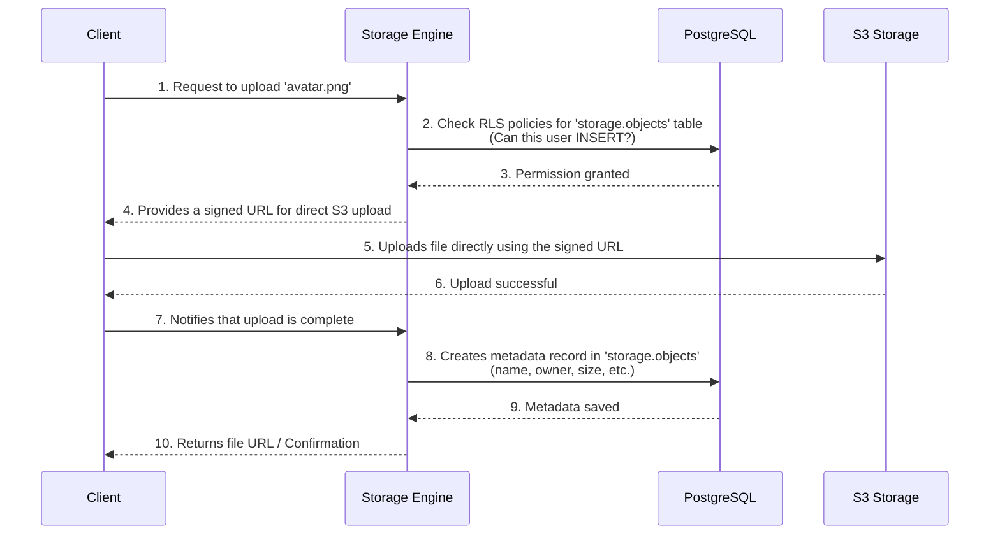
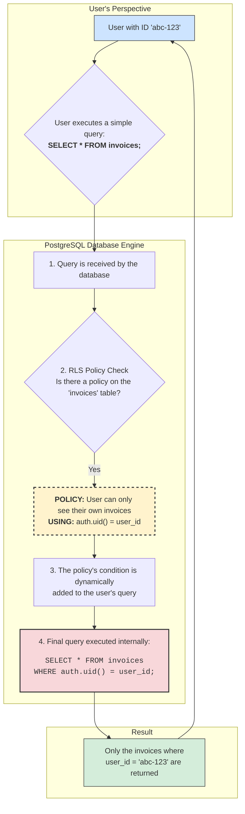

### Supabase Architecture Diagram

### Supabase Authentication Flow Diagram

### Supabase Realtime Flow Diagram

### Supabase Storage: File Upload Flow

### Conceptual Diagram: How Row-Level Security Works

