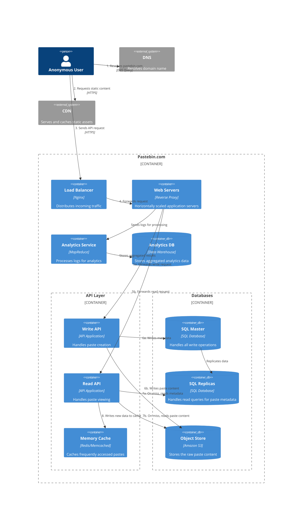
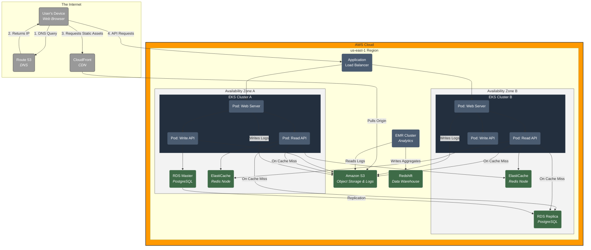

### Design Pastebin.com (or Bit.ly)

### Deployment Diagram for Pastebin on AWS

Source:

- [Design Pastebin.com (or Bit.ly)](https://github.com/maximalfocus/system-design-primer/blob/master/solutions/system_design/pastebin/README.md)
- [C4 Diagrams](https://github.com/mermaid-js/mermaid/edit/develop/packages/mermaid/src/docs/syntax/c4.md)
