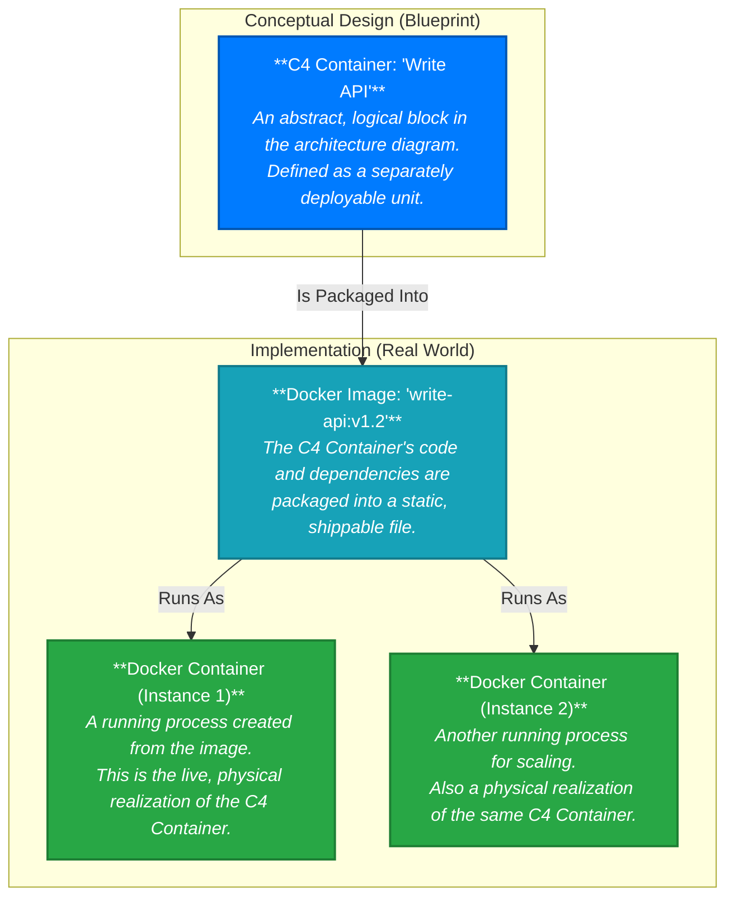

### C4 Container vs Docker Container

```mermaid
graph TD
    subgraph "Conceptual Design (Blueprint)"
        A["**C4 Container: 'Write API'**<br/><i>An abstract, logical block in the architecture diagram.<br/>Defined as a separately deployable unit.</i>"]
    end

    subgraph "Implementation (Real World)"
        B["**Docker Image: 'write-api:v1.2'**<br/><i>The C4 Container's code and dependencies are<br/>packaged into a static, shippable file.</i>"]
        C["**Docker Container (Instance 1)**<br/><i>A running process created from the image.<br/>This is the live, physical realization of the C4 Container.</i>"]
        D["**Docker Container (Instance 2)**<br/><i>Another running process for scaling.<br/>Also a physical realization of the same C4 Container.</i>"]
    end

    A -- Is Packaged Into --> B
    B -- Runs As --> C
    B -- Runs As --> D

    style A fill:#007bff,stroke:#0056b3,stroke-width:2px,color:#fff
    style B fill:#17a2b8,stroke:#117a8b,stroke-width:2px,color:#fff
    style C fill:#28a745,stroke:#1e7e34,stroke-width:2px,color:#fff
    style D fill:#28a745,stroke:#1e7e34,stroke-width:2px,color:#fff
```
