### Design the Twitter (x.com) timeline and search

```mermaid
C4Container
    Person(client, "Client", "Web Browser or Mobile App")
    System_Ext(dns, "DNS", "Resolves domain names")
    System_Ext(cdn, "CDN", "Serves static content like images and videos")

    Container_Boundary(c1, "Social Media Platform") {
        Container(load_balancer, "Load Balancer", "Nginx, HAProxy", "Distributes incoming traffic across web servers")
        Container(web_server, "Web Server", "Nginx", "Reverse proxy to API services")

        Container_Boundary(api_boundary, "API Gateways") {
            Container(write_api, "Write API", "Java, Spring", "Handles incoming tweets")
            Container(read_api, "Read API", "Java, Spring", "Handles timeline and user data reads")
            Container(search_api, "Search API", "Java, Spring", "Handles search queries")
        }

        Container_Boundary(services_boundary, "Core Services") {
            Container(fan_out_service, "Fan Out Service", "Go, Kafka", "Distributes tweets to followers' timelines and other services")
            Container(timeline_service, "Timeline Service", "Java, Spring", "Constructs user and home timelines")
            Container(search_service, "Search Service", "Python", "Processes queries and interfaces with the search cluster")
            Container(user_graph_service, "User Graph Service", "Java", "Manages user follow relationships")
            Container(tweet_info_service, "Tweet Info Service", "Go", "Provides hydrated tweet objects from IDs")
            Container(user_info_service, "User Info Service", "Go", "Provides hydrated user objects from IDs")
            Container(notification_service, "Notification Service", "Python", "Sends push notifications and emails")
        }

        Container_Boundary(data_boundary, "Data Stores") {
            ContainerDb(memory_cache, "Memory Cache", "Redis Cluster", "Stores home timelines for active users")
            ContainerDb(sql_master, "SQL DB Master", "MySQL", "Handles all writes for user data, tweets, and social graph")
            ContainerDb(sql_replicas, "SQL DB Replicas", "MySQL", "Handles read queries for user timelines and cache misses")
            ContainerDb(object_store, "Object Store", "AWS S3", "Stores media files (images, videos)")
            ContainerDb(search_cluster, "Search Cluster", "Elasticsearch", "Indexes and serves search queries for tweets")
        }
    }

    %% Relationships
    %% Client to System
    Rel(client, dns, "1. Resolves domain")
    Rel(dns, load_balancer, "2. Returns IP address")
    Rel(client, cdn, "Requests static assets")
    Rel(client, load_balancer, "3. Makes API requests", "HTTPS")

    %% Entry point
    Rel(load_balancer, web_server, "Forwards traffic")
    Rel(web_server, read_api, "Routes read requests")
    Rel(web_server, write_api, "Routes write requests")
    Rel(web_server, search_api, "Routes search requests")

    %% Write Path (Post Tweet)
    Rel(write_api, sql_master, "Writes to user timeline table")
    Rel(write_api, fan_out_service, "Pushes new tweet for fanout")
    Rel(fan_out_service, user_graph_service, "Gets followers")
    Rel(fan_out_service, memory_cache, "Writes to followers' timelines")
    Rel(fan_out_service, search_service, "Sends for indexing")
    Rel(fan_out_service, object_store, "Stores media")
    Rel(fan_out_service, notification_service, "Sends notifications")
    Rel(search_service, search_cluster, "Indexes tweet")

    %% Read Path (Home Timeline)
    Rel(read_api, timeline_service, "Requests home timeline")
    Rel(timeline_service, memory_cache, "Gets tweet IDs")
    Rel(timeline_service, tweet_info_service, "Gets tweet details")
    Rel(timeline_service, user_info_service, "Gets user details")

    %% Read Path (User Timeline & Cache Misses)
    Rel(read_api, sql_replicas, "Gets user timeline tweets")
    Rel(tweet_info_service, sql_replicas, "Hydrates tweets on cache miss")
    Rel(user_info_service, sql_replicas, "Hydrates users on cache miss")

    %% Search Path
    Rel(search_api, search_service, "Forwards search query")
    Rel(search_service, search_cluster, "Performs search")

    %% Data Replication
    Rel(sql_master, sql_replicas, "Replicates data", "Async")

    %% Styling to improve readability
    UpdateRelStyle(client, load_balancer, $offsetY="-100")
    UpdateRelStyle(fan_out_service, memory_cache, $offsetX="150", $offsetY="-20")
    UpdateRelStyle(fan_out_service, search_service, $offsetY="40")
    UpdateRelStyle(sql_master, sql_replicas, $offsetY="-20")
```

Sources:

- [Design the Twitter (x.com) timeline and search](https://github.com/zhu-weijie/system-design-primer/blob/master/solutions/system_design/twitter/README.md#design-the-twitter-timeline-and-search)
- [C4 Diagrams](https://github.com/mermaid-js/mermaid/edit/develop/packages/mermaid/src/docs/syntax/c4.md)
