### The Core Problem: The Window of Opportunity

```mermaid
sequenceDiagram
    autonumber
    actor Attacker
    participant Registry as Package Registry
    participant Vendor as Security Vendors
    participant BotBad as Bot (Default Config)
    participant BotGood as Bot (With Cooldown)

    Note over Attacker, BotGood: 📅 Day 0: The Attack Begins
    Attacker->>Registry: Publishes Malicious v1.0.1

    par 🔴 The Vulnerable Path (Immediate)
        BotBad->>Registry: Polls for updates
        Registry-->>BotBad: v1.0.1 Available
        BotBad->>BotBad: ⚡ Opens PR / Auto-merges
        Note right of BotBad: Compromised on Day 0
    and 🟡 The Defense Path (Hours/Days)
        Vendor->>Registry: Scans v1.0.1
        Vendor->>Vendor: Detects Malware
        Vendor->>Registry: Reports Abuse
        Registry->>Registry: Removes v1.0.1
        Note right of Vendor: Threat removed by Day 2
    and 🟢 The Cooldown Path (Waiting)
        BotGood->>Registry: Polls for updates
        Registry-->>BotGood: v1.0.1 Available
        BotGood->>BotGood: ⏳ Policy: Age < 7 Days. Ignore.
    end

    Note over Attacker, BotGood: 📅 Day 7: Cooldown Ends
    BotGood->>Registry: Polls v1.0.1 again
    Registry-->>BotGood: ❌ Package Not Found / Deprecated
    BotGood->>BotGood: 🛡️ No PR Created / Safe
```

### Data Visualization: Attack Duration vs. Cooldown Effectiveness

### The Implementation Logic

```mermaid
flowchart TD
    %% Added <br/> to break long lines and fix truncation
    A([Start: Dependency<br/>Update Available]) --> B[Check Cooldown Policy]
    B --> C[Get Publication Timestamp]
    
    %% Fixed: Added the '<' operator back
    C --> D{Is Age < <br/>Cooldown Period?}
    
    %% The Loop Logic
    D -- Yes (Too New) --> E[🚫 Hold Update / Ignore]
    E --> F[Wait for Next Schedule]
    F -.-> D
    
    %% The Success Logic
    D -- No (Matured) --> G{Is Package<br/>Still Valid?}
    
    G -- No (Removed by Registry) --> H[🛑 Abort:<br/>Security Avoided]
    H --> I[Alert User of<br/>Avoided Attack]
    
    G -- Yes --> J[✅ Create Pull Request<br/>or Install]
    
    %% Styling
    style H fill:#f96,stroke:#333,stroke-width:2px
    style J fill:#9f9,stroke:#333,stroke-width:2px
    style E fill:#eee,stroke:#333,stroke-dasharray: 5 5
```

### The Ecosystem Relationship

Sources:

- [We should all be using dependency cooldowns](https://blog.yossarian.net/2025/11/21/We-should-all-be-using-dependency-cooldowns)
