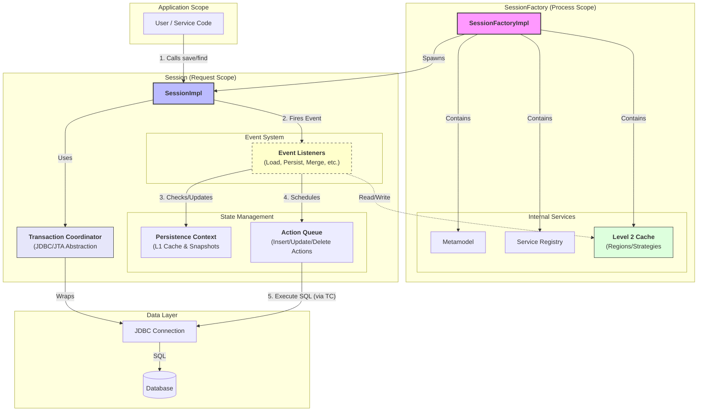
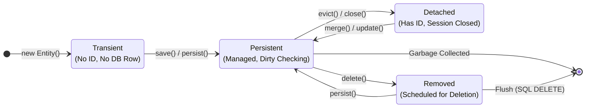
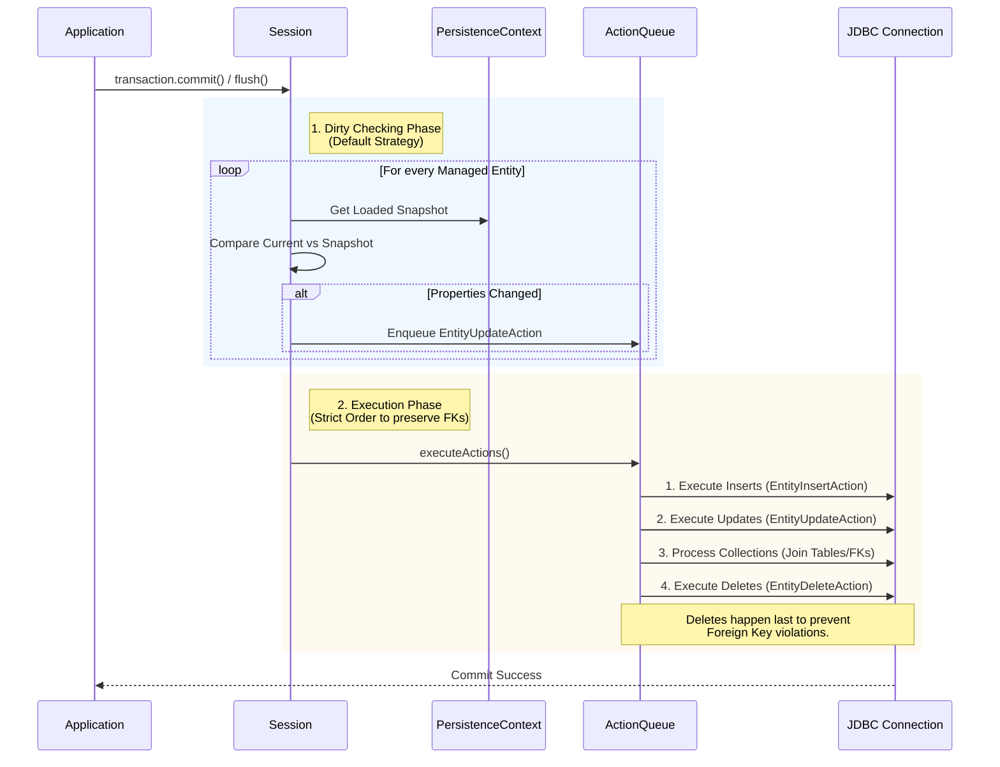
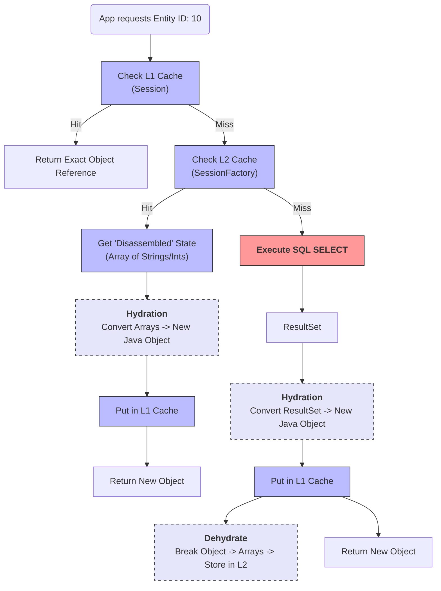

### High-Level Runtime Architecture

```mermaid
graph TD
    subgraph "Application Scope"
        UserCode[User / Service Code]
    end

    subgraph "SessionFactory (Process Scope)"
        SF[<b>SessionFactoryImpl</b>]
        
        subgraph "Internal Services"
            Meta[Metamodel]
            SR[Service Registry]
            L2["<b>Level 2 Cache</b><br/>(Regions/Strategies"]
        end
    end

    subgraph "Session (Request Scope)"
        Sess[<b>SessionImpl</b>]
        
        subgraph "Event System"
            EL["<b>Event Listeners</b><br/>(Load, Persist, Merge, etc.)"]
        end

        subgraph "State Management"
            PC["<b>Persistence Context</b><br/>(L1 Cache & Snapshots"]
            AQ["<b>Action Queue</b><br/>(Insert/Update/Delete Actions"]
        end

        TC["<b>Transaction Coordinator</b><br/>(JDBC/JTA Abstraction"]
    end

    subgraph "Data Layer"
        JDBC[JDBC Connection]
        DB[(Database)]
    end

    %% Flows
    UserCode -->|1. Calls save/find| Sess
    Sess -->|2. Fires Event| EL
    
    EL -->|3. Checks/Updates| PC
    EL -->|4. Schedules| AQ
    
    SF -- Contains --> Meta
    SF -- Contains --> SR
    SF -- Contains --> L2
    SF -- Spawns --> Sess
    
    Sess -- Uses --> TC
    TC -- Wraps --> JDBC
    
    AQ -- 5. Execute SQL (via TC) --> JDBC
    JDBC -- SQL --> DB

    %% L2 Interaction
    EL -.->|Read/Write| L2

    %% Styling
    style SF fill:#f9f,stroke:#333,stroke-width:2px
    style Sess fill:#bbf,stroke:#333,stroke-width:2px
    style EL fill:#ffc,stroke:#333,stroke-dasharray: 5 5
    style TC fill:#e6e6fa,stroke:#333
    style L2 fill:#dfd,stroke:#333
```

### Entity Lifecycle State Machine

```mermaid
stateDiagram-v2
    direction LR
    
    %% Using <br/> ensures the text wraps in all browsers/renderers
    state "Transient<br/>(No ID, No DB Row)" as T
    state "Persistent<br/>(Managed, Dirty Checking)" as P
    state "Detached<br/>(Has ID, Session Closed)" as D
    state "Removed<br/>(Scheduled for Deletion)" as R

    [*] --> T : new Entity()
    T --> P : save() / persist()
    
    P --> D : evict() / close()
    D --> P : merge() / update()
    
    P --> R : delete()
    R --> P : persist()
    
    P --> [*] : Garbage Collected
    R --> [*] : Flush (SQL DELETE)
```

### The "Flush" & Dirty Checking Sequence

```mermaid
sequenceDiagram
    participant App as Application
    participant Sess as Session
    participant PC as PersistenceContext
    participant AQ as ActionQueue
    participant JDBC as JDBC Connection

    App->>Sess: transaction.commit() / flush()
    
    rect rgb(240, 248, 255)
        note right of Sess: 1. Dirty Checking Phase<br/>(Default Strategy)
        loop For every Managed Entity
            Sess->>PC: Get Loaded Snapshot
            Sess->>Sess: Compare Current vs Snapshot
            alt Properties Changed
                Sess->>AQ: Enqueue EntityUpdateAction
            end
        end
    end

    rect rgb(255, 250, 240)
        note right of Sess: 2. Execution Phase<br/>(Strict Order to preserve FKs)
        Sess->>AQ: executeActions()
        
        AQ->>JDBC: 1. Execute Inserts (EntityInsertAction)
        AQ->>JDBC: 2. Execute Updates (EntityUpdateAction)
        AQ->>JDBC: 3. Process Collections (Join Tables/FKs)
        AQ->>JDBC: 4. Execute Deletes (EntityDeleteAction)
        
        Note over AQ, JDBC: Deletes happen last to prevent<br/>Foreign Key violations.
    end

    JDBC-->>App: Commit Success
```

### Multi-Level Caching Logic

```mermaid
flowchart TD
    Request(App requests Entity ID: 10) --> CheckL1["Check L1 Cache<br/>(Session)"]

    %% L1 Hit
    CheckL1 -- Hit --> ReturnL1[Return Exact Object Reference]
    
    %% L1 Miss
    CheckL1 -- Miss --> CheckL2["Check L2 Cache<br/>(SessionFactory)"]

    %% L2 Hit path
    CheckL2 -- Hit --> L2Data["Get 'Disassembled' State<br/>(Array of Strings/Ints)"]
    L2Data --> HydrateL2[<b>Hydration</b><br/>Convert Arrays -> New Java Object]
    HydrateL2 --> PutL1_Hit[Put in L1 Cache]
    PutL1_Hit --> ReturnL2[Return New Object]

    %% L2 Miss path
    CheckL2 -- Miss --> DB_Query[<b>Execute SQL SELECT</b>]
    DB_Query --> Result[ResultSet]
    
    Result --> HydrateDB[<b>Hydration</b><br/>Convert ResultSet -> New Java Object]
    HydrateDB --> PutL1_DB[Put in L1 Cache]
    
    PutL1_DB --> Dehydrate[<b>Dehydrate</b><br/>Break Object -> Arrays -> Store in L2]
    PutL1_DB --> ReturnDB[Return New Object]

    %% Consistent Styling using Classes
    classDef process fill:#f9f,stroke:#333,stroke-width:2px;
    classDef cacheOp fill:#bbf,stroke:#333;
    classDef transform stroke-dasharray: 5 5,fill:#e6e6fa,stroke:#333;
    classDef db fill:#f99,stroke:#333;

    class CheckL1,PutL1_Hit,PutL1_DB cacheOp;
    class CheckL2,L2Data cacheOp;
    class HydrateL2,HydrateDB,Dehydrate transform;
    class DB_Query db;
```
