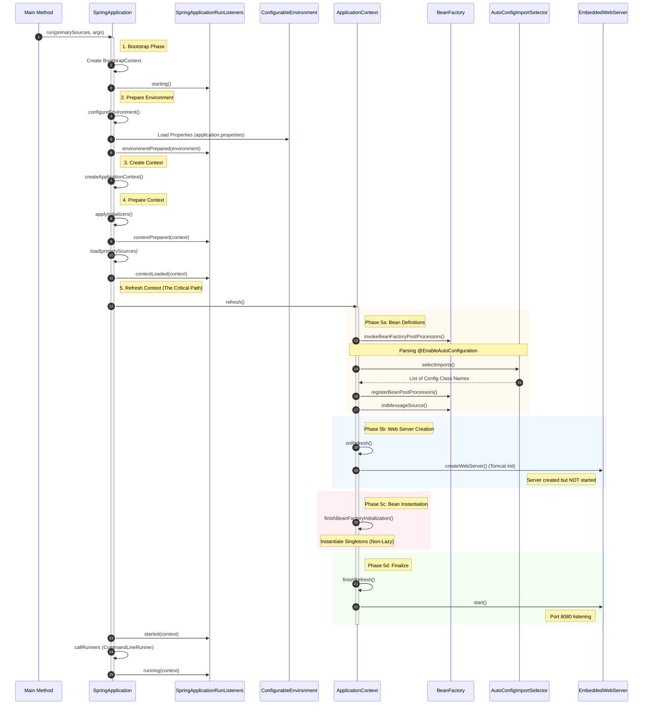
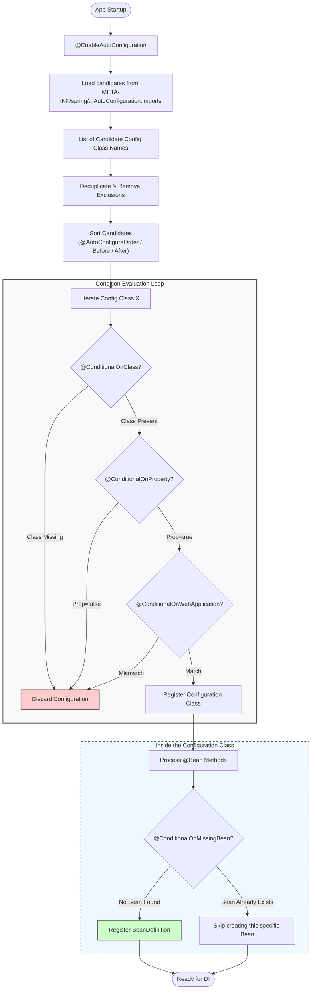
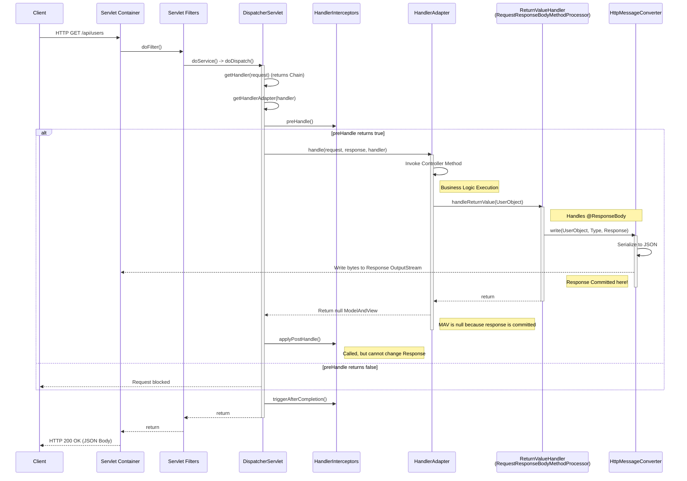
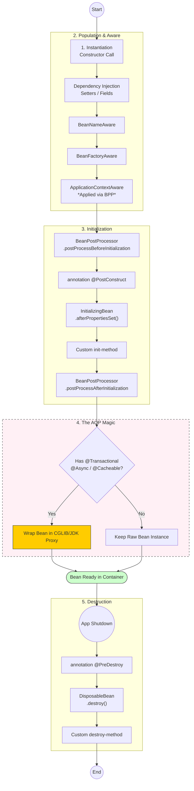

### The Spring Boot Startup Lifecycle (SpringApplication.run)

```mermaid
sequenceDiagram
    autonumber
    participant Main as Main Method
    participant SA as SpringApplication
    participant SARL as SpringApplicationRunListeners
    participant Env as ConfigurableEnvironment
    participant Ctx as ApplicationContext
    participant BF as BeanFactory
    participant Auto as AutoConfigImportSelector
    participant Embed as EmbeddedWebServer

    Main->>SA: run(primarySources, args)
    activate SA
    
    Note right of SA: 1. Bootstrap Phase
    SA->>SA: Create BootstrapContext
    SA->>SARL: starting()
    
    Note right of SA: 2. Prepare Environment
    SA->>SA: configureEnvironment()
    SA->>Env: Load Properties (application.properties)
    SA->>SARL: environmentPrepared(environment)
    
    Note right of SA: 3. Create Context
    SA->>SA: createApplicationContext()
    
    Note right of SA: 4. Prepare Context
    SA->>SA: applyInitializers()
    SA->>SARL: contextPrepared(context)
    SA->>SA: load(primarySources)
    SA->>SARL: contextLoaded(context)

    Note right of SA: 5. Refresh Context (The Critical Path)
    SA->>Ctx: refresh()
    activate Ctx
    
    rect rgb(255, 250, 240)
        note right of Ctx: Phase 5a: Bean Definitions
        Ctx->>BF: invokeBeanFactoryPostProcessors()
        
        Note over Ctx, Auto: Parsing @EnableAutoConfiguration
        Ctx->>Auto: selectImports()
        Auto-->>Ctx: List of Config Class Names
        
        Ctx->>BF: registerBeanPostProcessors()
        Ctx->>BF: initMessageSource()
    end

    rect rgb(240, 248, 255)
        note right of Ctx: Phase 5b: Web Server Creation
        Ctx->>Ctx: onRefresh()
        Ctx->>Embed: createWebServer() (Tomcat init)
        Note left of Embed: Server created but NOT started
    end
    
    rect rgb(255, 240, 245)
        note right of Ctx: Phase 5c: Bean Instantiation
        Ctx->>Ctx: finishBeanFactoryInitialization()
        Note over Ctx: Instantiate Singletons (Non-Lazy)
    end
    
    rect rgb(240, 255, 240)
        note right of Ctx: Phase 5d: Finalize
        Ctx->>Ctx: finishRefresh()
        Ctx->>Embed: start()
        activate Embed
        Note left of Embed: Port 8080 listening
    end
    
    deactivate Ctx
    
    SA->>SARL: started(context)
    SA->>SA: callRunners (CommandLineRunner)
    SA->>SARL: running(context)
    
    deactivate SA
```

### Auto-Configuration

```mermaid
flowchart TD
    Start([App Startup]) --> Scan["@EnableAutoConfiguration"]
    
    Scan --> Load["Load candidates from:<br/>META-INF/spring/...AutoConfiguration.imports"]
    
    Load --> Candidates["List of Candidate Config Class Names"]
    
    Candidates --> Deduplicate["Deduplicate & Remove Exclusions"]
    
    Deduplicate --> Sort["Sort Candidates<br/>(@AutoConfigureOrder / Before / After)"]
    
    Sort --> Iterate
    
    subgraph FilterProcess [Condition Evaluation Loop]
        direction TB
        Iterate[Iterate Config Class X] --> CondClass{"@ConditionalOnClass?"}
        
        CondClass -- Class Missing --> Discard[Discard Configuration]
        CondClass -- Class Present --> CondProp{"@ConditionalOnProperty?"}
        
        CondProp -- Prop=false --> Discard
        CondProp -- Prop=true --> CondWeb{"@ConditionalOnWebApplication?"}
        
        CondWeb -- Mismatch --> Discard
        CondWeb -- Match --> Register[Register Configuration Class]
    end
    
    Register --> BeanPhase[Process @Bean Methods]
    
    subgraph BeanLogic [Inside the Configuration Class]
        BeanPhase --> CondBean{"@ConditionalOnMissingBean?"}
        CondBean -- Bean Already Exists --> SkipBean[Skip creating this specific Bean]
        CondBean -- No Bean Found --> RegBean[Register BeanDefinition]
    end
    
    RegBean --> End([Ready for DI])
    SkipBean --> End

    style FilterProcess fill:#f9f9f9,stroke:#333,stroke-width:2px
    style BeanLogic fill:#f0f8ff,stroke:#333,stroke-dasharray: 5 5
    style Discard fill:#ffcccc,stroke:#333
    style RegBean fill:#ccffcc,stroke:#333
```

### MVC Request Flow

```mermaid
sequenceDiagram
    participant Client
    participant Container as Servlet Container
    participant Filter as Servlet Filters
    participant DS as DispatcherServlet
    participant INT as HandlerInterceptors
    participant HA as HandlerAdapter
    participant RVH as ReturnValueHandler<br/>(RequestResponseBodyMethodProcessor)
    participant MSG as HttpMessageConverter
    
    Client->>Container: HTTP GET /api/users
    Container->>Filter: doFilter()
    Filter->>DS: doService() -> doDispatch()
    
    activate DS
    
    DS->>DS: getHandler(request) (returns Chain)
    DS->>DS: getHandlerAdapter(handler)
    
    DS->>INT: preHandle()
    
    alt preHandle returns true
        DS->>HA: handle(request, response, handler)
        activate HA
        
        HA->>HA: Invoke Controller Method
        note right of HA: Business Logic Execution
        
        HA->>RVH: handleReturnValue(UserObject)
        activate RVH
        Note right of RVH: Handles @ResponseBody
        
        RVH->>MSG: write(UserObject, Type, Response)
        activate MSG
        MSG->>MSG: Serialize to JSON
        MSG-->>Container: Write bytes to Response OutputStream
        note left of MSG: Response Committed here!
        deactivate MSG
        
        RVH-->>HA: return
        deactivate RVH
        
        HA-->>DS: Return null ModelAndView
        note right of HA: MAV is null because response is committed
        deactivate HA
        
        DS->>INT: applyPostHandle()
        note right of INT: Called, but cannot change Response
    else preHandle returns false
        DS-->>Client: Request blocked
    end
    
    DS->>INT: triggerAfterCompletion()
    
    DS-->>Filter: return
    deactivate DS
    Filter-->>Container: return
    Container-->>Client: HTTP 200 OK (JSON Body)
```

### Bean Lifecycle

```mermaid
flowchart TD
    Start((Start)) --> Instantiate["1. Instantiation<br/>Constructor Call"]
    
    subgraph Pop [2. Population & Aware]
        direction TB
        Instantiate --> DI["Dependency Injection<br/>Setters / Fields"]
        DI --> BName["BeanNameAware"]
        BName --> BFactory["BeanFactoryAware"]
        BFactory --> AppCtx["ApplicationContextAware<br/>*Applied via BPP*"]
    end
    
    subgraph Init [3. Initialization]
        direction TB
        AppCtx --> BPPBefore[BeanPostProcessor<br/>.postProcessBeforeInitialization]
        
        BPPBefore --> PostConstruct[annotation @PostConstruct]
        PostConstruct --> InitBean["InitializingBean<br/>.afterPropertiesSet()"]
        InitBean --> CustomInit[Custom init-method]
        
        CustomInit --> BPPAfter[BeanPostProcessor<br/>.postProcessAfterInitialization]
    end

    subgraph ProxyPhase [4. The AOP Magic]
        direction TB
        BPPAfter --> IsAOP{Has @Transactional<br/>@Async / @Cacheable?}
        IsAOP -- Yes --> CreateProxy[Wrap Bean in CGLIB/JDK Proxy]
        IsAOP -- No --> ReturnRaw[Keep Raw Bean Instance]
    end
    
    CreateProxy --> Ready([Bean Ready in Container])
    ReturnRaw --> Ready
    
    Ready --> Stop((App Shutdown))
    
    subgraph Destroy [5. Destruction]
        direction TB
        Stop --> PreDestroy[annotation @PreDestroy]
        PreDestroy --> DispBean["DisposableBean<br/>.destroy()"]
        DispBean --> CustomDestroy[Custom destroy-method]
    end
    
    CustomDestroy --> End((End))

    style ProxyPhase fill:#fff0f5,stroke:#333,stroke-dasharray: 5 5
    style CreateProxy fill:#ffcc00,stroke:#333
    style Ready fill:#ccffcc,stroke:#333
```
