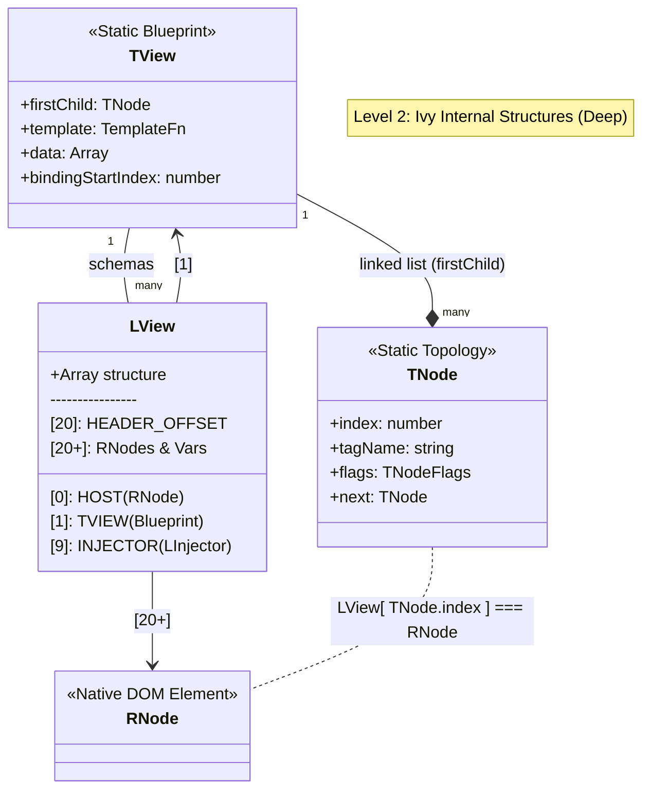
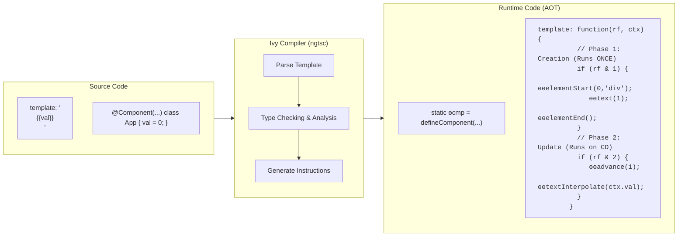
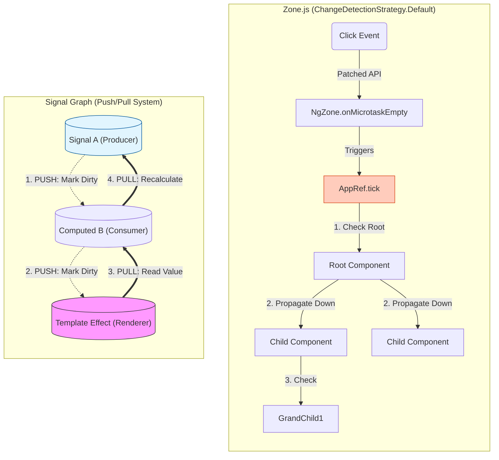
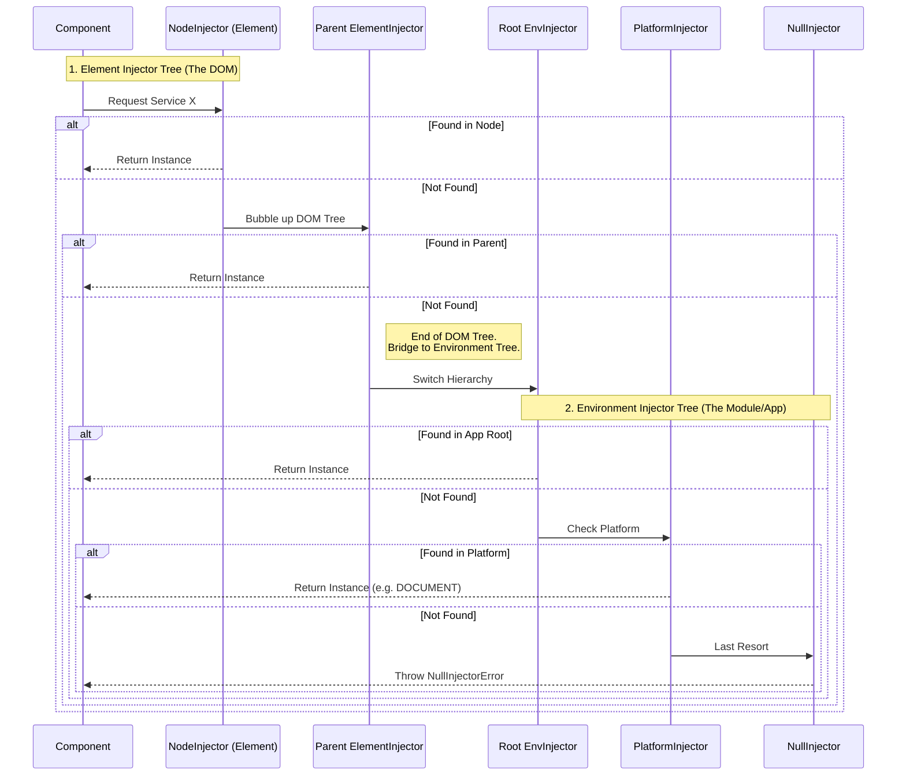
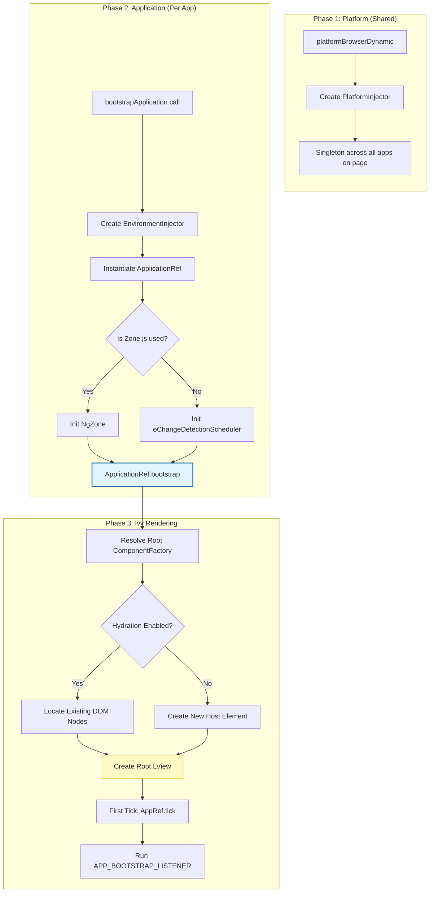

### The Problem

The core problem is the exponential complexity of maintaining state-to-view synchronization and architectural consistency in massive applications, where manual (imperative) DOM updates inevitably lead to fragile, unscalable codebases.

### The Ivy Engine: LView & TView

### Compilation: JIT vs AOT & The Instruction Set

### Change Detection: Zone.js vs. Signals

### Dependency Injection (DI) Internals

### Bootstrapping Flow

